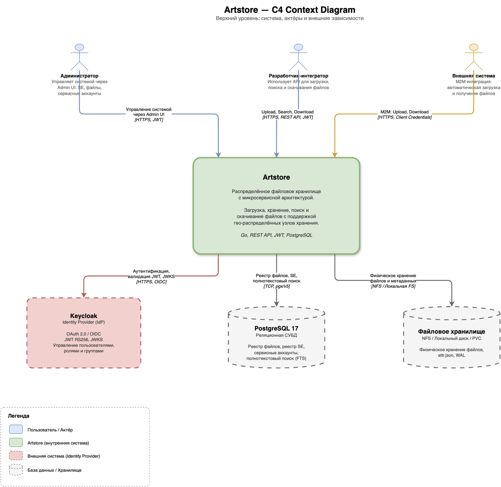
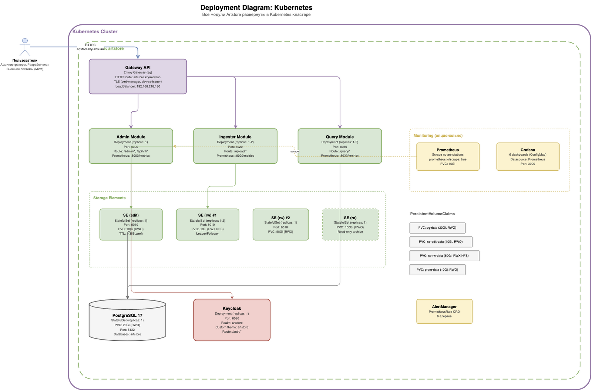

# Artstore

Distributed file storage with microservice architecture, written in Go.



## Overview

Artstore is a distributed file storage system designed for reliable storage, search,
and retrieval of files across multiple storage nodes. The system uses a microservice
architecture where each module is an independent Go project with its own API contract,
database migrations, Helm chart, and CI pipeline.

**Key features:**

- Distributed file storage across multiple Storage Elements
- Attribute-based file search with PostgreSQL Full-Text Search
- Write-Ahead Log (WAL) for atomic file operations
- Leader/Follower replication with NFS-based leader election
- Storage Element lifecycle management (edit -> rw -> ro -> ar)
- Role-based access control via Keycloak (OAuth 2.0 / OIDC)
- Built-in Admin UI for system management
- Prometheus metrics and Grafana dashboards
- Kubernetes-native deployment with Helm charts

## Architecture


### Modules

| Module | Port | Description | Version |
|--------|------|-------------|---------|
| [Admin Module](src/admin-module/) | 8000 | Keycloak IdP, RBAC, SE & file registry, Service Accounts, Admin UI | 0.1.0 |
| [Storage Element](src/storage-element/) | 8010 | Physical file storage, WAL, attr.json, replication | 0.1.0 |
| [Ingester Module](src/ingester-module/) | 8020 | Sync upload, Sequential Fill SE selection, file registration | 0.1.0 |
| [Query Module](src/query-module/) | 8030 | Search (PostgreSQL FTS), LRU cache, proxy download | 0.1.0 |
| [Demo Client](src/demo-client/) | 8080 | Web UI demo client for upload/search/download | 0.1.0 |

### Tech Stack

- **Language**: Go 1.25+
- **HTTP**: net/http + chi router
- **API**: OpenAPI 3.0.3, contract-first (oapi-codegen)
- **Database**: PostgreSQL 17, pgx/v5 (no ORM), golang-migrate
- **Auth**: JWT RS256 via Keycloak (OAuth 2.0 / OIDC)
- **Metrics**: Prometheus (client_golang)
- **Logging**: slog (stdlib) + JSON
- **Build**: Docker multi-stage (golang:1.25-alpine -> alpine:3.19)
- **Deploy**: Helm 3, Kubernetes (Gateway API)
- **Admin UI**: Templ + HTMX + Alpine.js + Tailwind CSS + ApexCharts

## Data Flow

### File Upload


1. Client sends file to **Ingester Module** via API Gateway
2. Ingester selects optimal Storage Element (Sequential Fill algorithm)
3. File is uploaded directly to the selected SE
4. Ingester registers file metadata in **Admin Module**

### File Search & Download


1. Client searches via **Query Module** (PostgreSQL FTS)
2. QM returns file metadata from the local registry with LRU caching
3. Client requests download — QM proxies the stream from SE


## Deployment



### Prerequisites

- Kubernetes cluster with Gateway API (Envoy Gateway)
- cert-manager with a ClusterIssuer
- PostgreSQL 17
- Keycloak 26+

### Quick Start with Helm

```bash
# Deploy infrastructure (PostgreSQL + Keycloak)
cd tests && make infra-up

# Deploy Storage Elements
make se-up

# Deploy application modules (AM + IM + QM)
make apps-up

# Initialize test data
make init-data
```

### Helm Charts

| Chart | Location | Description |
|-------|----------|-------------|
| `artstore` | `charts/artstore/` | Umbrella chart (all modules) |
| `admin-module` | `src/admin-module/charts/` | Admin Module |
| `storage-element` | `src/storage-element/charts/` | Storage Element |
| `ingester-module` | `src/ingester-module/charts/` | Ingester Module |
| `query-module` | `src/query-module/charts/` | Query Module |
| `demo-client` | `src/demo-client/charts/` | Demo Client |

## Project Structure

```
src/                     -- Go module source code
  admin-module/          -- Admin Module
  storage-element/       -- Storage Element
  ingester-module/       -- Ingester Module
  query-module/          -- Query Module
  demo-client/           -- Demo Client
charts/artstore/         -- Umbrella Helm chart
docs/
  api-contracts/         -- OpenAPI 3.0.3 specifications
  design/                -- Architecture diagrams (drawio)
  guides/                -- Admin, Developer, Operations guides (EN + RU)
tests/                   -- Integration test environment (Helm + scripts)
deploy/                  -- Keycloak realm configuration
```

### Module Structure (common pattern)

```
src/<module>/
+-- cmd/<module>/main.go          -- Entry point
+-- internal/
|   +-- api/
|   |   +-- generated/            -- oapi-codegen (types.gen.go, server.gen.go)
|   |   +-- handlers/             -- HTTP handlers
|   |   +-- middleware/            -- auth, logging, metrics
|   |   +-- errors/               -- Typed API errors
|   +-- config/                   -- Configuration from env variables
|   +-- server/                   -- HTTP server, graceful shutdown
|   +-- domain/model/             -- Domain models
|   +-- service/                  -- Business logic
+-- charts/<module>/              -- Helm chart
+-- tests/                        -- Integration tests
+-- Dockerfile
+-- Makefile
+-- go.mod
```

## Testing

```bash
cd tests

# Deploy full test environment
make test-env-up

# Run all integration tests (~60 tests)
make test-all

# Run module-specific tests
make test-am    # Admin Module (~30 tests)
make test-im    # Ingester Module (16 tests)
make test-qm    # Query Module (16 tests)
```

Unit tests for each module:

```bash
cd src/<module>
go test ./...
```

## Documentation

| Document | Language | Description |
|----------|----------|-------------|
| [Admin Guide](docs/guides/admin-guide.md) | EN | Keycloak setup, module configuration |
| [Admin Guide](docs/guides/admin-guide.ru.md) | RU | Настройка Keycloak, конфигурация модулей |
| [Developer Guide](docs/guides/developer-guide.md) | EN | API reference, data flows, architecture |
| [Developer Guide](docs/guides/developer-guide.ru.md) | RU | Справка по API, потоки данных, архитектура |
| [Operations Guide](docs/guides/operations-guide.md) | EN | Deployment, monitoring, Grafana dashboards |
| [Operations Guide](docs/guides/operations-guide.ru.md) | RU | Деплой, мониторинг, дашборды Grafana |
| [API Contracts](docs/api-contracts/) | — | OpenAPI 3.0.3 specs for all modules |

## Contributing

The project follows [GitHub Flow](GIT-WORKFLOW.md) with Conventional Commits:

```
<type>(<scope>): <subject>
```

Types: `feat`, `fix`, `docs`, `style`, `refactor`, `test`, `chore`

All modules are at development stage (`0.x.y`). Version `1.0.0` will be the first
production release after full integration testing.
