# Руководство администратора Artstore

> **Язык**: [English](admin-guide.md) | [Русский](admin-guide.ru.md)

---

## Содержание

- [1. Обзор архитектуры](#1-обзор-архитектуры)
  - [1.1 Компоненты системы](#11-компоненты-системы)
  - [1.2 Топология системы](#12-топология-системы)
  - [1.3 Потоки данных](#13-потоки-данных)
  - [1.4 Модели развёртывания](#14-модели-развёртывания)
- [2. Требования](#2-требования)
  - [2.1 Программные требования](#21-программные-требования)
  - [2.2 Аппаратные ресурсы](#22-аппаратные-ресурсы)
  - [2.3 Сетевые требования](#23-сетевые-требования)
  - [2.4 Требования к хранилищу](#24-требования-к-хранилищу)
- [3. Установка](#3-установка)
  - [3.1 Порядок развёртывания](#31-порядок-развёртывания)
  - [3.2 Быстрый старт (docker-compose)](#32-быстрый-старт-docker-compose)
  - [3.3 Продуктивное развёртывание в Kubernetes](#33-продуктивное-развёртывание-в-kubernetes)
  - [3.4 Установка отдельных модулей](#34-установка-отдельных-модулей)
  - [3.5 Удалённый Storage Element (Docker)](#35-удалённый-storage-element-docker)
  - [3.6 Настройка API Gateway](#36-настройка-api-gateway)
- [4. Конфигурация](#4-конфигурация)
  - [4.1 Admin Module](#41-admin-module)
  - [4.2 Storage Element](#42-storage-element)
  - [4.3 Ingester Module](#43-ingester-module)
  - [4.4 Query Module](#44-query-module)
  - [4.5 PostgreSQL (общая база данных)](#45-postgresql-общая-база-данных)
  - [4.6 Настройка TLS](#46-настройка-tls)
- [5. Управление Storage Element](#5-управление-storage-element)
  - [5.1 Жизненный цикл SE](#51-жизненный-цикл-se)
  - [5.2 Внутренняя архитектура SE](#52-внутренняя-архитектура-se)
  - [5.3 Регистрация Storage Element](#53-регистрация-storage-element)
  - [5.4 Репликация (высокая доступность)](#54-репликация-высокая-доступность)
  - [5.5 Планирование ёмкости](#55-планирование-ёмкости)
  - [5.6 Гео-распределённые Storage Elements](#56-гео-распределённые-storage-elements)
- [6. Admin UI](#6-admin-ui)
  - [6.1 Процесс аутентификации](#61-процесс-аутентификации)
  - [6.2 Дашборд](#62-дашборд)
  - [6.3 Страница Storage Elements](#63-страница-storage-elements)
  - [6.4 Страница файлов](#64-страница-файлов)
  - [6.5 Страница мониторинга](#65-страница-мониторинга)
  - [6.6 Управление доступом](#66-управление-доступом)
  - [6.7 Страница настроек](#67-страница-настроек)
- [7. Конфигурация Keycloak](#7-конфигурация-keycloak)
  - [7.1 Настройки Realm](#71-настройки-realm)
  - [7.2 Роли и группы Realm](#72-роли-и-группы-realm)
  - [7.3 Client Scopes](#73-client-scopes)
  - [7.4 Клиенты](#74-клиенты)
  - [7.5 Маппер client_id (критически важный)](#75-маппер-client_id-критически-важный)
  - [7.6 Паттерн двух URL для Kubernetes](#76-паттерн-двух-url-для-kubernetes)
  - [7.7 Пользовательская тема Keycloak](#77-пользовательская-тема-keycloak)
  - [7.8 Создание нового клиента (пошагово)](#78-создание-нового-клиента-пошагово)
- [8. Обновление](#8-обновление)
  - [8.1 Порядок обновления](#81-порядок-обновления)
  - [8.2 Миграции базы данных](#82-миграции-базы-данных)
  - [8.3 Совместимость версий](#83-совместимость-версий)
  - [8.4 Резервное копирование и восстановление](#84-резервное-копирование-и-восстановление)

---

## 1. Обзор архитектуры

Artstore — распределённая система хранения файлов с микросервисной архитектурой. Обеспечивает безопасное хранение, загрузку, поиск и скачивание файлов с гибким управлением доступом через Keycloak (OpenID Connect / OAuth 2.0).

### 1.1 Компоненты системы

Система состоит из четырёх независимо развёртываемых модулей:

| Модуль | Порт по умолчанию | Назначение |
|--------|:------------------:|------------|
| **Admin Module (AM)** | 8000 | Центр управления: реестр SE, реестр файлов, RBAC, Service Accounts, Admin UI |
| **Storage Element (SE)** | 8010 | Физическое хранение файлов с WAL, метаданными attr.json, репликацией |
| **Ingester Module (IM)** | 8020 | Endpoint загрузки файлов (stateless), выбор SE по алгоритму Sequential Fill |
| **Query Module (QM)** | 8030 | Поиск файлов (PostgreSQL FTS) и проксирование скачивания с LRU-кэшем |

**Ключевой архитектурный принцип**: Admin Module — *не* сервер аутентификации. Вся аутентификация (выпуск JWT, управление пользователями) делегирована **Keycloak**. Модули лишь проверяют JWT-токены для принятия решений об авторизации.


*Рисунок 1.1 — C4 Context: граница системы Artstore, внешние акторы и системы*

### 1.2 Топология системы

Все модули управляющего слоя (AM, IM, QM) работают внутри кластера Kubernetes за API Gateway. Storage Elements могут быть развёрнуты где угодно — внутри K8s, на удалённых Docker-хостах или на bare-metal серверах в других ЦОД.


*Рисунок 1.2 — C4 Container: модули, базы данных и потоки взаимодействия*

**Межмодульное взаимодействие**:

| Источник | Назначение | Протокол | Цель |
|----------|------------|----------|------|
| API Gateway | AM, IM, QM | HTTP | Маршрутизация внешних запросов, терминация TLS |
| IM | Keycloak | HTTP | Получение SA-токена (client_credentials grant) |
| IM | AM | HTTP + JWT | Получение списка SE, регистрация загруженных файлов |
| IM | SE | HTTPS + JWT | Загрузка файлов |
| QM | PostgreSQL | TCP | Поиск в реестре файлов (FTS) |
| QM | AM | HTTP + JWT | Получение URL SE для скачивания |
| QM | SE | HTTPS + JWT | Проксирование скачивания файлов |
| AM | Keycloak | HTTP | Синхронизация Service Accounts, JWKS |
| AM | SE | HTTPS + JWT | Health-check, синхронизация файлов, смена режимов |
| SE | Keycloak | HTTP | JWKS endpoint (валидация JWT) |

Эндпоинты health и метрик (`/health/*`, `/metrics`) доступны напрямую по IP подов, минуя API Gateway — используются пробами Kubernetes и Prometheus.

### 1.3 Потоки данных

**Загрузка файла** — Клиент загружает файл через Ingester Module, который выбирает целевой Storage Element по алгоритму Sequential Fill, сохраняет файл на SE и регистрирует его в Admin Module.


*Рисунок 1.3 — Поток данных: загрузка файла через IM → SE → AM*

**Скачивание файла** — Клиент запрашивает файл через Query Module, который ищет местоположение файла в Admin Module, потоково передаёт файл с соответствующего Storage Element и кэширует результат.


*Рисунок 1.4 — Поток данных: скачивание файла через QM → AM → SE*

**Поиск файлов** — Клиент ищет файлы через Query Module, который напрямую обращается к индексу полнотекстового поиска PostgreSQL (общая база с Admin Module).


*Рисунок 1.5 — Поток данных: поиск файлов через QM → PostgreSQL FTS*

Подробные диаграммы последовательностей:
- [Последовательность загрузки файла](images/seq-file-upload.png)
- [Последовательность скачивания файла](images/seq-file-download.png)
- [Последовательность аутентификации JWT](images/seq-jwt-auth.png)
- [Последовательность регистрации SE](images/seq-se-registration.png)

### 1.4 Модели развёртывания

Artstore поддерживает две основные модели развёртывания:

**Полностью в Kubernetes** — Все модули, включая Storage Elements, работают внутри кластера Kubernetes. SE использует StatefulSet с PersistentVolumeClaims (PVC) для хранения данных.


*Рисунок 1.6 — Развёртывание: все компоненты внутри кластера Kubernetes*

**Гибридное** — Модули управляющего слоя (AM, IM, QM) и базы данных (PostgreSQL, Keycloak) работают в Kubernetes. Storage Elements работают как Docker-контейнеры на удалённых хостах или ВМ в других ЦОД, подключённых через WAN с TLS.

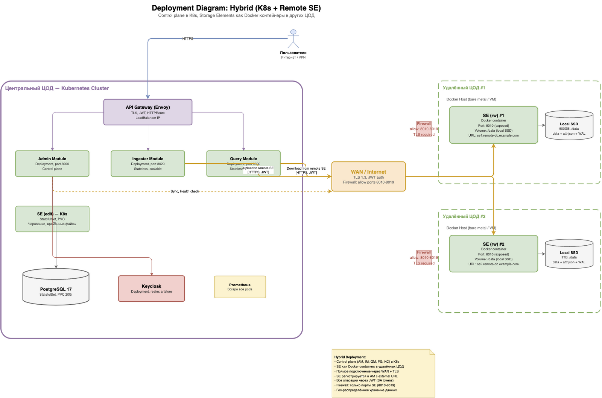
*Рисунок 1.7 — Развёртывание: управляющий слой в K8s + удалённые Docker SE*

Гибридная модель особенно полезна для:
- Гео-распределённого хранения в нескольких ЦОД
- Использования существующей инфраструктуры с большими локальными дисками
- Требований комплаенса, обязывающих локальное хранение данных
- Постепенной миграции с on-premise в облако

---

## 2. Требования

### 2.1 Программные требования

| Компонент | Минимальная версия | Примечания |
|-----------|:------------------:|------------|
| Kubernetes | 1.28+ | Для развёртывания AM, IM, QM |
| Docker | 24+ | Для развёртывания удалённых SE |
| PostgreSQL | 17 | Общая база для AM и QM |
| Keycloak | 26.1+ | С настроенным realm `artstore` |
| Helm | 3.12+ | Развёртывание chart-ов |
| cert-manager | 1.13+ | Управление TLS-сертификатами (рекомендуется) |
| Gateway API | 1.0+ | API Gateway (рекомендуется Envoy Gateway) |

**Необходимые возможности Kubernetes**:
- CRD Gateway API (основной) *или* Ingress-контроллер (nginx, альтернативный)
- Поддержка сервисов LoadBalancer (MetalLB для bare-metal кластеров)
- cert-manager с настроенным `ClusterIssuer` (для автоматического TLS)
- Provisioner PersistentVolume (для хранения данных SE в режиме K8s)

### 2.2 Аппаратные ресурсы

#### Разработка / Тестирование

| Компонент | CPU | Память | Хранилище |
|-----------|:---:|:------:|:---------:|
| Admin Module | 100m | 128Mi | — |
| Storage Element | 100m | 128Mi | 1Gi+ (PVC) |
| Ingester Module | 100m | 128Mi | — |
| Query Module | 100m | 128Mi | — |
| PostgreSQL | 250m | 256Mi | 1Gi |
| Keycloak | 500m | 512Mi | — |
| **Итого** | ~1,2 CPU | ~1,3Gi | ~3Gi |

Среда разработки может работать на **minikube** или **kind** с 4 ГБ оперативной памяти.

#### Продуктивная среда (рекомендуется)

| Компонент | CPU | Память | Хранилище | Реплик |
|-----------|:---:|:------:|:---------:|:------:|
| Admin Module | 500m | 512Mi | — | 1 |
| Storage Element | 500m–1000m | 512Mi–1Gi | 100Gi+ (PVC) | 1+ на режим |
| Ingester Module | 500m | 256Mi | — | 2 (HA) |
| Query Module | 500m | 512Mi | — | 2 (HA) |
| PostgreSQL | 1000m | 2Gi | 50Gi | 1 (или HA-кластер) |
| Keycloak | 1000m | 1Gi | — | 1 (или HA-кластер) |

Ресурсы SE зависят от размеров файлов и требований к пропускной способности. Для больших файлов (>100 МБ) рекомендуется увеличить память SE для буферизации потоковых операций.

### 2.3 Сетевые требования

- **API Gateway** должен иметь публичный или внутренний IP LoadBalancer, доступный клиентам
- **Storage Elements** должны быть доступны по HTTP/HTTPS из кластера Kubernetes (для загрузки IM, скачивания QM, health-check AM)
- **Keycloak** должен быть доступен отовсюду, где выполняется валидация JWT: API Gateway, экземпляры SE, клиентские приложения
- Все соединения с SE через WAN **должны** использовать TLS (настройте `SE_TLS_CERT` и `SE_TLS_KEY`)
- Правила файрвола: разрешить HTTPS (443) из кластера K8s к удалённым хостам SE
- Необходимо DNS-разрешение для всех endpoint-ов модулей

**Требования к пропускной способности для гибридных развёртываний**:
- Скорость загрузки зависит от WAN-канала между K8s (IM) и удалённым SE
- Скорость скачивания зависит от WAN-канала между K8s (QM) и удалённым SE
- Пропускная способность репликации между репликами SE зависит от общего NFS-подключения

### 2.4 Требования к хранилищу

Каждый Storage Element требует:

| Директория | Переменная среды | Назначение |
|------------|-----------------|------------|
| Директория данных | `SE_DATA_DIR` | Файлы данных и метаданные `*.attr.json` |
| Директория WAL | `SE_WAL_DIR` | Write-Ahead Log для атомарности операций |

**Для режима репликации** (`SE_REPLICA_MODE=replicated`):
- Общая файловая система NFS v4+, смонтированная на всех репликах
- И `SE_DATA_DIR`, и `SE_WAL_DIR` должны быть на общем NFS-томе
- Выбор лидера использует `flock()` на файле `.leader.lock` в директории данных

**Планирование ёмкости**:
- Каждый файл имеет накладные расходы ~1 КБ на соответствующий файл метаданных `*.attr.json`
- Записи WAL временные и очищаются после коммита
- `SE_MAX_CAPACITY` должна быть установлена в доступную ёмкость диска (исключая ОС и другие данные)
- Зарезервируйте 10% дискового пространства для WAL и накладных расходов файловой системы

---

## 3. Установка

### 3.1 Порядок развёртывания

Компоненты должны развёртываться в следующем порядке:

1. **PostgreSQL** — база данных для Admin Module и Query Module
2. **Keycloak** — настройка realm `artstore`, создание клиентов, групп и начального администратора
3. **API Gateway** — настройка терминации TLS, валидации JWT и маршрутизации по путям
4. **Admin Module** — подключается к PostgreSQL и Keycloak, автоматически применяет миграции БД
5. **Storage Elements** — регистрируются в Admin Module после запуска
6. **Ingester Module** и **Query Module** — подключаются к AM и SE через API Gateway

> **Примечание**: Admin Module должен быть запущен и доступен до запуска IM, QM или регистрации экземпляров SE. IM и QM зависят от AM для обнаружения SE и операций с реестром файлов.

### 3.2 Быстрый старт (docker-compose)

Самый быстрый способ запустить Artstore локально — через `docker-compose`:

```bash
# Клонирование репозитория
git clone https://github.com/bigkaa/goartstore.git
cd goartstore

# Запуск всех сервисов
docker-compose up -d

# Проверка работы всех сервисов
docker-compose ps
```

Будут запущены: PostgreSQL, Keycloak (с предварительно настроенным realm), Admin Module, один Storage Element (режим edit), Ingester Module и Query Module.

Endpoint-ы по умолчанию:
- Admin UI: `http://localhost:8000/admin/`
- API загрузки: `http://localhost:8020/api/v1/upload`
- API поиска: `http://localhost:8030/api/v1/search`
- API скачивания: `http://localhost:8030/api/v1/files/{id}/download`

Учётные данные по умолчанию:
- Администратор: `admin` / `admin`

> **Примечание**: docker-compose предназначен только для разработки и тестирования. Для продуктивных развёртываний используйте Kubernetes с umbrella Helm chart.

### 3.3 Продуктивное развёртывание в Kubernetes

Используйте umbrella Helm chart для полного развёртывания в Kubernetes:

```bash
# Добавление Helm-репозитория Artstore (или использование локальных chart-ов)
helm repo add artstore https://charts.example.com/artstore

# Установка с продуктивным профилем
helm install artstore charts/artstore/ \
  -f charts/artstore/values-production.yaml \
  -n artstore --create-namespace

# Проверка работы всех подов
kubectl get pods -n artstore
```

Umbrella chart включает все модули как sub-chart-ы с двумя предварительно настроенными профилями:
- `values-dev.yaml` — минимальные ресурсы для разработки/тестирования
- `values-production.yaml` — рекомендуемые ресурсы, HA-реплики, TLS

Подробные настройки см. в [§4. Конфигурация](#4-конфигурация).

### 3.4 Установка отдельных модулей

Каждый модуль имеет собственный Helm chart в `src/<модуль>/charts/<модуль>/` и может быть развёрнут независимо:

```bash
# Развёртывание Admin Module
helm install admin-module src/admin-module/charts/admin-module/ \
  -n artstore --create-namespace \
  -f my-admin-values.yaml

# Развёртывание Storage Element
helm install se-edit-01 src/storage-element/charts/storage-element/ \
  -n artstore \
  -f my-se-values.yaml

# Развёртывание Ingester Module
helm install ingester-module src/ingester-module/charts/ingester-module/ \
  -n artstore \
  -f my-ingester-values.yaml

# Развёртывание Query Module
helm install query-module src/query-module/charts/query-module/ \
  -n artstore \
  -f my-query-values.yaml
```

### 3.5 Удалённый Storage Element (Docker)

Для гибридных развёртываний запустите Storage Element как Docker-контейнер на удалённом хосте:

```bash
docker run -d \
  --name se-remote-01 \
  --restart unless-stopped \
  -p 8010:8010 \
  -v /data/artstore/storage:/data \
  -v /data/artstore/wal:/wal \
  -v /etc/artstore/certs:/certs:ro \
  -e SE_STORAGE_ID=se-remote-01 \
  -e SE_DATA_DIR=/data \
  -e SE_WAL_DIR=/wal \
  -e SE_MODE=rw \
  -e SE_MAX_CAPACITY=107374182400 \
  -e SE_MAX_FILE_SIZE=1073741824 \
  -e SE_TLS_CERT=/certs/tls.crt \
  -e SE_TLS_KEY=/certs/tls.key \
  -e SE_JWKS_URL=http://keycloak.example.com/realms/artstore/protocol/openid-connect/certs \
  harbor.kryukov.lan/library/storage-element:v0.6.0
```

После запуска удалённого SE зарегистрируйте его в Admin Module:

```bash
# Получение токена администратора
TOKEN=$(curl -s -X POST \
  "https://keycloak.example.com/realms/artstore/protocol/openid-connect/token" \
  -d "grant_type=client_credentials" \
  -d "client_id=artstore-admin-module" \
  -d "client_secret=<secret>" | jq -r '.access_token')

# Регистрация SE
curl -X POST "https://artstore.example.com/api/v1/storage-elements" \
  -H "Authorization: Bearer $TOKEN" \
  -H "Content-Type: application/json" \
  -d '{
    "name": "se-remote-01",
    "url": "https://se-remote-01.example.com:8010",
    "priority": 10
  }'
```

> **Важно**: URL SE должен быть доступен из кластера Kubernetes (из подов IM и QM). Убедитесь, что правила файрвола и DNS-разрешение настроены правильно.

### 3.6 Настройка API Gateway

Artstore требует API Gateway для терминации TLS, валидации JWT и маршрутизации по путям.

**Правила маршрутизации по путям**:

| Префикс пути | Backend-сервис | Порт | Обрезка префикса |
|---------------|---------------|:----:|:----------------:|
| `/admin/*` | admin-module | 8000 | Нет |
| `/api/*` | admin-module | 8000 | Нет |
| `/upload/*` | ingester-module | 8020 | Да (`/upload` → `/api/v1`) |
| `/query/*` | query-module | 8030 | Да (`/query` → `/`) |

**Envoy Gateway (рекомендуется для Kubernetes)**:

```yaml
apiVersion: gateway.networking.k8s.io/v1
kind: HTTPRoute
metadata:
  name: artstore
  namespace: artstore
spec:
  parentRefs:
    - name: eg
      namespace: envoy-gateway-system
  hostnames:
    - "artstore.example.com"
  rules:
    - matches:
        - path:
            type: PathPrefix
            value: /admin
      backendRefs:
        - name: admin-module
          port: 8000
    - matches:
        - path:
            type: PathPrefix
            value: /api
      backendRefs:
        - name: admin-module
          port: 8000
    - matches:
        - path:
            type: PathPrefix
            value: /upload
      backendRefs:
        - name: ingester-module
          port: 8020
      filters:
        - type: URLRewrite
          urlRewrite:
            path:
              type: ReplacePrefixMatch
              replacePrefixMatch: /api/v1
    - matches:
        - path:
            type: PathPrefix
            value: /query
      backendRefs:
        - name: query-module
          port: 8030
      filters:
        - type: URLRewrite
          urlRewrite:
            path:
              type: ReplacePrefixMatch
              replacePrefixMatch: /
```

**Валидация JWT (Envoy Gateway)**:

```yaml
apiVersion: gateway.envoyproxy.io/v1alpha1
kind: SecurityPolicy
metadata:
  name: artstore-jwt
  namespace: artstore
spec:
  targetRefs:
    - group: gateway.networking.k8s.io
      kind: HTTPRoute
      name: artstore
  jwt:
    providers:
      - name: keycloak
        issuer: "https://artstore.example.com/realms/artstore"
        remoteJWKS:
          uri: "http://keycloak.artstore.svc:8080/realms/artstore/protocol/openid-connect/certs"
```

**Альтернатива: Nginx Ingress** — При использовании Nginx Ingress-контроллера вместо Gateway API настройте валидацию JWT через `auth_request` к sidecar или `lua-resty-jwt`.

---

## 4. Конфигурация

Все модули настраиваются через переменные среды. Каждый модуль использует уникальный префикс для избежания коллизий.

### 4.1 Admin Module

Префикс переменных среды: `AM_`

**Сервер**:

| Переменная | Обязательна | По умолчанию | Описание |
|------------|:-----------:|--------------|----------|
| `AM_PORT` | Нет | `8000` | Порт HTTP-сервера |
| `AM_LOG_LEVEL` | Нет | `info` | Уровень логирования: `debug`, `info`, `warn`, `error` |
| `AM_LOG_FORMAT` | Нет | `json` | Формат логов: `json` (продуктив), `text` (разработка) |

**PostgreSQL**:

| Переменная | Обязательна | По умолчанию | Описание |
|------------|:-----------:|--------------|----------|
| `AM_DB_HOST` | Да | — | Хост PostgreSQL |
| `AM_DB_PORT` | Нет | `5432` | Порт PostgreSQL |
| `AM_DB_NAME` | Да | — | Имя базы данных |
| `AM_DB_USER` | Да | — | Пользователь БД |
| `AM_DB_PASSWORD` | Да | — | Пароль БД |
| `AM_DB_SSL_MODE` | Нет | `disable` | Режим SSL: `disable`, `require`, `verify-ca`, `verify-full` |

**Keycloak**:

| Переменная | Обязательна | По умолчанию | Описание |
|------------|:-----------:|--------------|----------|
| `AM_KEYCLOAK_URL` | Да | — | Базовый URL Keycloak (напр., `https://keycloak.example.com`) |
| `AM_KEYCLOAK_REALM` | Нет | `artstore` | Имя realm Keycloak |
| `AM_KEYCLOAK_CLIENT_ID` | Да | — | Client ID для Keycloak Admin API (напр., `artstore-admin-module`) |
| `AM_KEYCLOAK_CLIENT_SECRET` | Да | — | Client Secret для Keycloak Admin API |
| `AM_KEYCLOAK_SA_PREFIX` | Нет | `sa_` | Префикс для идентификации SA-клиентов в Keycloak |

**JWT**:

| Переменная | Обязательна | По умолчанию | Описание |
|------------|:-----------:|--------------|----------|
| `AM_JWT_ISSUER` | Нет | *(из URL KC)* | Ожидаемый claim `iss` в JWT |
| `AM_JWT_JWKS_URL` | Нет | *(из URL KC)* | URL JWKS для валидации JWT |
| `AM_JWT_ROLES_CLAIM` | Нет | `realm_access.roles` | JSON-путь к ролям в claims JWT |
| `AM_JWT_GROUPS_CLAIM` | Нет | `groups` | JSON-путь к группам в claims JWT |

**Синхронизация**:

| Переменная | Обязательна | По умолчанию | Описание |
|------------|:-----------:|--------------|----------|
| `AM_SYNC_INTERVAL` | Нет | `1h` | Интервал синхронизации реестра файлов SE |
| `AM_SYNC_PAGE_SIZE` | Нет | `1000` | Размер страницы при синхронизации файлов |
| `AM_SA_SYNC_INTERVAL` | Нет | `15m` | Интервал синхронизации Service Accounts с Keycloak |
| `AM_SE_CA_CERT_PATH` | Нет | — | Путь к CA-сертификату для TLS-соединений с SE |
| `AM_DEPHEALTH_CHECK_INTERVAL` | Нет | `15s` | Интервал проверки здоровья зависимостей |

**Маппинг ролей**:

| Переменная | Обязательна | По умолчанию | Описание |
|------------|:-----------:|--------------|----------|
| `AM_ROLE_ADMIN_GROUPS` | Нет | `artstore-admins` | Группы Keycloak, маппящиеся на роль `admin` |
| `AM_ROLE_READONLY_GROUPS` | Нет | `artstore-viewers` | Группы Keycloak, маппящиеся на роль `readonly` |

**Сессия Admin UI**:

| Переменная | Обязательна | По умолчанию | Описание |
|------------|:-----------:|--------------|----------|
| `AM_UI_SESSION_SECRET` | Нет | *(авто-генерация)* | 32-байтовый ключ для AES-GCM шифрования cookies сессии |

> **Примечание**: В продуктиве всегда явно задавайте `AM_UI_SESSION_SECRET`. Авто-сгенерированный ключ меняется при перезапуске пода, что инвалидирует все активные сессии.

### 4.2 Storage Element

Префикс переменных среды: `SE_`

**Сервер**:

| Переменная | Обязательна | По умолчанию | Описание |
|------------|:-----------:|--------------|----------|
| `SE_PORT` | Нет | `8010` | Порт HTTP-сервера |
| `SE_STORAGE_ID` | Да | — | Уникальный идентификатор SE (напр., `se-moscow-01`) |
| `SE_LOG_LEVEL` | Нет | `info` | Уровень логирования |
| `SE_LOG_FORMAT` | Нет | `json` | Формат логов |

**Хранилище**:

| Переменная | Обязательна | По умолчанию | Описание |
|------------|:-----------:|--------------|----------|
| `SE_DATA_DIR` | Да | — | Путь к директории данных |
| `SE_WAL_DIR` | Да | — | Путь к директории WAL |
| `SE_MODE` | Нет | `edit` | Начальный режим: `edit`, `rw`, `ro`, `ar` |
| `SE_MAX_FILE_SIZE` | Нет | `1073741824` | Максимальный размер файла в байтах (по умолчанию: 1 ГБ) |
| `SE_MAX_CAPACITY` | Да | — | Настроенный лимит ёмкости в байтах |

**Обслуживание**:

| Переменная | Обязательна | По умолчанию | Описание |
|------------|:-----------:|--------------|----------|
| `SE_GC_INTERVAL` | Нет | `1h` | Интервал сборки мусора |
| `SE_RECONCILE_INTERVAL` | Нет | `6h` | Интервал авто-сверки (attr.json vs файловая система) |

**Безопасность**:

| Переменная | Обязательна | По умолчанию | Описание |
|------------|:-----------:|--------------|----------|
| `SE_JWKS_URL` | Да | — | URL JWKS endpoint для валидации JWT |
| `SE_TLS_CERT` | Да | — | Путь к TLS-сертификату |
| `SE_TLS_KEY` | Да | — | Путь к приватному ключу TLS |

**Репликация** (опционально):

| Переменная | Обязательна | По умолчанию | Описание |
|------------|:-----------:|--------------|----------|
| `SE_REPLICA_MODE` | Нет | `standalone` | `standalone` или `replicated` |
| `SE_INDEX_REFRESH_INTERVAL` | Нет | `30s` | Интервал обновления индекса фолловера |

**Health**:

| Переменная | Обязательна | По умолчанию | Описание |
|------------|:-----------:|--------------|----------|
| `SE_DEPHEALTH_CHECK_INTERVAL` | Нет | `15s` | Интервал проверки здоровья зависимостей |

### 4.3 Ingester Module

Префикс переменных среды: `IM_`

**Сервер**:

| Переменная | Обязательна | По умолчанию | Описание |
|------------|:-----------:|--------------|----------|
| `IM_PORT` | Нет | `8020` | Порт HTTP-сервера |
| `IM_LOG_LEVEL` | Нет | `info` | Уровень логирования |
| `IM_LOG_FORMAT` | Нет | `json` | Формат логов |

**JWT**:

| Переменная | Обязательна | По умолчанию | Описание |
|------------|:-----------:|--------------|----------|
| `IM_JWKS_URL` | Да | — | JWKS endpoint для валидации входящих JWT |
| `IM_JWT_ISSUER` | Нет | `""` | Ожидаемый издатель JWT |

**Service Account**:

| Переменная | Обязательна | По умолчанию | Описание |
|------------|:-----------:|--------------|----------|
| `IM_CLIENT_ID` | Да | — | client_id SA для запросов к AM и SE |
| `IM_CLIENT_SECRET` | Да | — | client_secret SA |
| `IM_TOKEN_URL` | Нет | `""` | Token endpoint Keycloak (прямой, не через AM) |

**Загрузка**:

| Переменная | Обязательна | По умолчанию | Описание |
|------------|:-----------:|--------------|----------|
| `IM_ADMIN_URL` | Да | — | Базовый URL Admin Module |
| `IM_MAX_FILE_SIZE` | Нет | `1073741824` | Максимальный размер файла (1 ГБ) |
| `IM_DEFAULT_TTL_DAYS` | Нет | `30` | TTL по умолчанию для временных файлов |
| `IM_MAX_RETRIES` | Нет | `3` | Макс. повторов при 507 от SE (Insufficient Storage) |
| `IM_SE_UPLOAD_TIMEOUT` | Нет | `10m` | Таймаут загрузки на SE |
| `IM_SE_CA_CERT_PATH` | Нет | `""` | CA-сертификат для TLS-соединений с SE |
| `IM_HTTP_WRITE_TIMEOUT` | Нет | `600s` | Таймаут записи HTTP (большой для поддержки крупных загрузок) |

**Маппинг ролей**:

| Переменная | Обязательна | По умолчанию | Описание |
|------------|:-----------:|--------------|----------|
| `IM_ROLE_ADMIN_GROUPS` | Нет | `artstore-admins` | Группы Keycloak для роли admin |
| `IM_ROLE_READONLY_GROUPS` | Нет | `artstore-viewers` | Группы Keycloak для роли readonly |

### 4.4 Query Module

Префикс переменных среды: `QM_`

**Сервер**:

| Переменная | Обязательна | По умолчанию | Описание |
|------------|:-----------:|--------------|----------|
| `QM_PORT` | Нет | `8030` | Порт HTTP-сервера |
| `QM_LOG_LEVEL` | Нет | `info` | Уровень логирования |
| `QM_LOG_FORMAT` | Нет | `json` | Формат логов |

**PostgreSQL**:

| Переменная | Обязательна | По умолчанию | Описание |
|------------|:-----------:|--------------|----------|
| `QM_DB_HOST` | Да | — | Хост PostgreSQL (тот же экземпляр, что и AM) |
| `QM_DB_PORT` | Нет | `5432` | Порт PostgreSQL |
| `QM_DB_NAME` | Да | — | Имя базы данных (то же, что и AM) |
| `QM_DB_USER` | Да | — | Пользователь БД (может быть только для чтения) |
| `QM_DB_PASSWORD` | Да | — | Пароль БД |
| `QM_DB_SSL_MODE` | Нет | `disable` | Режим SSL |

**Service Account**:

| Переменная | Обязательна | По умолчанию | Описание |
|------------|:-----------:|--------------|----------|
| `QM_JWKS_URL` | Да | — | JWKS endpoint для валидации JWT |
| `QM_ADMIN_URL` | Да | — | Базовый URL Admin Module |
| `QM_CLIENT_ID` | Да | — | client_id SA |
| `QM_CLIENT_SECRET` | Да | — | client_secret SA |
| `QM_TOKEN_URL` | Нет | `""` | Token endpoint Keycloak |

**Кэш**:

| Переменная | Обязательна | По умолчанию | Описание |
|------------|:-----------:|--------------|----------|
| `QM_CACHE_TTL` | Нет | `60s` | TTL записи в LRU-кэше |
| `QM_CACHE_MAX_SIZE` | Нет | `10000` | Максимальное количество записей в кэше |

**Таймауты**:

| Переменная | Обязательна | По умолчанию | Описание |
|------------|:-----------:|--------------|----------|
| `QM_ADMIN_TIMEOUT` | Нет | `10s` | Таймаут запросов к Admin Module |
| `QM_SE_DOWNLOAD_TIMEOUT` | Нет | `5m` | Таймаут проксирования скачивания с SE |
| `QM_SE_CA_CERT_PATH` | Нет | — | CA-сертификат для TLS-соединений с SE |

### 4.5 PostgreSQL (общая база данных)

Admin Module и Query Module используют один экземпляр PostgreSQL:

- **Admin Module** владеет схемой: создаёт таблицы (`file_registry`, `storage_elements`, `service_accounts`, `role_overrides`, `sync_state`, `ui_settings`) и применяет миграции при запуске
- **Query Module** добавляет индексы для оптимизации чтения (GIN/FTS) к таблице `file_registry` и применяет собственные миграции (только индексы) при запуске
- Оба модуля используют `golang-migrate` со встроенными файлами миграций — ручные шаги не требуются

**Настройка базы данных**:

```sql
-- Создание базы данных и пользователя
CREATE DATABASE artstore;
CREATE USER artstore_app WITH PASSWORD 'secure_password';
GRANT ALL PRIVILEGES ON DATABASE artstore TO artstore_app;

-- Для пользователя Query Module только для чтения (опционально, рекомендуется для продуктива)
CREATE USER artstore_reader WITH PASSWORD 'reader_password';
GRANT CONNECT ON DATABASE artstore TO artstore_reader;
GRANT USAGE ON SCHEMA public TO artstore_reader;
GRANT SELECT ON ALL TABLES IN SCHEMA public TO artstore_reader;
ALTER DEFAULT PRIVILEGES IN SCHEMA public GRANT SELECT ON TABLES TO artstore_reader;
-- Примечание: QM также нужно право CREATE INDEX для его миграций
GRANT CREATE ON SCHEMA public TO artstore_reader;
```

### 4.6 Настройка TLS

**Для SE в Kubernetes** — Используйте cert-manager для автоматического выпуска TLS-сертификатов:

```yaml
apiVersion: cert-manager.io/v1
kind: Certificate
metadata:
  name: se-tls
  namespace: artstore
spec:
  secretName: se-tls-secret
  issuerRef:
    name: dev-ca-issuer
    kind: ClusterIssuer
  dnsNames:
    - "se-edit-01.artstore.svc"
    - "se-rw-01.artstore.svc"
```

Примонтируйте секрет сертификата в под SE и установите `SE_TLS_CERT` и `SE_TLS_KEY`.

**Для удалённых SE** — Получите TLS-сертификат от вашего CA (или используйте Let's Encrypt) и примонтируйте в Docker-контейнер:

```bash
# Генерация с Let's Encrypt (пример)
certbot certonly --standalone -d se-remote-01.example.com

# Или используя внутренний CA
openssl req -x509 -newkey rsa:4096 -keyout tls.key -out tls.crt \
  -days 365 -nodes -subj "/CN=se-remote-01.example.com"
```

**Доверие CA** — При использовании внутренних CA-сертификатов настройте все модули на доверие CA SE:
- Admin Module: `AM_SE_CA_CERT_PATH=/path/to/ca.crt`
- Ingester Module: `IM_SE_CA_CERT_PATH=/path/to/ca.crt`
- Query Module: `QM_SE_CA_CERT_PATH=/path/to/ca.crt`

---

## 5. Управление Storage Element

### 5.1 Жизненный цикл SE

Storage Elements следуют строгому жизненному циклу со сменой режимов:

```
  ┌──────────────────────────────────────────────────────┐
  │  edit (полный доступ, временные файлы)               │
  │  - Изолированный цикл, без переходов в/из других    │
  └──────────────────────────────────────────────────────┘

  ┌──────┐     ┌──────┐     ┌──────┐
  │  rw  │ ──→ │  ro  │ ──→ │  ar  │
  └──────┘     └──────┘     └──────┘
  чтение-     только       архив
  запись      чтение
               ← (с confirm:true)
```

**Возможности режимов**:

| Режим | Загрузка | Скачивание | Обновление | Удаление | Список/Метаданные | Применение |
|-------|:--------:|:----------:|:----------:|:--------:|:-----------------:|------------|
| `edit` | Да | Да | Да | Да | Да | Временные файлы, черновики |
| `rw` | Да | Да | Да | Нет | Да | Постоянное хранение файлов |
| `ro` | Нет | Да | Нет | Нет | Да | Вывод из эксплуатации, миграция |
| `ar` | Нет | Нет | Нет | Нет | Да | Холодное хранение (только метаданные) |

**Два раздельных жизненных цикла**:
1. **`edit`** — полностью изолирован, без переходов в другие режимы (и обратно)
2. **`rw` → `ro` → `ar`** — однонаправленная прогрессия для постоянного хранения. Единственный допустимый обратный переход — `ro` → `rw` (требует явного `confirm: true`)

**Политики хранения**:

| Политика | Режим SE | TTL | Описание |
|----------|----------|-----|----------|
| `temporary` | edit | 1–365 дней (по умолчанию 30) | Автоматическое удаление сборщиком мусора SE |
| `permanent` | rw | Нет | Хранится бессрочно до смены режима SE |

### 5.2 Внутренняя архитектура SE

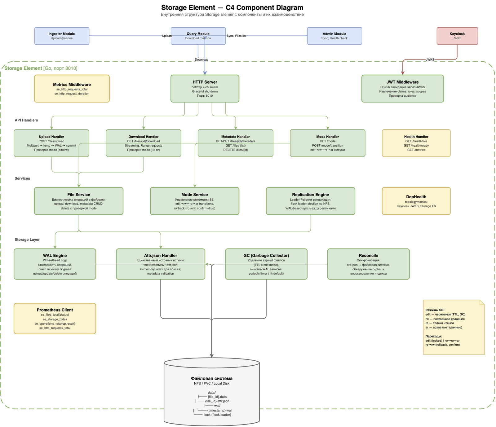
*Рисунок 5.1 — C4 Component диаграмма: внутренняя структура SE*

Ключевые компоненты:
- **WAL (Write-Ahead Log)** — обеспечивает атомарность файловых операций. Последовательность: запись WAL → запись файла → создание `attr.json` → коммит WAL
- **Обработчик attr.json** — управляет файлами метаданных. `*.attr.json` — единственный источник истины для метаданных файлов
- **GC (Garbage Collector)** — запускается периодически (`SE_GC_INTERVAL`), удаляет просроченные временные файлы
- **Механизм сверки** — периодически (`SE_RECONCILE_INTERVAL`) синхронизирует метаданные attr.json с фактическим состоянием файловой системы
- **In-Memory индекс** — быстрый поиск файлов по ID, перестраивается при запуске из файлов attr.json
- **Health Check** — предоставляет endpoint-ы `/health/live` и `/health/ready`
- **Метрики Prometheus** — предоставляет endpoint `/metrics`

### 5.3 Регистрация Storage Element

**В Kubernetes** — Поды SE регистрируются автоматически при обнаружении Admin Module. Admin UI предоставляет кнопку «Обнаружить» для сканирования новых сервисов SE в namespace.

**Через API** (для удалённых SE):

```bash
curl -X POST "https://artstore.example.com/api/v1/storage-elements" \
  -H "Authorization: Bearer $TOKEN" \
  -H "Content-Type: application/json" \
  -d '{
    "name": "se-remote-datacenter-01",
    "url": "https://se-dc01.example.com:8010",
    "priority": 10
  }'
```

**Через Admin UI** — Перейдите на страницу Storage Elements → нажмите «Добавить» → введите имя, URL и приоритет.

После регистрации Admin Module выполняет:
1. Health-check для проверки доступности SE
2. Полную синхронизацию файлов для импорта существующих файлов в реестр
3. Периодические health-check-и (`AM_DEPHEALTH_CHECK_INTERVAL`)

**Приоритет** — Меньшее значение = более высокий приоритет. Используется алгоритмом Sequential Fill Ingester Module для определения порядка заполнения SE.

### 5.4 Репликация (высокая доступность)

При `SE_REPLICA_MODE=replicated` несколько экземпляров SE разделяют файловую систему NFS v4+ по модели Лидер/Фолловер.

**Выбор лидера**: через блокировку `flock()` файла `.leader.lock` в общей директории NFS. Без внешних зависимостей (без etcd, без Redis).

**Распределение ролей**:

| Операция | Лидер | Фолловер |
|----------|:-----:|:--------:|
| Загрузка | Да | Проксирует лидеру |
| Скачивание | Да | Да |
| Удаление | Да | Проксирует лидеру |
| Обновление метаданных | Да | Проксирует лидеру |
| Список / метаданные | Да | Да |
| GC | Да | Нет |
| Сверка | Да | Нет |
| WAL | Да | Нет |
| Смена режима | Да | Проксирует лидеру |

**Поведение фолловера**:
- Обнаруживает адрес лидера через файл `.leader.info` на NFS
- Перестраивает in-memory индекс при запуске и обновляет каждые `SE_INDEX_REFRESH_INTERVAL` (по умолчанию 30 с)
- Метаданные на фолловере могут отставать от лидера до `SE_INDEX_REFRESH_INTERVAL`
- При отказе лидера фолловер захватывает блокировку и автоматически становится новым лидером

### 5.5 Планирование ёмкости

**Алгоритм Sequential Fill** — Ingester Module заполняет экземпляры SE в порядке приоритета (по возрастанию). Когда один SE достигает ёмкости (возвращает HTTP 507), IM повторяет попытку со следующим доступным SE.

Рекомендации:
- Обеспечьте как минимум один `edit` SE и один `rw` SE для нормальной работы
- Мониторьте отношение `se_storage_bytes` / `SE_MAX_CAPACITY` — оповещение при 80%, критическое при 90%
- При добавлении нового SE устанавливайте более низкий приоритет (большее число) для заполнения существующих SE в первую очередь
- Для крупных развёртываний используйте несколько SE с одинаковой ёмкостью для сбалансированного распределения

### 5.6 Гео-распределённые Storage Elements

Для гибридных развёртываний с SE в удалённых ЦОД:

1. **Сеть**: Обеспечьте стабильное WAN-соединение между кластером K8s и удалённым SE. Задержка влияет на скорость загрузки/скачивания, но не на стабильность системы
2. **TLS**: Всегда включайте TLS для WAN-соединений (`SE_TLS_CERT`, `SE_TLS_KEY`)
3. **Доверие CA**: Настройте AM, IM, QM с CA-сертификатом удалённого SE
4. **DNS**: Удалённый SE должен быть разрешим из подов K8s
5. **Файрвол**: Разрешите HTTPS (порт SE) из кластера K8s к удалённому SE
6. **Приоритет**: Назначьте более высокий приоритет (меньшее число) локальным SE для быстрого доступа; более низкий приоритет (большее число) удалённым SE

**Репликация между ЦОД**: Напрямую через NFS не поддерживается (требуется файловая система общего доступа с низкой задержкой). Для гео-репликации разворачивайте отдельные standalone-экземпляры SE и используйте реестр файлов Admin Module для отслеживания расположения файлов.

---

## 6. Admin UI

Admin UI — веб-приложение, встроенное в бинарный файл Admin Module. Использует Templ (Go-шаблоны), HTMX для динамического контента, Alpine.js для клиентской интерактивности и Tailwind CSS для стилизации.

Доступ к Admin UI: `https://<домен>/admin/`

### 6.1 Процесс аутентификации

Admin UI использует Authorization Code flow Keycloak с PKCE (S256):

1. Пользователь переходит на `/admin/` в браузере
2. Admin Module обнаруживает отсутствие активной сессии → перенаправляет на страницу логина Keycloak
3. Пользователь вводит учётные данные на странице логина Keycloak (с пользовательской темой `artstore`)
4. Keycloak перенаправляет обратно на Admin Module с authorization code
5. Admin Module обменивает код на JWT-токены через token endpoint Keycloak
6. JWT хранится в AES-GCM зашифрованном HTTP-only cookie

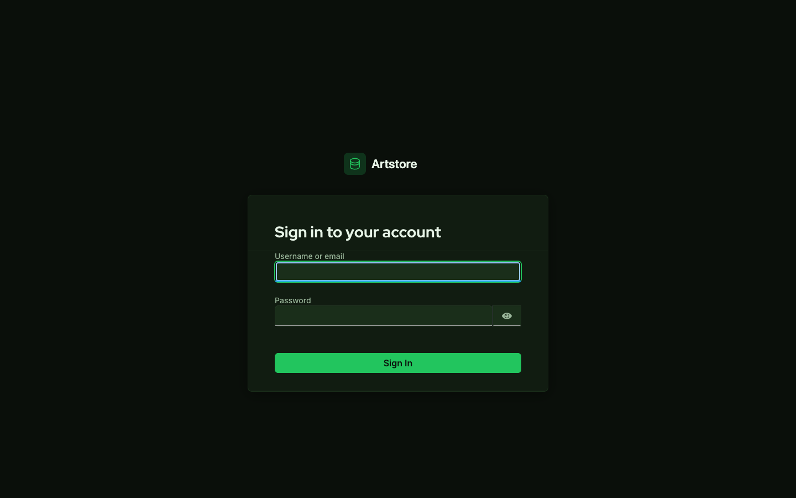
*Рисунок 6.1 — Страница логина Keycloak с пользовательской темой Artstore*

### 6.2 Дашборд

Дашборд предоставляет обзор системы в реальном времени:

- Карточки метрик: количество SE по статусам, файлы по режимам SE, общее использование/доступность хранилища
- Статус зависимостей: подключение к PostgreSQL и Keycloak
- Список SE с индикаторами режимов, статуса и прогресс-барами ёмкости
- Графики использования хранилища (ApexCharts)

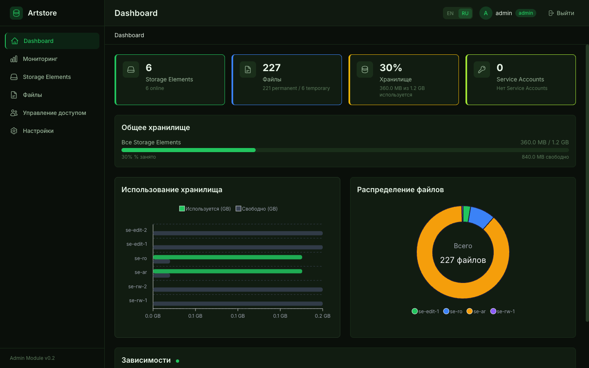
*Рисунок 6.2 — Дашборд Admin UI с обзором системы*

### 6.3 Страница Storage Elements

Управление всеми зарегистрированными Storage Elements:

- Таблица с колонками: имя, режим, статус, ёмкость (прогресс-бар), количество файлов, задержка, время последней синхронизации
- Действия: обнаружение новых SE, ручная регистрация SE, редактирование настроек SE, запуск ручной синхронизации, удаление SE
- Смена режима: изменение режима SE через жизненный цикл (`rw` → `ro` → `ar`, или обратно `ro` → `rw` с подтверждением)

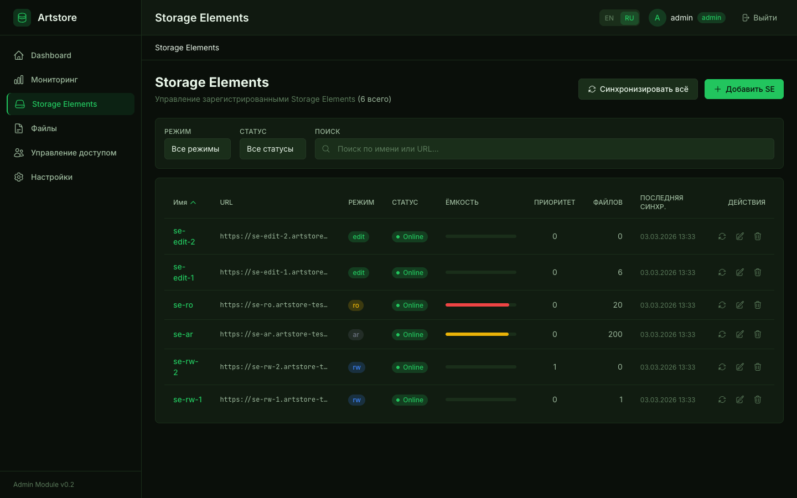
*Рисунок 6.3 — Список Storage Elements со статусом и ёмкостью*

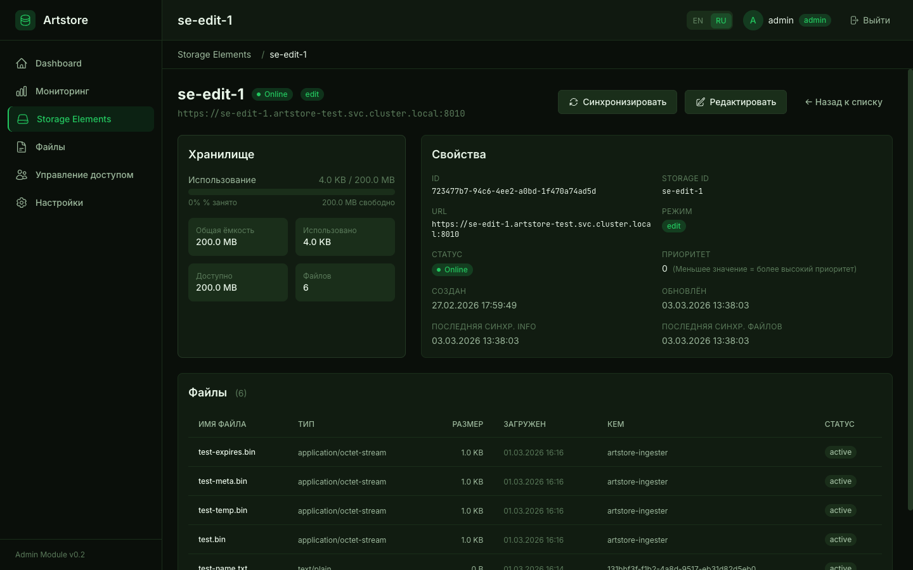
*Рисунок 6.4 — Детальный вид Storage Element*

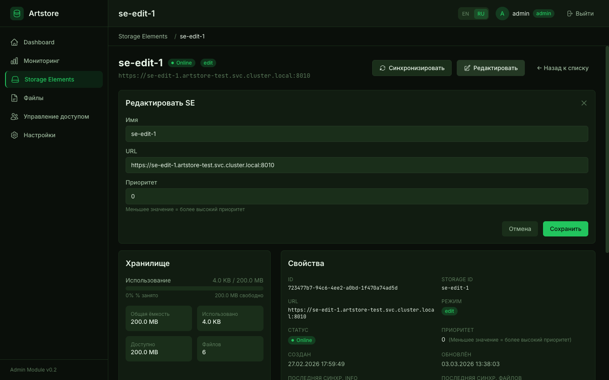
*Рисунок 6.5 — Диалог смены режима SE*

### 6.4 Страница файлов

Просмотр и управление реестром файлов:

- Таблица файлов с метаданными: имя, размер, тип контента, расположение SE, политика хранения, статус, дата загрузки
- Фильтры: по статусу (активные/удалённые/просроченные), политике хранения, SE, типу контента
- Поиск: по имени файла (подстрока)
- Модальное окно деталей файла с полными метаданными
- Мягкое удаление (только роль admin): отмечает файл как удалённый в реестре

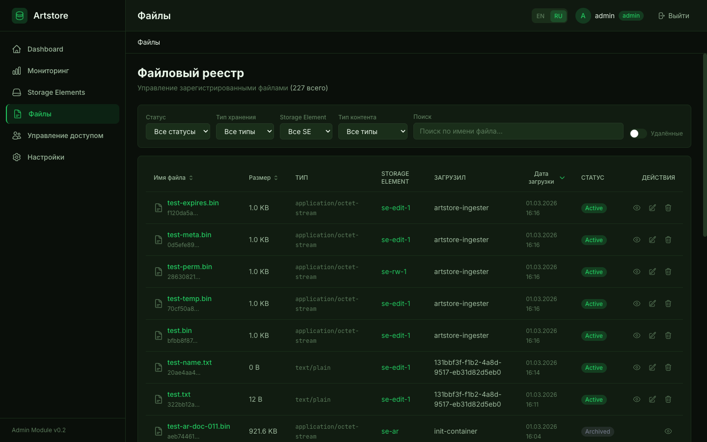
*Рисунок 6.6 — Реестр файлов с фильтрами*

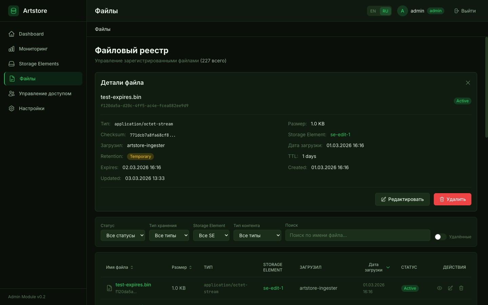
*Рисунок 6.7 — Детальный вид файла*

### 6.5 Страница мониторинга

Встроенный мониторинг без внешних инструментов:

- Здоровье зависимостей: статус PostgreSQL, Keycloak и каждого SE
- Графики задержек проверок зависимостей
- Статус фоновых задач: прогресс синхронизации файлов и SA


*Рисунок 6.8 — Мониторинг: здоровье зависимостей и графики задержек*

### 6.6 Управление доступом

**Вкладка «Пользователи»** — Просмотр пользователей из Keycloak с их ролями. Администратор может повысить роль пользователя локально (напр., `readonly` → `admin`). Понижение роли невозможно — эффективная роль = max(роль из IdP, локальное переопределение).

**Вкладка «Service Accounts»** — Управление межсервисными (M2M) Service Accounts:
- Просмотр списка SA с правами и статусом синхронизации
- Создание нового SA (создаёт соответствующего клиента Keycloak с префиксом `sa_`)
- Редактирование прав SA
- Ротация секрета SA (отображается однократно после генерации)
- Удаление SA
- Синхронизация с Keycloak (ручной запуск)

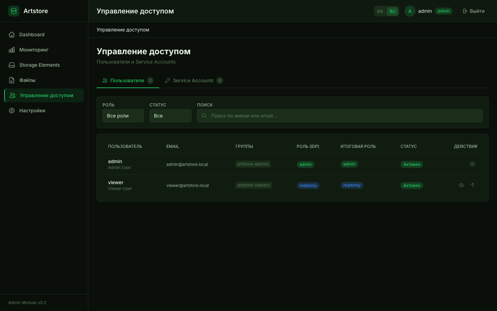
*Рисунок 6.9 — Управление Service Accounts*

### 6.7 Страница настроек

Настройка параметров Admin Module в runtime (требуется роль admin):

- URL Prometheus, переключатель включения/выключения
- Настройки таймаута запросов и периода хранения

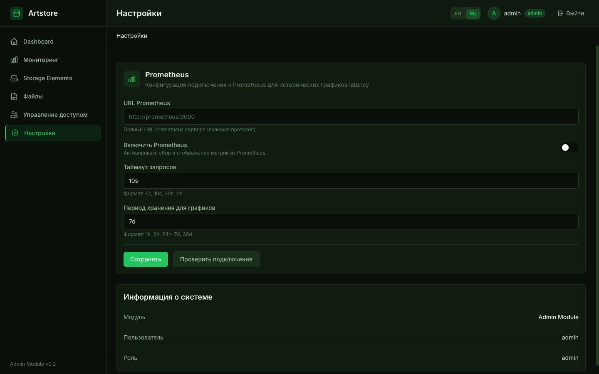
*Рисунок 6.10 — Страница настроек*

---

## 7. Конфигурация Keycloak

Artstore использует Keycloak как провайдера идентификации (IdP) для всей аутентификации и авторизации. В этом разделе приведены подробные инструкции по настройке realm `artstore`.

### 7.1 Настройки Realm

Создайте новый realm с именем `artstore` со следующими настройками:

**Общие**:

| Настройка | Значение | Примечания |
|-----------|----------|------------|
| Имя realm | `artstore` | Изолированный realm для проекта |
| Отображаемое имя | `Artstore` | Показывается на странице логина |
| Тема логина | `artstore` | Пользовательская тема (см. [§7.7](#77-пользовательская-тема-keycloak)) |
| Алгоритм подписи по умолчанию | `RS256` | Все модули валидируют RS256 JWT |

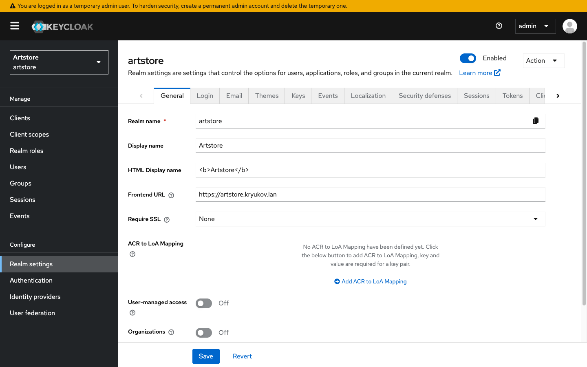
*Рисунок 7.1 — Общие настройки realm*

**Логин**:

| Настройка | Значение | Примечания |
|-----------|----------|------------|
| Регистрация пользователей | Отключена | Пользователи создаются только администратором |
| Забытый пароль | Отключён | Не требуется для начального развёртывания |
| Запомнить меня | Включено | Удобство для пользователей Admin UI |
| Вход по email | Отключён | Вход только по имени пользователя |

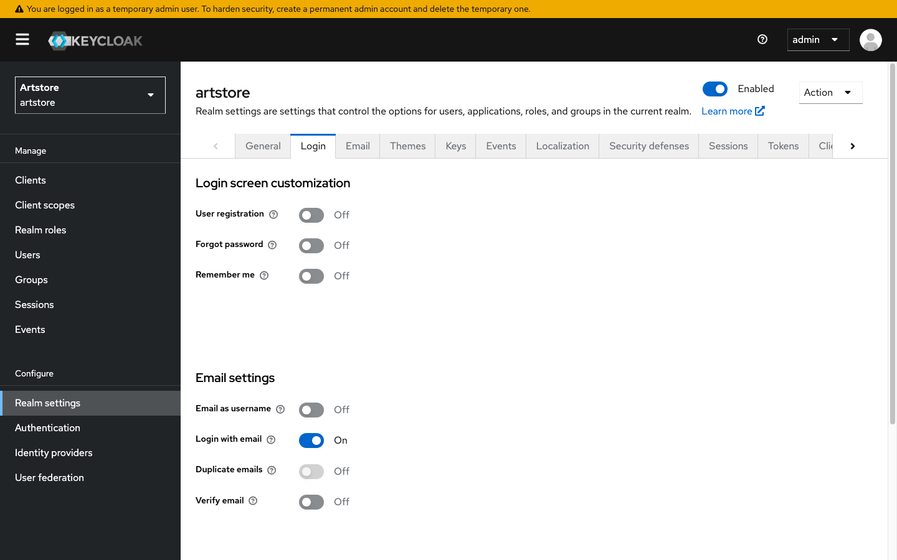
*Рисунок 7.2 — Настройки логина realm*

**Сессии**:

| Настройка | Значение |
|-----------|----------|
| Тайм-аут бездействия SSO | 1800 секунд (30 мин) |
| Максимум сессии SSO | 36000 секунд (10 часов) |

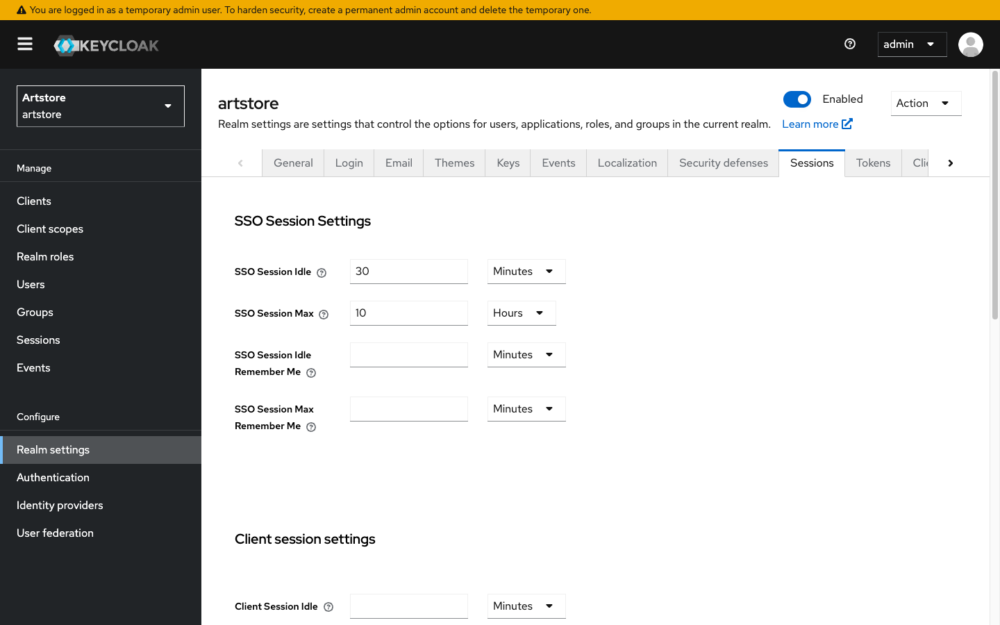
*Рисунок 7.3 — Настройки сессий realm*

**Токены**:

| Настройка | Значение | Примечания |
|-----------|----------|------------|
| Время жизни Access Token | 300 секунд (5 мин) | Короткоживущий для безопасности |
| Защита от перебора | Включена | 5 попыток, постоянная блокировка на 900 с |

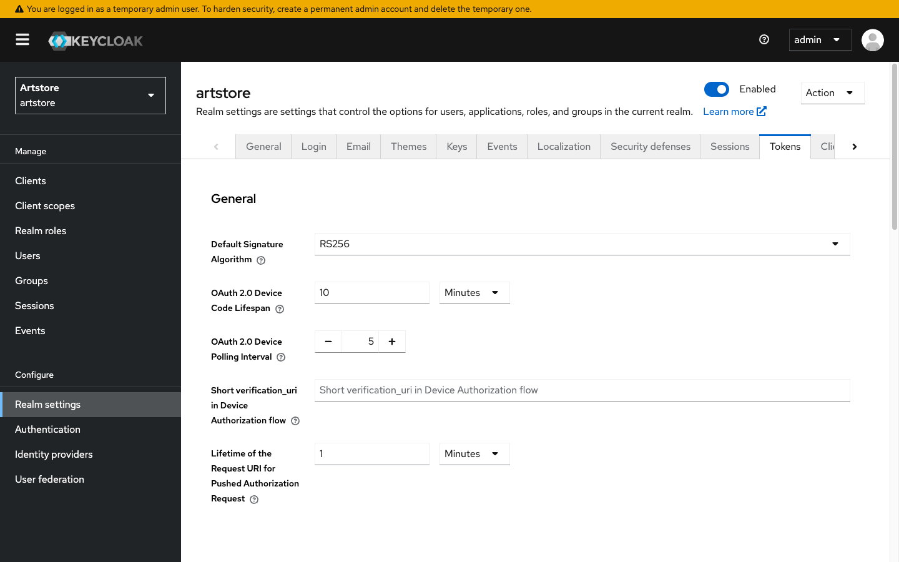
*Рисунок 7.4 — Настройки токенов realm*

### 7.2 Роли и группы Realm

**Роли** — Создайте две роли realm:

| Роль | Описание |
|------|----------|
| `admin` | Полный доступ: CRUD-операции, управление SE, SA и настройками |
| `readonly` | Доступ только для чтения: просмотр файлов, SE и данных мониторинга |

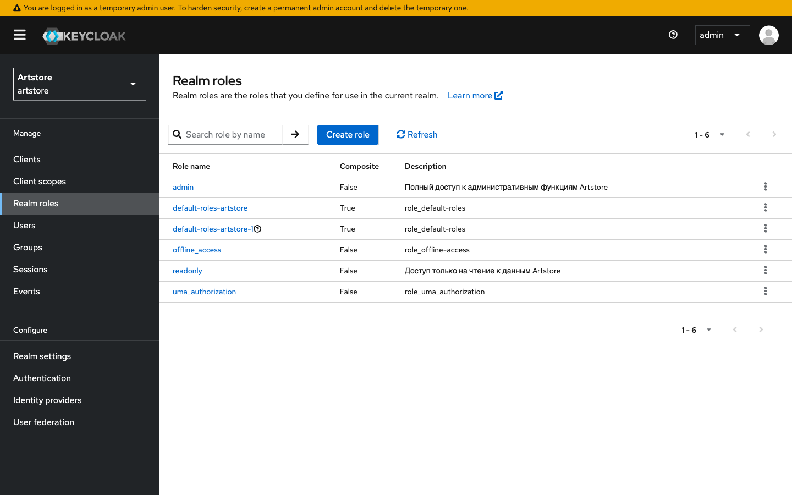
*Рисунок 7.5 — Роли realm*

**Группы** — Создайте две группы с маппингом ролей:

| Группа | Маппинг роли | Назначение |
|--------|-------------|------------|
| `artstore-admins` | `admin` | Участники получают роль admin через членство в группе |
| `artstore-viewers` | `readonly` | Участники получают роль readonly через членство в группе |

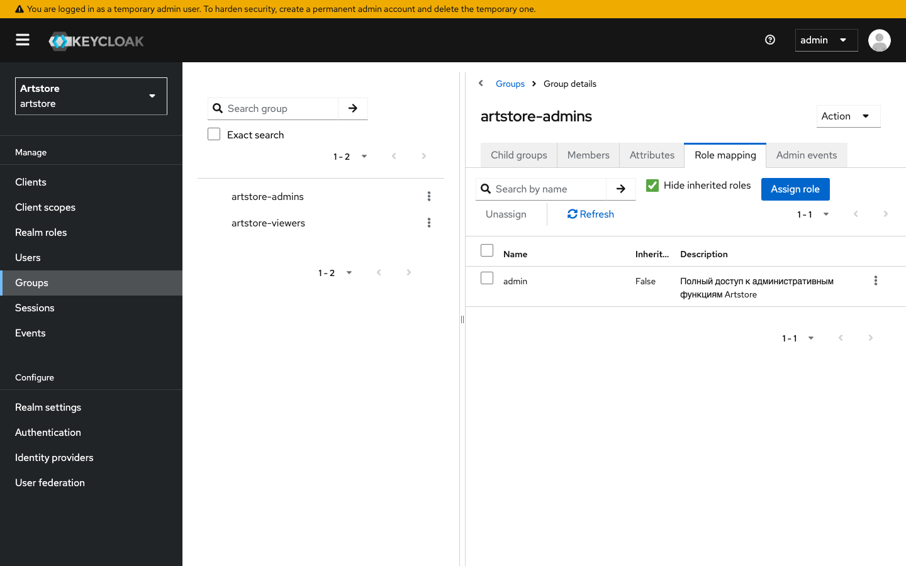
*Рисунок 7.6 — Группа artstore-admins с маппингом роли admin*

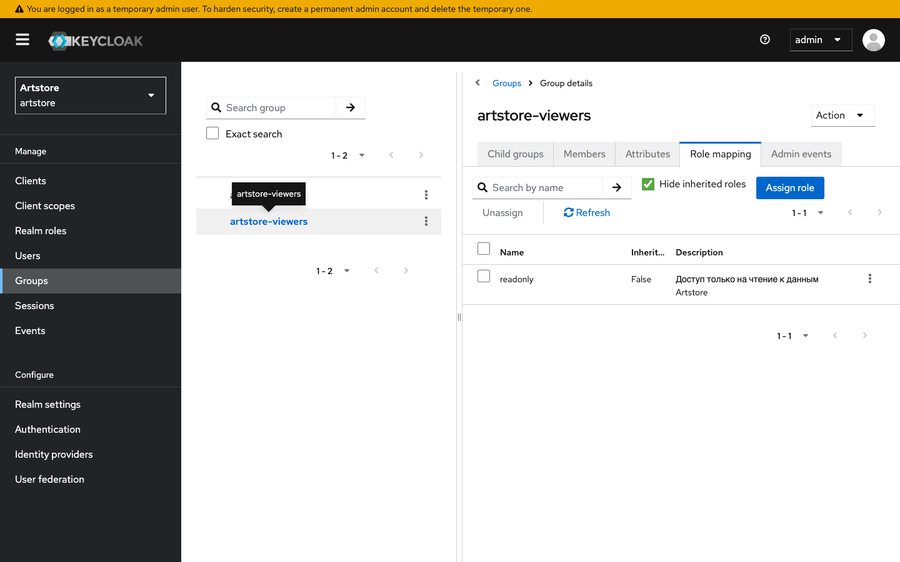
*Рисунок 7.7 — Группа artstore-viewers с маппингом роли readonly*

Назначение ролей работает через членство в группах. Модули настраивают маппинг групп в роли через переменные среды (напр., `AM_ROLE_ADMIN_GROUPS=artstore-admins`).

### 7.3 Client Scopes

Client scopes определяют гранулярные разрешения для Service Accounts. Каждый scope включает `oidc-audience-mapper` для добавления claim audience в access token.

**Бизнес-скоупы**:

| Scope | Описание | Используется |
|-------|----------|-------------|
| `files:read` | Чтение метаданных файлов и скачивание | IM, QM, AM |
| `files:write` | Загрузка, обновление и удаление файлов | IM, AM |
| `storage:read` | Чтение информации о SE | IM, QM, AM |
| `storage:write` | Управление SE (синхронизация, смена режима) | AM |
| `admin:read` | Чтение административных данных (пользователи, SA) | AM |
| `admin:write` | Управление пользователями и SA | AM |

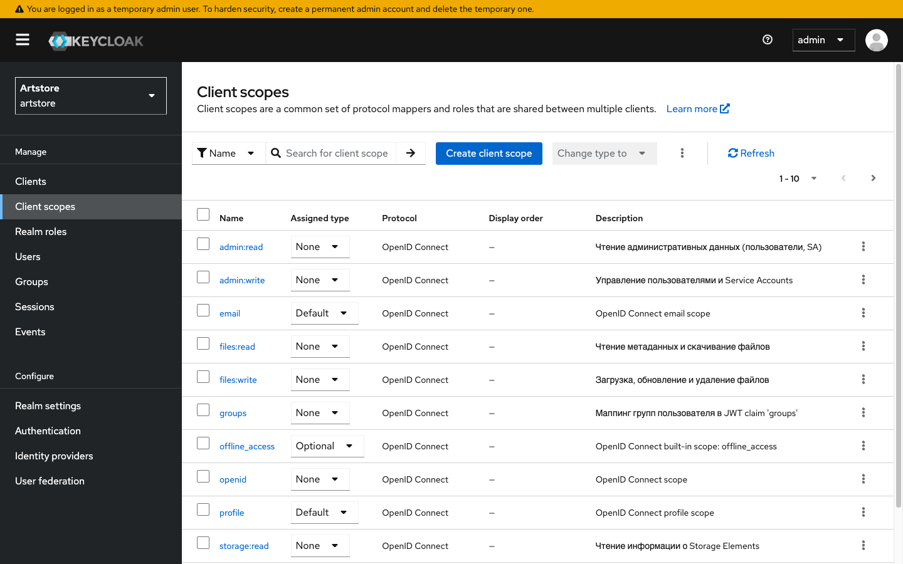
*Рисунок 7.8 — Список client scopes*

**Пример: scope `files:read`**:

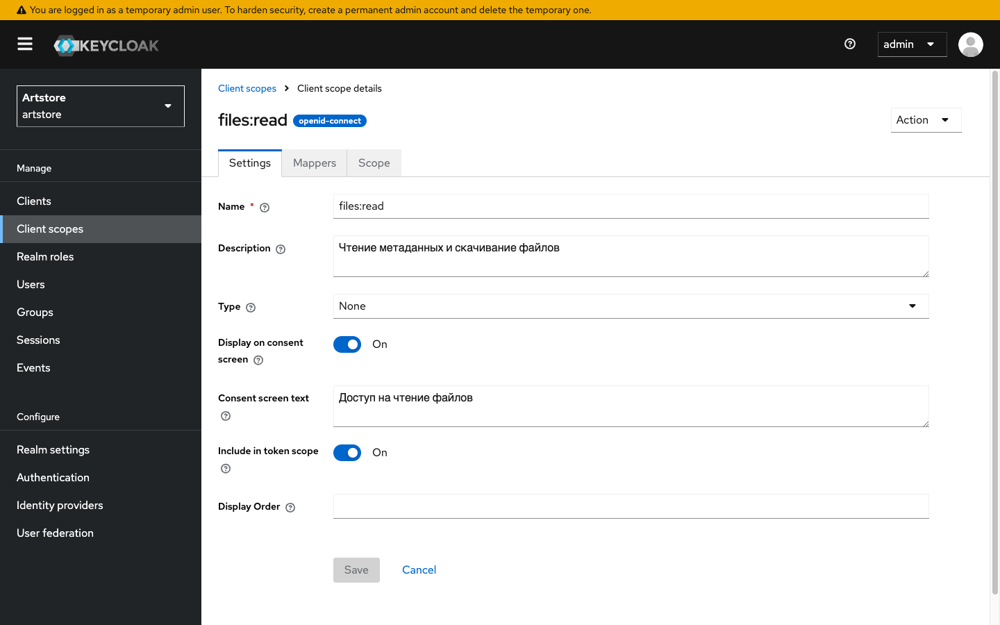
*Рисунок 7.9 — Настройки scope files:read*

Каждый scope имеет audience mapper, добавляющий имя scope в claim `aud`:

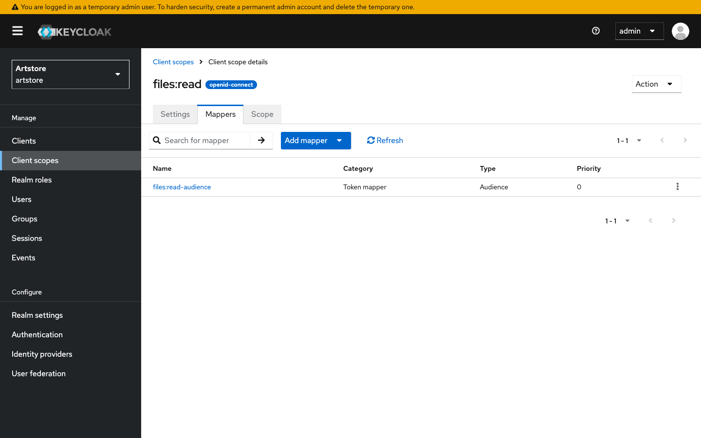
*Рисунок 7.10 — Audience mapper scope files:read*

**Специальный scope: `groups`** — Этот scope использует `group-membership-mapper` для включения имён групп в JWT:

| Настройка маппера | Значение |
|-------------------|----------|
| Тип маппера | Group Membership |
| Имя claim | `groups` |
| Полный путь группы | Выкл (короткие имена без префикса `/`) |

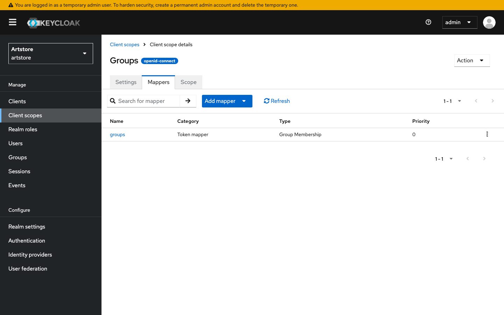
*Рисунок 7.11 — Scope Groups с маппером группового членства*

Claim `groups` необходим для ролевой авторизации. Модули используют его для определения ролей пользователей через маппинг групп в роли.

### 7.4 Клиенты

Artstore использует четыре клиента Keycloak:

#### 7.4.1 artstore-admin-module — Service Account Admin Module

| Настройка | Значение |
|-----------|----------|
| Тип клиента | Confidential (client-secret) |
| Поток аутентификации | Client Credentials |
| Service Account | Включён |
| Standard flow | Отключён |

**Client Scopes** (назначенные): `files:read`, `files:write`, `storage:read`, `storage:write`, `admin:read`, `admin:write`, `groups`

**Роли управления realm для Service Account**: `view-users`, `manage-clients`, `view-clients`, `manage-users`, `view-realm`, `query-users`, `query-clients`

Эти роли позволяют Admin Module управлять ресурсами Keycloak: синхронизировать Service Accounts, читать информацию о пользователях и управлять клиентами SA.


*Рисунок 7.12 — Настройки клиента Admin Module*

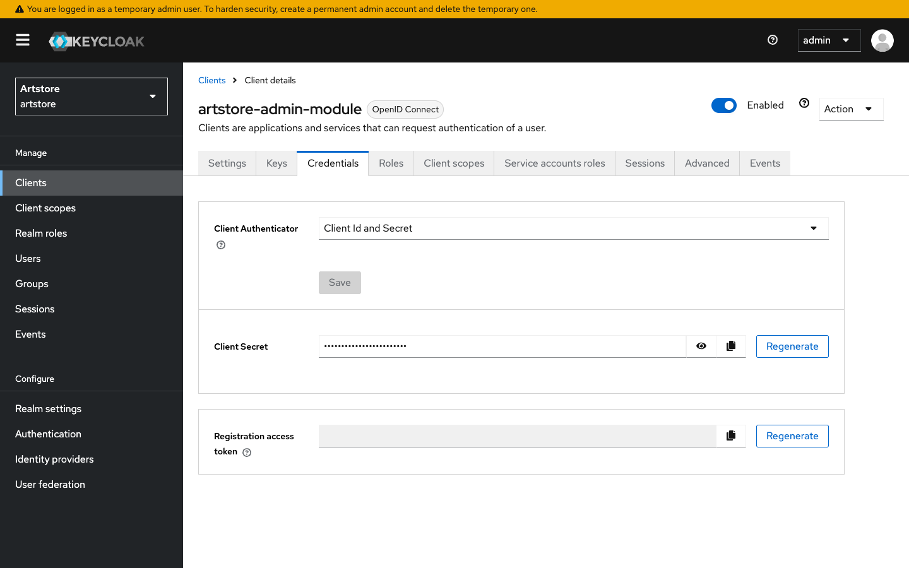
*Рисунок 7.13 — Учётные данные клиента Admin Module*

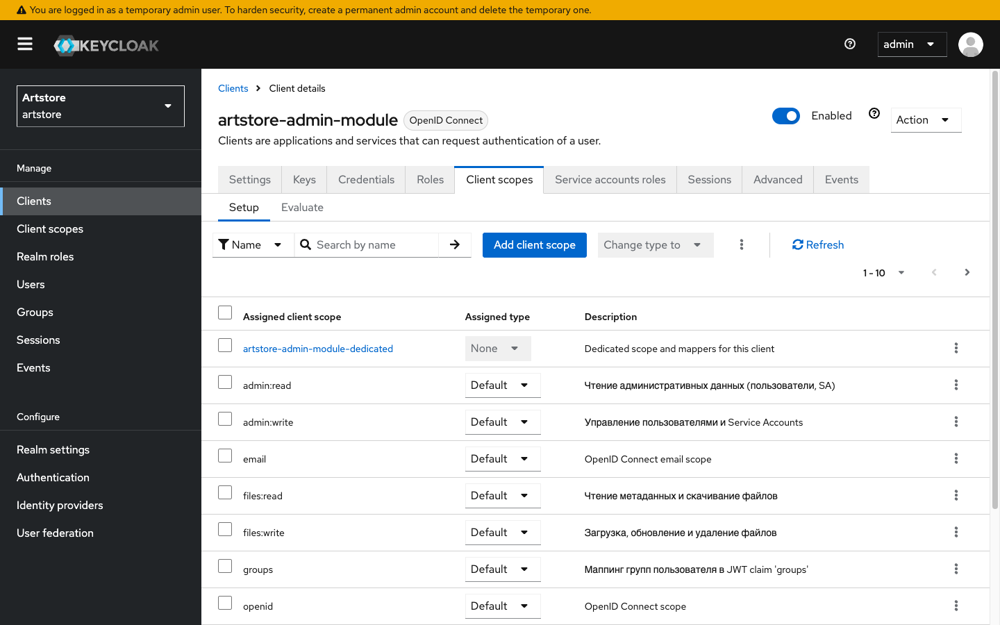
*Рисунок 7.14 — Назначенные scopes Admin Module*

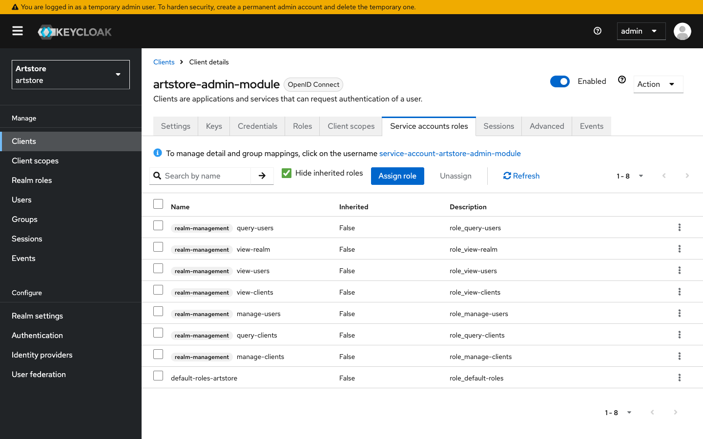
*Рисунок 7.15 — Роли управления realm для Service Account Admin Module*

#### 7.4.2 artstore-ingester — Service Account Ingester Module

| Настройка | Значение |
|-----------|----------|
| Тип клиента | Confidential (client-secret) |
| Поток аутентификации | Client Credentials |
| Service Account | Включён |

**Client Scopes** (назначенные): `files:read`, `files:write`, `storage:read`

Ingester Module нуждается в чтении информации о SE (для выбора цели загрузки), записи файлов (загрузка на SE) и регистрации файлов в Admin Module.

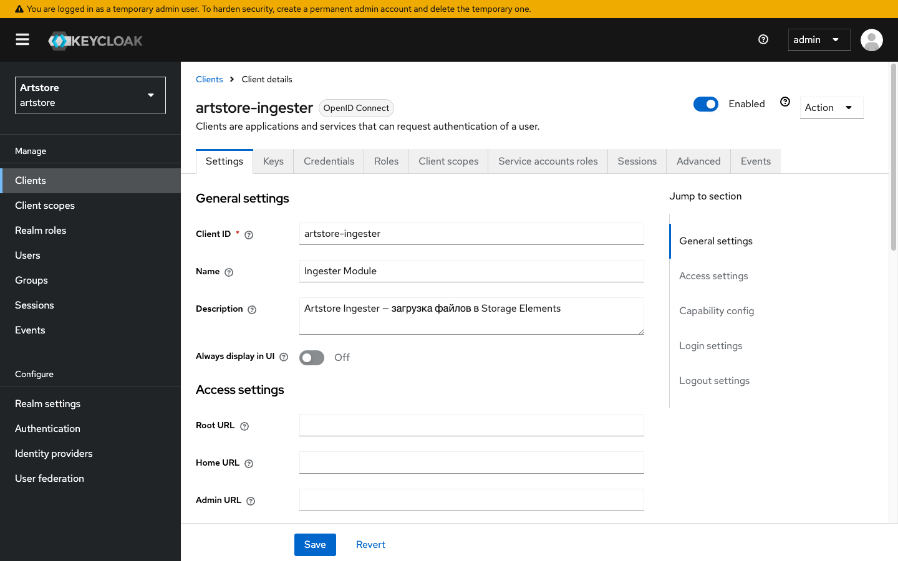
*Рисунок 7.16 — Настройки клиента Ingester Module*

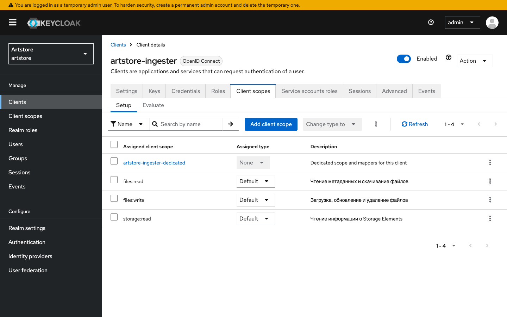
*Рисунок 7.17 — Назначенные scopes Ingester Module*

#### 7.4.3 artstore-query — Service Account Query Module

| Настройка | Значение |
|-----------|----------|
| Тип клиента | Confidential (client-secret) |
| Поток аутентификации | Client Credentials |
| Service Account | Включён |

**Client Scopes** (назначенные): `files:read`, `storage:read`

Query Module нуждается в чтении метаданных файлов (для поиска и определения расположения) и информации о SE (для проксирования скачивания).


*Рисунок 7.18 — Настройки клиента Query Module*

#### 7.4.4 artstore-admin-ui — Браузерный клиент Admin UI

| Настройка | Значение |
|-----------|----------|
| Тип клиента | Public (без client secret) |
| Поток аутентификации | Authorization Code + PKCE (S256) |
| Standard flow | Включён |
| Direct access grants | Отключён |
| Redirect URIs | `https://<домен>/*` |

**Scopes по умолчанию**: `openid`, `profile`, `email`, `groups`

Этот клиент используется Admin UI для аутентификации через браузер. Использует PKCE для защиты потока authorization code без client secret.

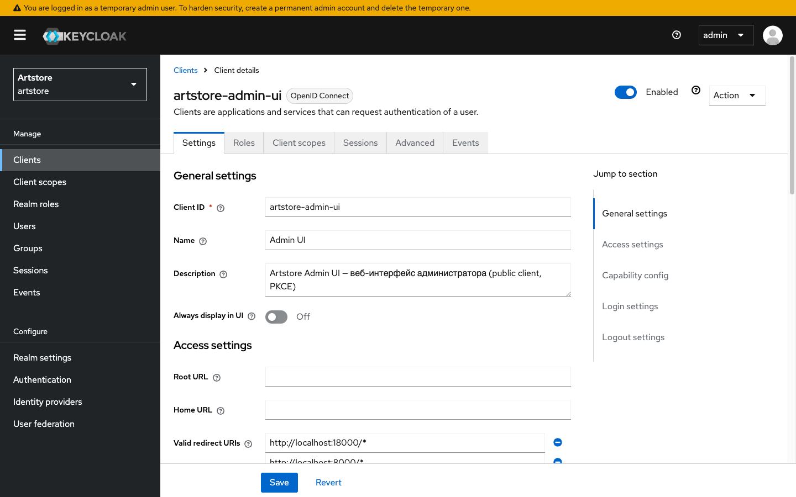
*Рисунок 7.19 — Настройки клиента Admin UI*

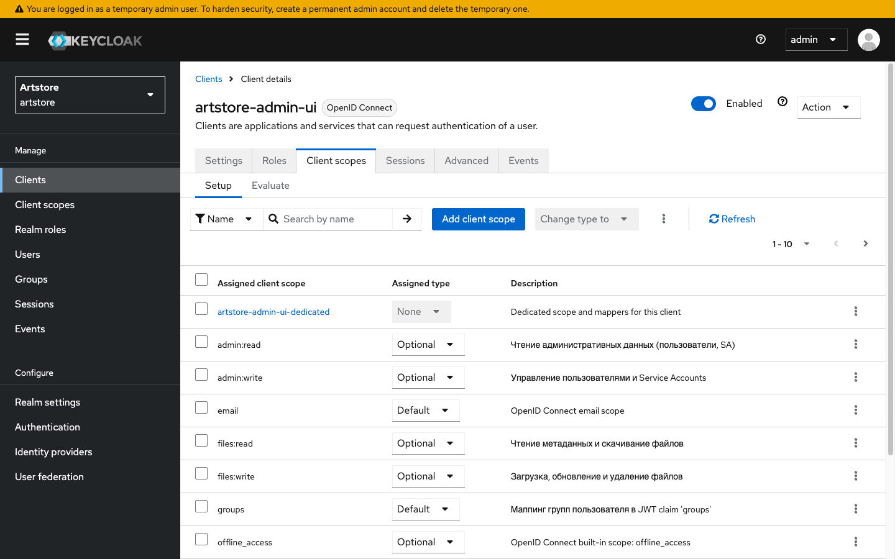
*Рисунок 7.20 — Назначенные scopes Admin UI*

### 7.5 Маппер client_id (критически важный)

> **Это критически важный элемент конфигурации. Без него межсервисная авторизация работать не будет.**

Все клиенты Service Account (`artstore-admin-module`, `artstore-ingester`, `artstore-query`) **обязательно** должны иметь protocol mapper, добавляющий claim `client_id` в access token.

| Настройка маппера | Значение |
|-------------------|----------|
| Имя | `client_id` |
| Тип маппера | User Session Note |
| User Session Note | `client_id` |
| Имя claim в токене | `client_id` |
| Тип JSON claim | String |
| Добавить в access token | Вкл |
| Добавить в ID token | Выкл |

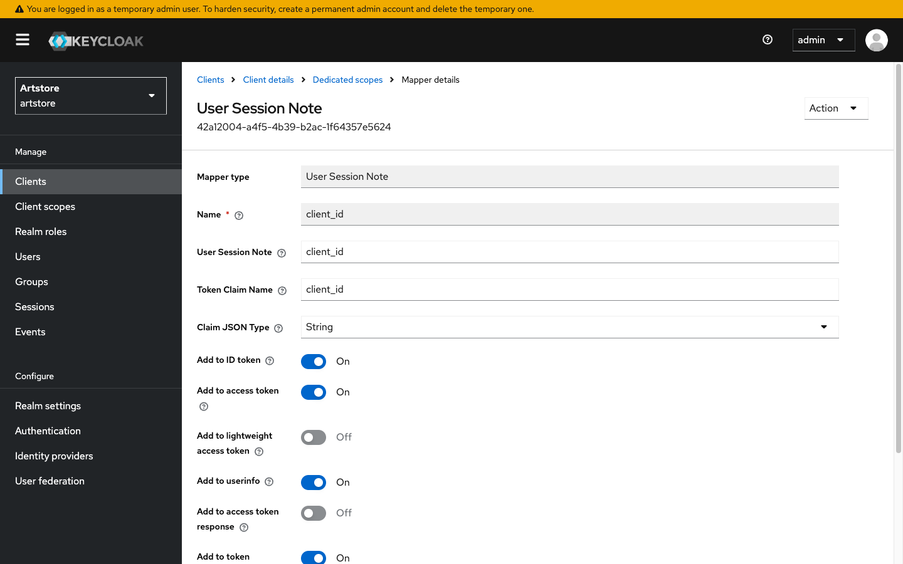
*Рисунок 7.21 — Конфигурация маппера client_id*

**Зачем это нужно?** — Admin Module использует claim `client_id` в SA-токенах для идентификации Service Account, выполняющего запрос. Этот claim сопоставляется с таблицей `service_accounts` для определения прав SA (scopes). Без этого маппера access token не будет содержать `client_id`, и Admin Module будет отклонять запросы SA.

**Как добавить**: В каждом клиенте SA → Client Scopes → Dedicated scope → Add mapper → By configuration → User Session Note → настроить как показано выше.

### 7.6 Паттерн двух URL для Kubernetes

В развёртываниях Kubernetes Keycloak обычно имеет два URL:

| Тип URL | Протокол | Назначение | Пример |
|---------|----------|------------|--------|
| Внутренний | HTTP | Запросы модулей к KC (JWKS, token endpoint) | `http://keycloak.artstore.svc:8080` |
| Внешний | HTTPS | Издатель JWT (claim `iss`), аутентификация в браузере | `https://artstore.example.com` |

**Конфигурация**:
- Claim JWT `iss` должен соответствовать **внешнему** URL (тому, что видит клиентское приложение)
- `JWKS_URL` и `TOKEN_URL` в конфигурации модулей должны использовать **внутренний** URL (для производительности, избежания TLS и внешнего роутинга)
- Редирект Admin UI использует **внешний** URL (браузер переходит на Keycloak)

Пример для Ingester Module:
```
IM_JWT_ISSUER=https://artstore.example.com/realms/artstore
IM_JWKS_URL=http://keycloak.artstore.svc:8080/realms/artstore/protocol/openid-connect/certs
IM_TOKEN_URL=http://keycloak.artstore.svc:8080/realms/artstore/protocol/openid-connect/token
```

### 7.7 Пользовательская тема Keycloak

Artstore включает пользовательскую тему логина Keycloak (`artstore`), соответствующую дизайну Admin UI:

- Кастомизация только CSS (родитель: `keycloak.v2`)
- Тёмно-зелёная цветовая схема: акцент `#22c55e`, фон `#0a0f0a`
- Шрифты: Inter (основной), JetBrains Mono (моноширинный)
- Локализация: английский и русский
- Docker-образ: `harbor.kryukov.lan/library/keycloak-artstore:v26.1-1`
- Исходники: `deploy/keycloak/Dockerfile`

Для использования пользовательской темы разверните предварительно собранный образ Keycloak и установите тему логина `artstore` в настройках realm.

### 7.8 Создание нового клиента (пошагово)

Для создания нового клиента Service Account (напр., для пользовательской интеграции):

**Шаг 1: Общие настройки**

- Нажмите «Create client» в разделе Clients
- Введите Client ID (напр., `sa_my-integration`)
- Введите описание

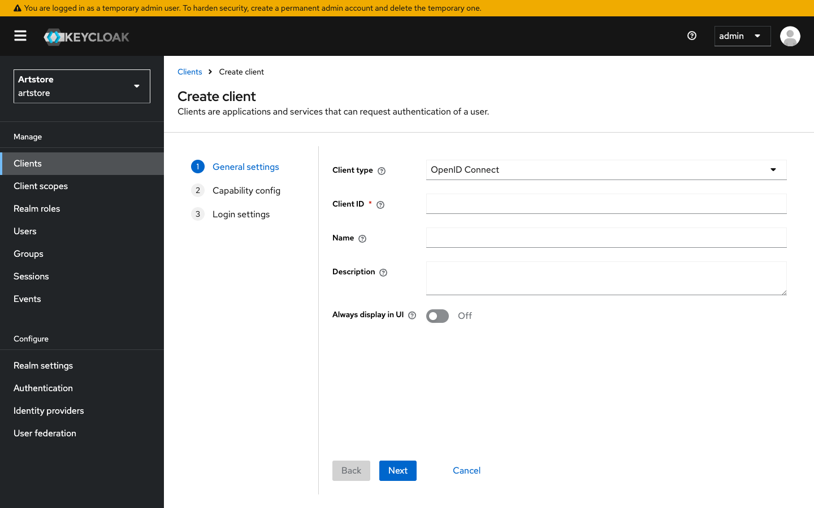
*Рисунок 7.22 — Визард создания клиента: общие настройки*

**Шаг 2: Конфигурация возможностей**

- Включите «Client authentication» (confidential)
- Включите «Service accounts roles»
- Отключите «Standard flow» и «Direct access grants»

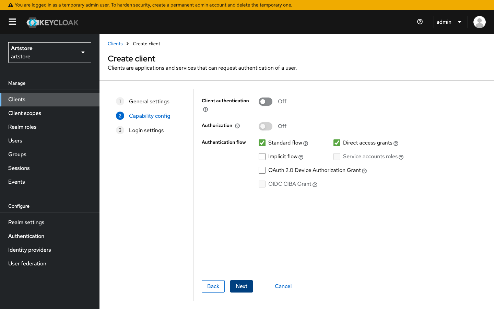
*Рисунок 7.23 — Визард создания клиента: конфигурация возможностей*

**Шаг 3: Настройки логина**

- Оставьте redirect URI пустыми (не нужны для Client Credentials flow)
- Нажмите «Save»

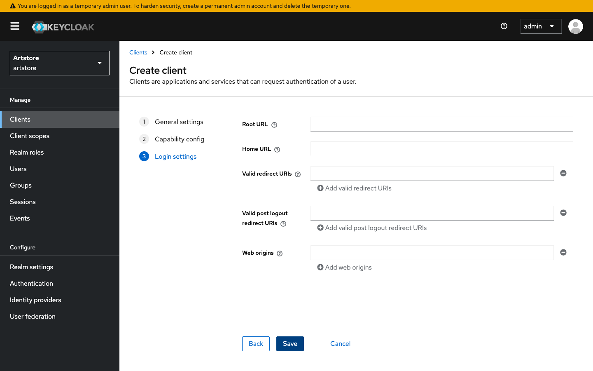
*Рисунок 7.24 — Визард создания клиента: настройки логина*

**Шаг 4: Назначение Client Scopes**

- Перейдите в новый клиент → вкладка «Client scopes»
- Добавьте необходимые scopes (напр., `files:read`, `storage:read`)

**Шаг 5: Добавление маппера client_id**

- Перейдите в «Client scopes» → dedicated scope клиента
- Нажмите «Add mapper» → «By configuration»
- Выберите «User Session Note»
- Настройте как описано в [§7.5](#75-маппер-client_id-критически-важный)

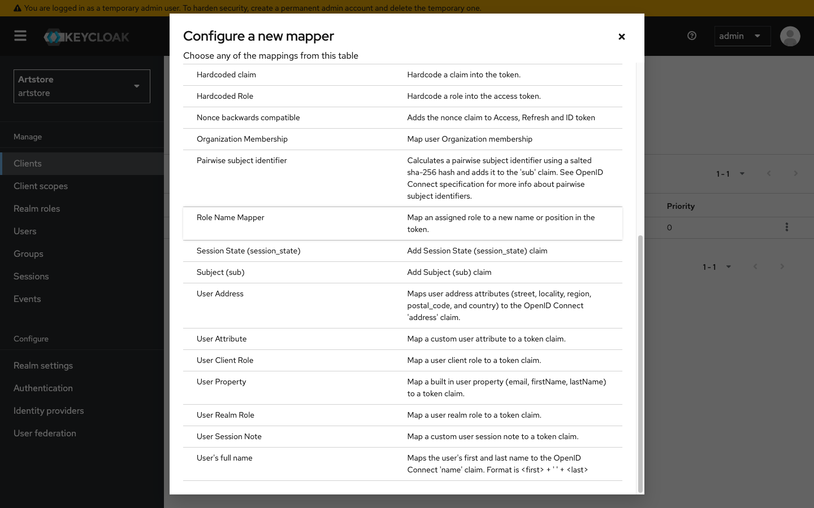
*Рисунок 7.25 — Добавление маппера в dedicated scope клиента*

**Шаг 6: Копирование учётных данных**

- Перейдите на вкладку «Credentials»
- Скопируйте client secret — он будет использоваться как пароль Service Account

**Шаг 7: Регистрация в Admin Module**

- SA будет автоматически обнаружен Admin Module, если client ID начинается с настроенного префикса (`AM_KEYCLOAK_SA_PREFIX`, по умолчанию: `sa_`)
- Альтернативно, создайте SA вручную через Admin UI → Управление доступом → Service Accounts

---

## 8. Обновление

### 8.1 Порядок обновления

При обновлении компонентов Artstore следуйте данному порядку для минимизации простоя и проблем совместимости:

1. **PostgreSQL** — применить обновления версии при необходимости (редко, обычно обратно совместимы)
2. **Keycloak** — обновить и убедиться в целостности конфигурации realm
3. **Admin Module** — обновить первым среди модулей приложения (применяет миграции БД)
4. **Storage Elements** — обновлять по одному (rolling update в K8s)
5. **Ingester Module** — обновить (stateless, zero-downtime при нескольких репликах)
6. **Query Module** — обновить (минимальный простой при нескольких репликах)

> **Важно**: Всегда обновляйте Admin Module до IM и QM. AM применяет миграции базы данных, от которых могут зависеть IM/QM.

### 8.2 Миграции базы данных

Все миграции применяются автоматически при запуске модуля с помощью `golang-migrate` со встроенными файлами миграций:

- **Admin Module**: создаёт и обновляет таблицы (`file_registry`, `storage_elements`, `service_accounts` и др.)
- **Query Module**: создаёт и обновляет индексы для оптимизации чтения в `file_registry`

**Разделение таблиц миграций**:
- AM использует `schema_migrations` (по умолчанию)
- QM использует `schema_migrations_qm` (отдельная таблица для избежания конфликтов)

Ручные шаги миграции не требуются. Просто разверните новую версию — миграции запустятся автоматически при старте.

**Откат**: Если миграция завершится с ошибкой, модуль не запустится. Проверьте логи на предмет конкретной ошибки миграции. Миграции спроектированы с прямой совместимостью; откат требует восстановления резервной копии базы данных.

### 8.3 Совместимость версий

Artstore следует семантическому версионированию (`0.Y.Z` на стадии разработки):

- **Патч-версии** (`0.1.0` → `0.1.1`): исправления ошибок, обратно совместимы. Безопасно обновлять без координации
- **Минорные версии** (`0.1.0` → `0.2.0`): новые функции, могут включать миграции БД. Сначала обновите AM, затем другие модули
- **Мажорные версии** (`0.x.y` → `1.0.0`): потенциально ломающие изменения. Следуйте примечаниям к релизу

**Межмодульная совместимость**: Все модули в пределах одной минорной версии совместимы. При обновлении между минорными версиями всегда сначала обновляйте AM для применения изменений схемы.

### 8.4 Резервное копирование и восстановление

**PostgreSQL**:
- Используйте `pg_dump` для логических резервных копий
- Используйте `VolumeSnapshot` для PVC-резервных копий в Kubernetes
- Планируйте регулярные бэкапы (рекомендуется: ежедневный полный + почасовое архивирование WAL)

**Keycloak**:
- Экспорт конфигурации realm: `kcadm.sh export --realm artstore`
- JSON realm включает: настройки, клиентов, группы, роли, scopes (не пароли пользователей)
- Храните экспорт realm в системе контроля версий для воспроизводимых развёртываний

**Storage Elements**:
- Директория данных содержит файлы и метаданные `*.attr.json`
- Используйте бэкапы на уровне файловой системы или `VolumeSnapshot` для PVC
- В гибридных развёртываниях используйте стандартные инструменты бэкапа серверов (rsync, borgbackup и т.д.)

**Процедура восстановления**:

1. Восстановить PostgreSQL из резервной копии
2. Запустить Admin Module — он применит недостающие миграции
3. Service Accounts — восстановятся автоматически из Keycloak в следующем цикле синхронизации
4. Реестр файлов — восстановится автоматически через полную синхронизацию при подключении каждого SE
5. Локальные переопределения ролей — **восстановимы только из резервной копии PostgreSQL** (не хранятся внешне)
6. Система полностью работоспособна после завершения синхронизации всех SE

> **Примечание**: Реестр файлов в PostgreSQL — вторичный индекс. Если база данных утеряна и резервной копии нет, он может быть полностью перестроен путём запуска ручной синхронизации для каждого зарегистрированного Storage Element. Файлы `attr.json` на SE являются первичным источником истины.
