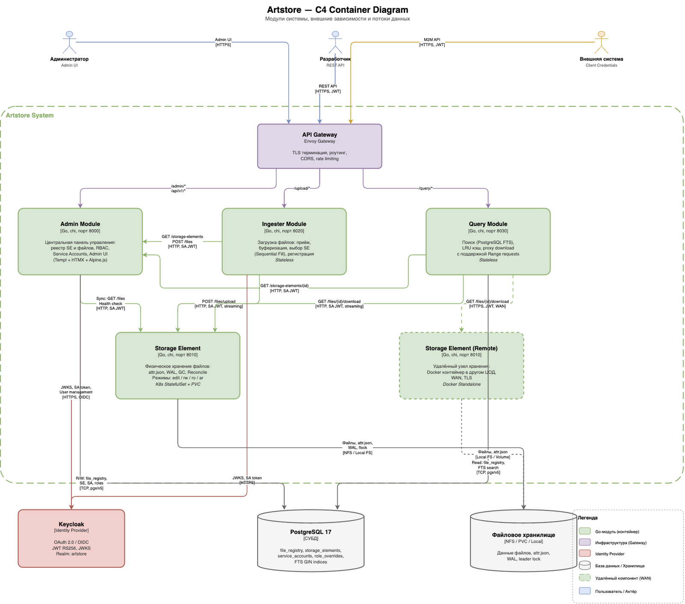
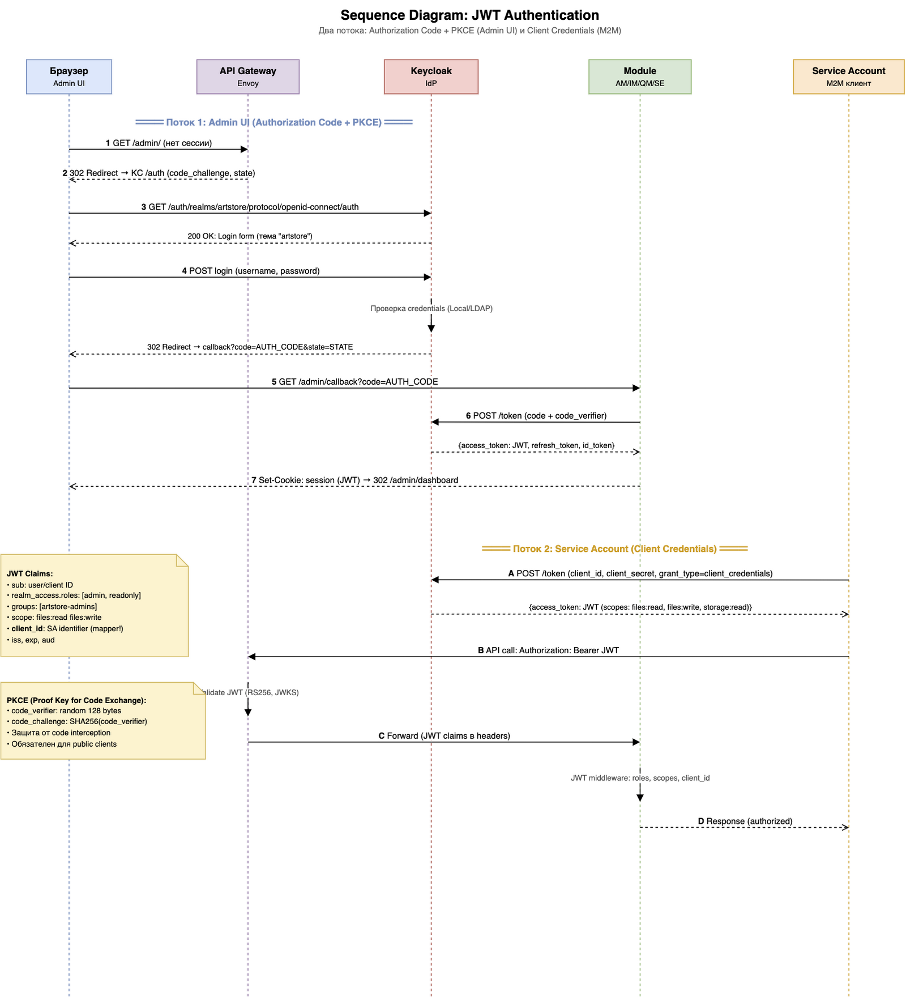
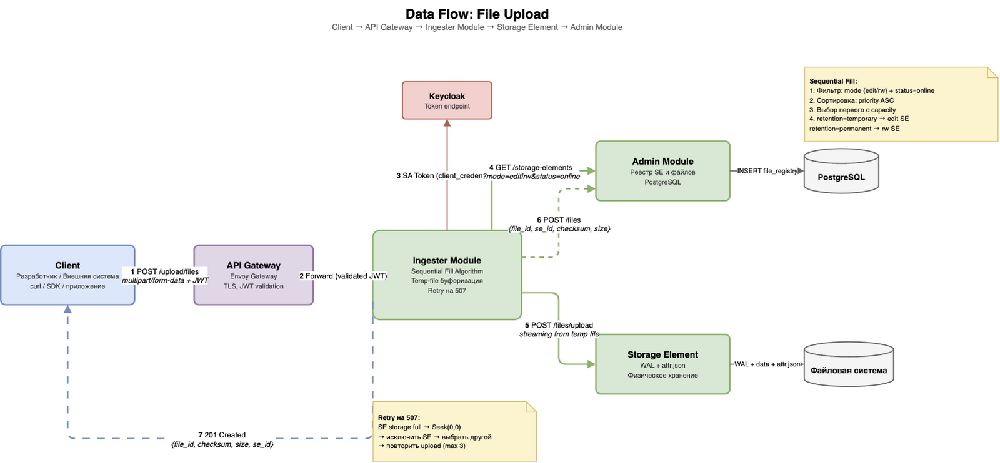
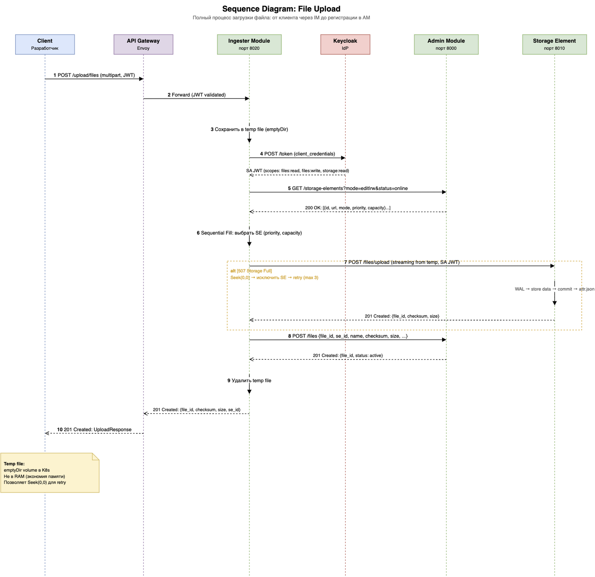
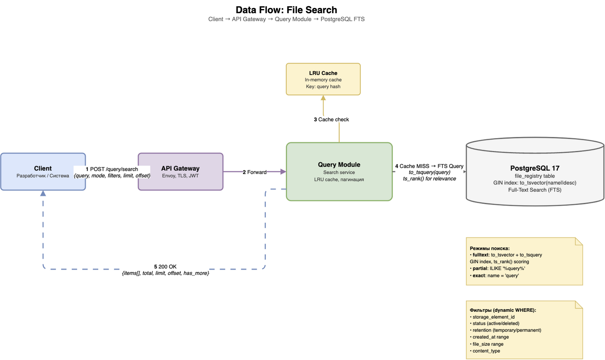
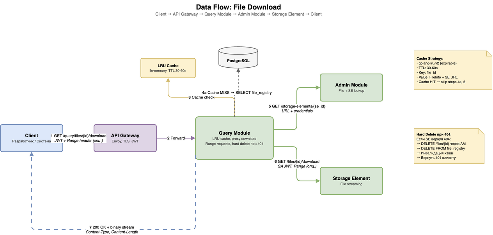
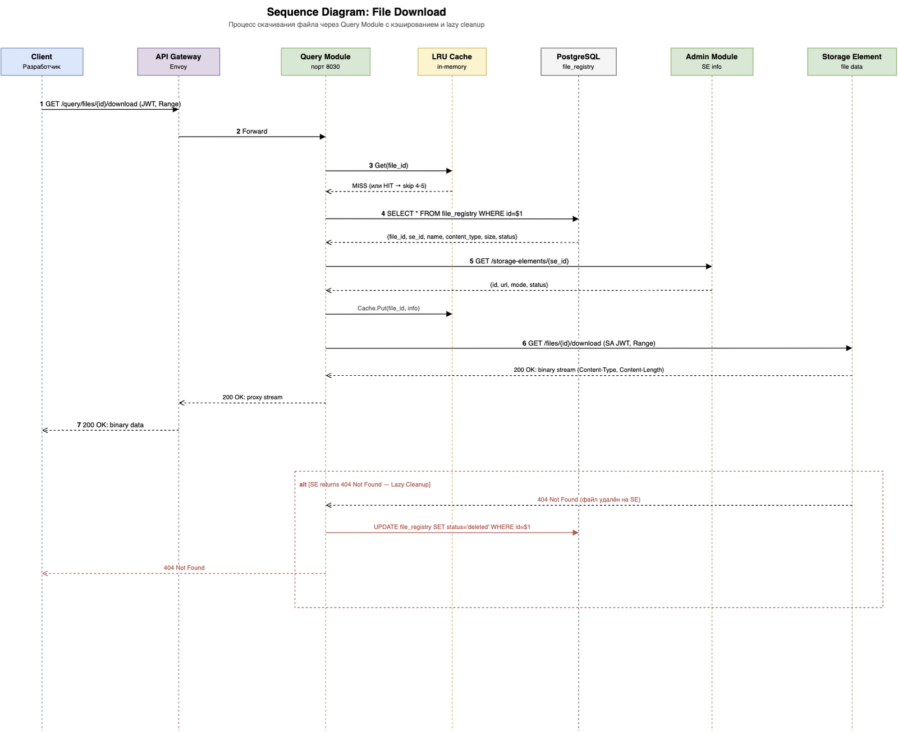

# Artstore Developer Guide

> **Language**: [English](developer-guide.md) | [Русский](developer-guide.ru.md)

## Table of Contents

- [1. API Overview](#1-api-overview)
  - [1.1 Architecture](#11-architecture)
  - [1.2 Base URLs](#12-base-urls)
  - [1.3 API Modules](#13-api-modules)
  - [1.4 OpenAPI Specifications](#14-openapi-specifications)
  - [1.5 Common Conventions](#15-common-conventions)
- [2. Authentication](#2-authentication)
  - [2.1 JWT Overview](#21-jwt-overview)
  - [2.2 Obtaining Tokens — User Credentials](#22-obtaining-tokens--user-credentials)
  - [2.3 Obtaining Tokens — Client Credentials (Service Accounts)](#23-obtaining-tokens--client-credentials-service-accounts)
  - [2.4 Scopes and Roles](#24-scopes-and-roles)
  - [2.5 Using Tokens in Requests](#25-using-tokens-in-requests)
  - [2.6 Token Refresh](#26-token-refresh)
- [3. File Upload](#3-file-upload)
  - [3.1 Upload Flow](#31-upload-flow)
  - [3.2 Upload Endpoint](#32-upload-endpoint)
  - [3.3 Retention Policies](#33-retention-policies)
  - [3.4 Examples](#34-examples)
- [4. File Search](#4-file-search)
  - [4.1 Search Flow](#41-search-flow)
  - [4.2 Search Endpoint](#42-search-endpoint)
  - [4.3 Search Filters](#43-search-filters)
  - [4.4 Pagination and Sorting](#44-pagination-and-sorting)
  - [4.5 Examples](#45-examples)
- [5. File Download](#5-file-download)
  - [5.1 Download Flow](#51-download-flow)
  - [5.2 Download Endpoint](#52-download-endpoint)
  - [5.3 Range Requests](#53-range-requests)
  - [5.4 Archived Files](#54-archived-files)
  - [5.5 Examples](#55-examples)
- [6. File Management](#6-file-management)
  - [6.1 Get File Metadata](#61-get-file-metadata)
  - [6.2 List Files](#62-list-files)
  - [6.3 Update File Metadata](#63-update-file-metadata)
  - [6.4 Delete File](#64-delete-file)
  - [6.5 Register File (Service Accounts)](#65-register-file-service-accounts)
- [7. Error Handling](#7-error-handling)
  - [7.1 Error Response Format](#71-error-response-format)
  - [7.2 Error Codes Reference](#72-error-codes-reference)
  - [7.3 HTTP Status Codes](#73-http-status-codes)
  - [7.4 Handling Errors in Code](#74-handling-errors-in-code)

---

## 1. API Overview

### 1.1 Architecture

Artstore is a distributed file storage system with a microservice architecture. From a developer's perspective, the system exposes three API modules, each responsible for a specific set of operations:

- **Ingester Module (IM)** — file upload
- **Query Module (QM)** — file search and download
- **Admin Module (AM)** — file registry, storage management, service accounts

All modules sit behind an **API Gateway** (Envoy Gateway) that handles TLS termination, JWT validation, and request routing.


*Figure 1.1 — System architecture: modules, databases, and communication flows*

> **Key principle**: Clients interact with the system through a single domain (`https://artstore.example.com`). The API Gateway routes requests to the appropriate module based on URL path prefixes.

### 1.2 Base URLs

All API requests go through the API Gateway using a single base URL:

| Environment | Base URL |
|-------------|----------|
| Production | `https://artstore.example.com` |
| Development | `https://artstore.kryukov.lan` |

Path routing to modules:

| Path Prefix | Module | Purpose |
|-------------|--------|---------|
| `/upload/*` | Ingester Module | File upload |
| `/query/*` | Query Module | Search and download |
| `/admin/*` | Admin Module | File registry, SE management, service accounts |

For example, to upload a file, send a request to:

```
POST https://artstore.example.com/upload/api/v1/files/upload
```

### 1.3 API Modules

| Module | Port Range | Key Endpoints | Auth Required |
|--------|-----------|---------------|---------------|
| Ingester Module | 8020-8029 | `POST /api/v1/files/upload` | Yes (files:write) |
| Query Module | 8030-8039 | `POST /api/v1/search`, `GET /api/v1/files/{id}/download` | Yes (files:read) |
| Admin Module | 8000-8009 | `GET/POST/PUT/DELETE /api/v1/files`, `/api/v1/storage-elements`, `/api/v1/service-accounts` | Yes (various) |

> **Note**: Port ranges are for direct module access (debugging, internal communication). Clients should always use the API Gateway.

### 1.4 OpenAPI Specifications

Full OpenAPI 3.0.3 specifications are available for each module:

| Module | Specification |
|--------|--------------|
| Admin Module | [`docs/api-contracts/admin-module-openapi.yaml`](../api-contracts/admin-module-openapi.yaml) |
| Ingester Module | [`docs/api-contracts/ingester-module-openapi.yaml`](../api-contracts/ingester-module-openapi.yaml) |
| Query Module | [`docs/api-contracts/query-module-openapi.yaml`](../api-contracts/query-module-openapi.yaml) |
| Storage Element | [`docs/api-contracts/storage-element-openapi.yaml`](../api-contracts/storage-element-openapi.yaml) |

### 1.5 Common Conventions

**Request format**:

- JSON for request/response bodies (`Content-Type: application/json`)
- `multipart/form-data` for file uploads
- All timestamps in ISO 8601 format (`2026-03-03T10:30:00Z`)
- UUIDs for all resource identifiers

**Response format**:

- Successful responses: `200 OK`, `201 Created`, `204 No Content`
- Paginated lists include `total`, `limit`, `offset`, `has_more` fields
- Errors always use the [standard error format](#71-error-response-format)

**Authentication**:

- All endpoints (except `/health/*` and `/metrics`) require JWT Bearer token
- Token passed in the `Authorization` header

---

## 2. Authentication

### 2.1 JWT Overview

Artstore uses **JWT RS256 tokens** issued by **Keycloak** (OIDC-compliant Identity Provider). The authentication flow:

1. Client obtains a JWT from the Keycloak token endpoint
2. Client includes the JWT in the `Authorization: Bearer <token>` header
3. API Gateway validates the JWT signature via JWKS, checks expiration
4. Module extracts claims (roles, scopes, username) from the validated JWT


*Figure 2.1 — JWT authentication sequence: Client → Keycloak → Gateway → Module*

### 2.2 Obtaining Tokens — User Credentials

For human users (administrators, viewers), use the **Resource Owner Password Credentials** grant:

**curl**:

```bash
# Obtain JWT for a user
TOKEN=$(curl -s -X POST \
  "https://keycloak.example.com/realms/artstore/protocol/openid-connect/token" \
  -H "Content-Type: application/x-www-form-urlencoded" \
  -d "grant_type=password" \
  -d "client_id=artstore-test-user" \
  -d "client_secret=test-user-secret" \
  -d "username=admin" \
  -d "password=admin" \
  | jq -r '.access_token')

echo $TOKEN
```

**Python**:

```python
import requests

token_url = "https://keycloak.example.com/realms/artstore/protocol/openid-connect/token"

response = requests.post(token_url, data={
    "grant_type": "password",
    "client_id": "artstore-test-user",
    "client_secret": "test-user-secret",
    "username": "admin",
    "password": "admin",
})

token = response.json()["access_token"]
```

**Go**:

```go
package main

import (
    "encoding/json"
    "net/http"
    "net/url"
    "strings"
)

func getToken() (string, error) {
    tokenURL := "https://keycloak.example.com/realms/artstore/protocol/openid-connect/token"

    data := url.Values{
        "grant_type":    {"password"},
        "client_id":     {"artstore-test-user"},
        "client_secret": {"test-user-secret"},
        "username":      {"admin"},
        "password":      {"admin"},
    }

    resp, err := http.Post(tokenURL, "application/x-www-form-urlencoded",
        strings.NewReader(data.Encode()))
    if err != nil {
        return "", err
    }
    defer resp.Body.Close()

    var result struct {
        AccessToken string `json:"access_token"`
    }
    if err := json.NewDecoder(resp.Body).Decode(&result); err != nil {
        return "", err
    }
    return result.AccessToken, nil
}
```

The response contains:

```json
{
  "access_token": "eyJhbGciOiJSUzI1NiIs...",
  "expires_in": 300,
  "refresh_expires_in": 1800,
  "refresh_token": "eyJhbGciOiJIUzUxMiIs...",
  "token_type": "Bearer",
  "scope": "openid profile email"
}
```

> **Note**: The Resource Owner Password Credentials grant is primarily used for testing. In production, use Authorization Code + PKCE flow for browser-based applications.

### 2.3 Obtaining Tokens — Client Credentials (Service Accounts)

For machine-to-machine (M2M) integration, use the **Client Credentials** grant:

**curl**:

```bash
# Obtain JWT for a service account
TOKEN=$(curl -s -X POST \
  "https://keycloak.example.com/realms/artstore/protocol/openid-connect/token" \
  -H "Content-Type: application/x-www-form-urlencoded" \
  -d "grant_type=client_credentials" \
  -d "client_id=artstore-ingester" \
  -d "client_secret=ingester-test-secret" \
  | jq -r '.access_token')
```

**Python**:

```python
response = requests.post(token_url, data={
    "grant_type": "client_credentials",
    "client_id": "artstore-ingester",
    "client_secret": "ingester-test-secret",
})

token = response.json()["access_token"]
```

**Go**:

```go
func getServiceAccountToken(clientID, clientSecret string) (string, error) {
    tokenURL := "https://keycloak.example.com/realms/artstore/protocol/openid-connect/token"

    data := url.Values{
        "grant_type":    {"client_credentials"},
        "client_id":     {clientID},
        "client_secret": {clientSecret},
    }

    resp, err := http.Post(tokenURL, "application/x-www-form-urlencoded",
        strings.NewReader(data.Encode()))
    if err != nil {
        return "", err
    }
    defer resp.Body.Close()

    var result struct {
        AccessToken string `json:"access_token"`
    }
    if err := json.NewDecoder(resp.Body).Decode(&result); err != nil {
        return "", err
    }
    return result.AccessToken, nil
}
```

Service account tokens include scopes in the JWT payload:

```json
{
  "scope": "files:read files:write storage:read",
  "client_id": "artstore-ingester",
  "typ": "Bearer"
}
```

### 2.4 Scopes and Roles

Artstore uses two authorization models:

**Roles** (for human users via Keycloak groups):

| Role | Group | Permissions |
|------|-------|-------------|
| `admin` | `artstore-admins` | Full access: read, write, delete, manage SE and SA |
| `readonly` | `artstore-viewers` | Read-only: list files, search, download |

**Scopes** (for service accounts via Keycloak client configuration):

| Scope | Permissions |
|-------|-------------|
| `files:read` | Read file metadata, download files, search |
| `files:write` | Upload files, update metadata, delete files, register files |
| `storage:read` | Read Storage Element info and status |
| `storage:write` | Manage SE modes, trigger maintenance operations |
| `admin:read` | Read user list, service account list |
| `admin:write` | Manage users, create/update service accounts |

**Endpoint authorization rules**:

| Operation | Required Role | Required Scope |
|-----------|---------------|----------------|
| Upload file | `admin` | `files:write` |
| Search files | `admin` or `readonly` | `files:read` |
| Download file | `admin` or `readonly` | `files:read` |
| Get file metadata | `admin` or `readonly` | `files:read` |
| Update file metadata | `admin` | `files:write` |
| Delete file | `admin` | `files:write` |
| List/manage SE | `admin` | `storage:read` / `storage:write` |
| Manage service accounts | `admin` | `admin:write` |

> **Authorization logic**: Endpoints accept **either** a user role **or** a service account scope. A request with `files:read` scope OR `readonly` role can search and download files.

### 2.5 Using Tokens in Requests

Include the JWT in the `Authorization` header for all API calls:

```bash
curl -H "Authorization: Bearer $TOKEN" \
  "https://artstore.example.com/query/api/v1/files/{file_id}"
```

### 2.6 Token Refresh

Access tokens have a short lifetime (default: 5 minutes). Use the refresh token to obtain a new access token without re-authenticating:

```bash
NEW_TOKEN=$(curl -s -X POST \
  "https://keycloak.example.com/realms/artstore/protocol/openid-connect/token" \
  -H "Content-Type: application/x-www-form-urlencoded" \
  -d "grant_type=refresh_token" \
  -d "client_id=artstore-test-user" \
  -d "client_secret=test-user-secret" \
  -d "refresh_token=$REFRESH_TOKEN" \
  | jq -r '.access_token')
```

> **Note**: Service account tokens (Client Credentials grant) do not have refresh tokens. Request a new token when the current one expires.

---

## 3. File Upload

### 3.1 Upload Flow

File upload is handled by the **Ingester Module**. The upload process:

1. Client sends file via `POST /api/v1/files/upload` (multipart/form-data)
2. Ingester authenticates the request (JWT validation)
3. Ingester selects a Storage Element based on the retention policy:
   - `temporary` → SE in `edit` mode
   - `permanent` → SE in `rw` mode
4. Ingester streams the file to the selected SE
5. SE stores the file and creates `attr.json` metadata
6. Ingester registers the file in the Admin Module
7. Client receives the upload response with file metadata


*Figure 3.1 — Upload data flow: Client → Ingester → SE → Admin Module*


*Figure 3.2 — Upload sequence diagram with detailed module interactions*

### 3.2 Upload Endpoint

```
POST /upload/api/v1/files/upload
Content-Type: multipart/form-data
Authorization: Bearer <token>
```

**Form fields**:

| Field | Type | Required | Description |
|-------|------|----------|-------------|
| `file` | binary | Yes | File to upload |
| `description` | string | No | File description (max 1000 characters) |
| `tags` | string | No | JSON array of tags, e.g., `["logo","draft"]` |
| `retention_policy` | string | No | `temporary` (default) or `permanent` |
| `ttl_days` | integer | No | Days until expiration, 1-365 (default: 30, only for `temporary`) |

**Response** (`201 Created`):

```json
{
  "file_id": "550e8400-e29b-41d4-a716-446655440000",
  "original_filename": "report.pdf",
  "content_type": "application/pdf",
  "size": 2048576,
  "checksum": "a1b2c3d4e5f6...",
  "uploaded_by": "admin",
  "uploaded_at": "2026-03-03T10:30:00Z",
  "description": "Q1 Report",
  "tags": ["report", "2026"],
  "status": "active",
  "storage_element_id": "7d3f2a1b-4c5e-6f7a-8b9c-0d1e2f3a4b5c",
  "retention_policy": "temporary",
  "ttl_days": 30,
  "expires_at": "2026-04-02T10:30:00Z"
}
```

### 3.3 Retention Policies

| Policy | SE Mode | TTL | Use Case |
|--------|---------|-----|----------|
| `temporary` | `edit` | 1-365 days (default: 30) | Drafts, temp files, CI artifacts |
| `permanent` | `rw` | No expiration | Production assets, documents |

- Temporary files are automatically deleted by the SE garbage collector after `expires_at`
- Permanent files persist until manually deleted or the SE transitions to `ar` (archive) mode

### 3.4 Examples

**curl — simple upload**:

```bash
curl -X POST "https://artstore.example.com/upload/api/v1/files/upload" \
  -H "Authorization: Bearer $TOKEN" \
  -F "file=@/path/to/report.pdf"
```

**curl — upload with metadata**:

```bash
curl -X POST "https://artstore.example.com/upload/api/v1/files/upload" \
  -H "Authorization: Bearer $TOKEN" \
  -F "file=@/path/to/logo.png" \
  -F "description=Company logo v2" \
  -F 'tags=["logo","brand","v2"]' \
  -F "retention_policy=permanent"
```

**curl — temporary file with custom TTL**:

```bash
curl -X POST "https://artstore.example.com/upload/api/v1/files/upload" \
  -H "Authorization: Bearer $TOKEN" \
  -F "file=@/tmp/build-artifact.tar.gz" \
  -F "description=CI build #1234" \
  -F 'tags=["ci","build"]' \
  -F "retention_policy=temporary" \
  -F "ttl_days=7"
```

**Python**:

```python
import requests

url = "https://artstore.example.com/upload/api/v1/files/upload"
headers = {"Authorization": f"Bearer {token}"}

# Simple upload
with open("/path/to/report.pdf", "rb") as f:
    response = requests.post(url, headers=headers, files={"file": f})

print(response.json()["file_id"])

# Upload with metadata
import json

with open("/path/to/logo.png", "rb") as f:
    response = requests.post(url, headers=headers,
        files={"file": ("logo.png", f, "image/png")},
        data={
            "description": "Company logo v2",
            "tags": json.dumps(["logo", "brand", "v2"]),
            "retention_policy": "permanent",
        })

print(response.json())
```

**Go**:

```go
package main

import (
    "bytes"
    "encoding/json"
    "fmt"
    "io"
    "mime/multipart"
    "net/http"
    "os"
)

func uploadFile(token, filePath, description string, tags []string,
    retentionPolicy string) (map[string]interface{}, error) {

    file, err := os.Open(filePath)
    if err != nil {
        return nil, err
    }
    defer file.Close()

    body := &bytes.Buffer{}
    writer := multipart.NewWriter(body)

    // Add file
    part, err := writer.CreateFormFile("file", file.Name())
    if err != nil {
        return nil, err
    }
    if _, err := io.Copy(part, file); err != nil {
        return nil, err
    }

    // Add metadata
    if description != "" {
        writer.WriteField("description", description)
    }
    if len(tags) > 0 {
        tagsJSON, _ := json.Marshal(tags)
        writer.WriteField("tags", string(tagsJSON))
    }
    if retentionPolicy != "" {
        writer.WriteField("retention_policy", retentionPolicy)
    }

    writer.Close()

    req, err := http.NewRequest("POST",
        "https://artstore.example.com/upload/api/v1/files/upload", body)
    if err != nil {
        return nil, err
    }
    req.Header.Set("Content-Type", writer.FormDataContentType())
    req.Header.Set("Authorization", "Bearer "+token)

    resp, err := http.DefaultClient.Do(req)
    if err != nil {
        return nil, err
    }
    defer resp.Body.Close()

    var result map[string]interface{}
    if err := json.NewDecoder(resp.Body).Decode(&result); err != nil {
        return nil, err
    }

    if resp.StatusCode != http.StatusCreated {
        return nil, fmt.Errorf("upload failed: %d %v", resp.StatusCode, result)
    }
    return result, nil
}
```

---

## 4. File Search

### 4.1 Search Flow

File search is handled by the **Query Module**. It queries PostgreSQL directly (shared database with Admin Module) and supports full-text search with multiple filters.


*Figure 4.1 — Search data flow: Client → Query Module → PostgreSQL FTS*

The Query Module maintains an in-memory LRU cache for hot metadata queries (TTL: 30-60 seconds).

### 4.2 Search Endpoint

```
POST /query/api/v1/search
Content-Type: application/json
Authorization: Bearer <token>
```

> **Note**: Search uses POST (not GET) because the filter criteria can be complex and lengthy.

**Request body** (`SearchRequest`):

```json
{
  "query": "report",
  "tags": ["2026"],
  "retention_policy": "permanent",
  "sort_by": "uploaded_at",
  "sort_order": "desc",
  "limit": 20,
  "offset": 0
}
```

**Response** (`200 OK`):

```json
{
  "items": [
    {
      "file_id": "550e8400-e29b-41d4-a716-446655440000",
      "original_filename": "annual-report-2026.pdf",
      "content_type": "application/pdf",
      "size": 5242880,
      "checksum": "a1b2c3d4e5f6...",
      "uploaded_by": "admin",
      "uploaded_at": "2026-03-01T14:00:00Z",
      "description": "Annual report 2026",
      "tags": ["report", "2026", "annual"],
      "status": "active",
      "retention_policy": "permanent",
      "storage_element_id": "7d3f2a1b-4c5e-6f7a-8b9c-0d1e2f3a4b5c",
      "se_mode": "rw"
    }
  ],
  "total": 1,
  "limit": 20,
  "offset": 0,
  "has_more": false
}
```

### 4.3 Search Filters

All filters are optional. When multiple filters are provided, they are combined with AND logic.

| Filter | Type | Description |
|--------|------|-------------|
| `query` | string | Substring search in `original_filename` (case-insensitive) |
| `filename` | string | Exact or partial filename match |
| `file_extension` | string | File extension without dot (e.g., `pdf`, `jpg`) |
| `tags` | string[] | File must contain ALL specified tags |
| `uploaded_by` | string | Username or client_id of the uploader |
| `retention_policy` | string | `temporary` or `permanent` |
| `status` | string | Not used (removed) |
| `min_size` | integer | Minimum file size in bytes |
| `max_size` | integer | Maximum file size in bytes |
| `uploaded_after` | string | ISO 8601 datetime lower bound |
| `uploaded_before` | string | ISO 8601 datetime upper bound |
| `mode` | string | `partial` (default, ILIKE) or `exact` (case-insensitive) |

**Validation rules**:

- `uploaded_after` must not be later than `uploaded_before`
- `min_size` must not exceed `max_size`
- `min_size` and `max_size` must be non-negative
- `query` max length: 500 characters
- `tags` max: 50 items

### 4.4 Pagination and Sorting

| Parameter | Type | Default | Range | Description |
|-----------|------|---------|-------|-------------|
| `limit` | integer | 20 | 1-1000 | Number of results per page |
| `offset` | integer | 0 | 0+ | Number of results to skip |
| `sort_by` | string | `uploaded_at` | `uploaded_at`, `original_filename`, `size` | Sort field |
| `sort_order` | string | `desc` | `asc`, `desc` | Sort direction |

**Pagination example** — fetching page 3 (20 items per page):

```json
{
  "query": "report",
  "limit": 20,
  "offset": 40
}
```

### 4.5 Examples

**curl — simple search**:

```bash
curl -X POST "https://artstore.example.com/query/api/v1/search" \
  -H "Authorization: Bearer $TOKEN" \
  -H "Content-Type: application/json" \
  -d '{"query": "report"}'
```

**curl — search with filters**:

```bash
curl -X POST "https://artstore.example.com/query/api/v1/search" \
  -H "Authorization: Bearer $TOKEN" \
  -H "Content-Type: application/json" \
  -d '{
    "query": "logo",
    "file_extension": "png",
    "tags": ["brand"],
    "retention_policy": "permanent",
    "min_size": 1024,
    "uploaded_after": "2026-01-01T00:00:00Z",
    "sort_by": "size",
    "sort_order": "desc",
    "limit": 10
  }'
```

**Python**:

```python
import requests

url = "https://artstore.example.com/query/api/v1/search"
headers = {
    "Authorization": f"Bearer {token}",
    "Content-Type": "application/json",
}

# Simple search
response = requests.post(url, headers=headers, json={"query": "report"})
results = response.json()

print(f"Found {results['total']} files")
for item in results["items"]:
    print(f"  {item['original_filename']} ({item['size']} bytes)")

# Paginated search
all_files = []
offset = 0
while True:
    response = requests.post(url, headers=headers, json={
        "query": "report",
        "limit": 100,
        "offset": offset,
    })
    data = response.json()
    all_files.extend(data["items"])
    if not data["has_more"]:
        break
    offset += 100

print(f"Total files collected: {len(all_files)}")
```

**Go**:

```go
package main

import (
    "bytes"
    "encoding/json"
    "fmt"
    "net/http"
)

type SearchRequest struct {
    Query           string   `json:"query,omitempty"`
    Tags            []string `json:"tags,omitempty"`
    RetentionPolicy string   `json:"retention_policy,omitempty"`
    Limit           int      `json:"limit,omitempty"`
    Offset          int      `json:"offset,omitempty"`
    SortBy          string   `json:"sort_by,omitempty"`
    SortOrder       string   `json:"sort_order,omitempty"`
}

type SearchResponse struct {
    Items   []map[string]interface{} `json:"items"`
    Total   int                      `json:"total"`
    Limit   int                      `json:"limit"`
    Offset  int                      `json:"offset"`
    HasMore bool                     `json:"has_more"`
}

func searchFiles(token string, req SearchRequest) (*SearchResponse, error) {
    body, err := json.Marshal(req)
    if err != nil {
        return nil, err
    }

    httpReq, err := http.NewRequest("POST",
        "https://artstore.example.com/query/api/v1/search",
        bytes.NewReader(body))
    if err != nil {
        return nil, err
    }
    httpReq.Header.Set("Content-Type", "application/json")
    httpReq.Header.Set("Authorization", "Bearer "+token)

    resp, err := http.DefaultClient.Do(httpReq)
    if err != nil {
        return nil, err
    }
    defer resp.Body.Close()

    if resp.StatusCode != http.StatusOK {
        return nil, fmt.Errorf("search failed: %d", resp.StatusCode)
    }

    var result SearchResponse
    if err := json.NewDecoder(resp.Body).Decode(&result); err != nil {
        return nil, err
    }
    return &result, nil
}
```

---

## 5. File Download

### 5.1 Download Flow

File download is handled by the **Query Module**, which acts as a proxy between the client and the Storage Element.

1. Client requests `GET /api/v1/files/{file_id}/download`
2. Query Module authenticates the request
3. Query Module looks up the file in the registry (PostgreSQL or cache)
4. Query Module fetches the file from the corresponding SE
5. File is streamed to the client


*Figure 5.1 — Download data flow: Client → Query Module → Admin Module → SE*


*Figure 5.2 — Download sequence with caching and SE interaction*

> **Lazy cleanup**: If the SE returns HTTP 404 during download, the Query Module automatically marks the file as `deleted` in the registry.

### 5.2 Download Endpoint

```
GET /query/api/v1/files/{file_id}/download
Authorization: Bearer <token>
```

**Response** (`200 OK`):

Binary file content with headers:

| Header | Example | Description |
|--------|---------|-------------|
| `Content-Type` | `application/pdf` | MIME type of the file |
| `Content-Length` | `2048576` | File size in bytes |
| `Content-Disposition` | `attachment; filename="report.pdf"` | Suggested filename |
| `Accept-Ranges` | `bytes` | Server supports range requests |
| `ETag` | `"a1b2c3d4e5f6"` | File checksum for caching |

### 5.3 Range Requests

For large files or resumable downloads, use the `Range` header:

```bash
# Download first 1MB
curl -H "Authorization: Bearer $TOKEN" \
  -H "Range: bytes=0-1048575" \
  "https://artstore.example.com/query/api/v1/files/{file_id}/download" \
  -o partial.bin
```

**Response** (`206 Partial Content`):

| Header | Example | Description |
|--------|---------|-------------|
| `Content-Range` | `bytes 0-1048575/5242880` | Returned range / total size |
| `Content-Length` | `1048576` | Size of the partial response |

### 5.4 Archived Files

If the file resides on a Storage Element in `ar` (archive) mode, the download returns:

**Response** (`410 Gone`):

```json
{
  "error": {
    "code": "FILE_ARCHIVED",
    "message": "File is in an archived storage element and cannot be downloaded"
  }
}
```

> **Tip**: Use the `se_mode` field in [search results](#42-search-endpoint) to check if a file is downloadable before attempting download.

### 5.5 Examples

**curl — download file**:

```bash
curl -H "Authorization: Bearer $TOKEN" \
  "https://artstore.example.com/query/api/v1/files/550e8400-e29b-41d4-a716-446655440000/download" \
  -o report.pdf
```

**curl — download with progress**:

```bash
curl -# -H "Authorization: Bearer $TOKEN" \
  "https://artstore.example.com/query/api/v1/files/{file_id}/download" \
  -o large-file.zip
```

**Python**:

```python
import requests

file_id = "550e8400-e29b-41d4-a716-446655440000"
url = f"https://artstore.example.com/query/api/v1/files/{file_id}/download"
headers = {"Authorization": f"Bearer {token}"}

# Simple download
response = requests.get(url, headers=headers, stream=True)
with open("report.pdf", "wb") as f:
    for chunk in response.iter_content(chunk_size=8192):
        f.write(chunk)

# Download with progress
import shutil
response = requests.get(url, headers=headers, stream=True)
total = int(response.headers.get("Content-Length", 0))
with open("report.pdf", "wb") as f:
    downloaded = 0
    for chunk in response.iter_content(chunk_size=8192):
        f.write(chunk)
        downloaded += len(chunk)
        if total > 0:
            print(f"\rProgress: {downloaded}/{total} ({100*downloaded//total}%)", end="")
```

**Go**:

```go
package main

import (
    "fmt"
    "io"
    "net/http"
    "os"
)

func downloadFile(token, fileID, outputPath string) error {
    url := fmt.Sprintf(
        "https://artstore.example.com/query/api/v1/files/%s/download", fileID)

    req, err := http.NewRequest("GET", url, nil)
    if err != nil {
        return err
    }
    req.Header.Set("Authorization", "Bearer "+token)

    resp, err := http.DefaultClient.Do(req)
    if err != nil {
        return err
    }
    defer resp.Body.Close()

    if resp.StatusCode != http.StatusOK {
        return fmt.Errorf("download failed: %d", resp.StatusCode)
    }

    out, err := os.Create(outputPath)
    if err != nil {
        return err
    }
    defer out.Close()

    _, err = io.Copy(out, resp.Body)
    return err
}
```

---

## 6. File Management

File management operations (metadata CRUD) are handled by the **Admin Module**. These endpoints are primarily used by administrators and service accounts for file registry management.

### 6.1 Get File Metadata

```
GET /admin/api/v1/files/{file_id}
Authorization: Bearer <token>
```

**Required**: role `admin` or `readonly`, or scope `files:read`

**Response** (`200 OK`):

```json
{
  "file_id": "550e8400-e29b-41d4-a716-446655440000",
  "original_filename": "report.pdf",
  "content_type": "application/pdf",
  "size": 2048576,
  "checksum": "a1b2c3d4e5f6...",
  "storage_element_id": "7d3f2a1b-4c5e-6f7a-8b9c-0d1e2f3a4b5c",
  "uploaded_by": "admin",
  "uploaded_at": "2026-03-03T10:30:00Z",
  "description": "Q1 Report",
  "tags": ["report", "2026"],
  "status": "active",
  "retention_policy": "temporary",
  "ttl_days": 30,
  "expires_at": "2026-04-02T10:30:00Z",
  "created_at": "2026-03-03T10:30:00Z",
  "updated_at": "2026-03-03T10:30:00Z"
}
```

**curl**:

```bash
curl -H "Authorization: Bearer $TOKEN" \
  "https://artstore.example.com/admin/api/v1/files/550e8400-e29b-41d4-a716-446655440000"
```

> **Note**: You can also get file metadata via the Query Module endpoint `GET /query/api/v1/files/{file_id}`, which returns similar data and uses an in-memory cache for faster responses.

### 6.2 List Files

```
GET /admin/api/v1/files?limit=20&offset=0
Authorization: Bearer <token>
```

**Required**: role `admin` or `readonly`, or scope `files:read`

**Query parameters**:

| Parameter | Type | Default | Description |
|-----------|------|---------|-------------|
| `limit` | integer | 20 | Results per page (1-1000) |
| `offset` | integer | 0 | Results to skip |
| `status` | string | — | Not used (removed) |
| `retention_policy` | string | — | Filter: `temporary` or `permanent` |
| `storage_element_id` | UUID | — | Filter by SE |
| `uploaded_by` | string | — | Filter by uploader |

**Response** (`200 OK`):

```json
{
  "items": [ ... ],
  "total": 150,
  "limit": 20,
  "offset": 0
}
```

**curl**:

```bash
# List active temporary files
curl -H "Authorization: Bearer $TOKEN" \
  "https://artstore.example.com/admin/api/v1/files?status=active&retention_policy=temporary&limit=50"
```

### 6.3 Update File Metadata

```
PUT /admin/api/v1/files/{file_id}
Content-Type: application/json
Authorization: Bearer <token>
```

**Required**: role `admin`, or scope `files:write`

**Mutable fields**: `description`, `tags`, `status`

**Immutable fields** (cannot be changed): `original_filename`, `content_type`, `size`, `checksum`, `storage_element_id`, `uploaded_by`, `retention_policy`

**Request body**:

```json
{
  "description": "Updated description",
  "tags": ["report", "2026", "final"],
  "status": "active"
}
```

**curl**:

```bash
curl -X PUT "https://artstore.example.com/admin/api/v1/files/{file_id}" \
  -H "Authorization: Bearer $TOKEN" \
  -H "Content-Type: application/json" \
  -d '{"description": "Final version", "tags": ["report", "final"]}'
```

### 6.4 Delete File

```
DELETE /admin/api/v1/files/{file_id}
Authorization: Bearer <token>
```

**Required**: role `admin`, or scope `files:write`

**Response**: `204 No Content`

> **Note**: This is a hard delete. The file record is permanently removed from the registry.

**curl**:

```bash
curl -X DELETE "https://artstore.example.com/admin/api/v1/files/{file_id}" \
  -H "Authorization: Bearer $TOKEN"
```

### 6.5 Register File (Service Accounts)

This endpoint is used by the Ingester Module (or other service accounts) to register a file after successful upload to a Storage Element.

```
POST /admin/api/v1/files
Content-Type: application/json
Authorization: Bearer <token>
```

**Required**: scope `files:write`

**Request body**:

```json
{
  "file_id": "550e8400-e29b-41d4-a716-446655440000",
  "original_filename": "report.pdf",
  "content_type": "application/pdf",
  "size": 2048576,
  "checksum": "a1b2c3d4e5f6...",
  "storage_element_id": "7d3f2a1b-4c5e-6f7a-8b9c-0d1e2f3a4b5c",
  "uploaded_by": "admin",
  "retention_policy": "temporary",
  "ttl_days": 30,
  "description": "Q1 Report",
  "tags": ["report", "2026"]
}
```

**Validation rules**:

- `file_id`, `original_filename`, `content_type`, `checksum`, `storage_element_id` — required
- `size` must be greater than 0
- For `temporary` retention: `ttl_days` must be 1-365
- `uploaded_by` is set from the JWT: `preferred_username` for users, `client_id` for service accounts

**Response** (`201 Created`): The registered `FileRecord` object.

---

## 7. Error Handling

### 7.1 Error Response Format

All Artstore modules return errors in a uniform JSON format:

```json
{
  "error": {
    "code": "ERROR_CODE",
    "message": "Human-readable error description"
  }
}
```

- `code` — machine-readable error code in `SCREAMING_SNAKE_CASE`
- `message` — human-readable description (may vary, do not parse programmatically)

### 7.2 Error Codes Reference

**Common errors (all modules)**:

| Code | HTTP Status | Description |
|------|-------------|-------------|
| `VALIDATION_ERROR` | 400 | Invalid request parameters or body |
| `UNAUTHORIZED` | 401 | Missing, expired, or invalid JWT token |
| `FORBIDDEN` | 403 | Insufficient role or scope for the operation |
| `NOT_FOUND` | 404 | Requested resource does not exist |
| `INTERNAL_ERROR` | 500 | Unexpected server error |

**Ingester Module errors**:

| Code | HTTP Status | Description |
|------|-------------|-------------|
| `FILE_TOO_LARGE` | 413 | Uploaded file exceeds the size limit |
| `STORAGE_FULL` | 507 | No free space on the selected Storage Element |
| `NO_STORAGE_AVAILABLE` | 502 | No SE available for the requested retention policy |
| `SE_UPLOAD_FAILED` | 502 | Storage Element returned an error during upload |
| `ADMIN_UNAVAILABLE` | 502 | Admin Module is unreachable |

**Query Module errors**:

| Code | HTTP Status | Description |
|------|-------------|-------------|
| `INVALID_RANGE` | 416 | Malformed or unsatisfiable `Range` header |
| `FILE_ARCHIVED` | 410 | File is on an archived SE and cannot be downloaded |
| `SE_UNAVAILABLE` | 502 | Storage Element is unreachable for download |
| `AM_UNAVAILABLE` | 502 | Admin Module is unreachable |

**Admin Module errors**:

| Code | HTTP Status | Description |
|------|-------------|-------------|
| `CONFLICT` | 409 | Resource with the same name already exists |
| `MODE_NOT_ALLOWED` | 409 | Invalid SE mode transition |

### 7.3 HTTP Status Codes

| Status | Meaning | When |
|--------|---------|------|
| `200 OK` | Success | Read, update, search |
| `201 Created` | Resource created | Upload, register file, create SA |
| `204 No Content` | Success, no body | Delete |
| `206 Partial Content` | Partial download | Range request |
| `400 Bad Request` | Invalid input | Validation errors |
| `401 Unauthorized` | Auth required | Missing/invalid JWT |
| `403 Forbidden` | Access denied | Insufficient permissions |
| `404 Not Found` | Not found | Non-existent resource |
| `409 Conflict` | State conflict | Duplicate name, invalid mode transition |
| `410 Gone` | Resource gone | Archived file |
| `413 Payload Too Large` | File too big | Upload size limit |
| `416 Range Not Satisfiable` | Invalid range | Bad Range header |
| `500 Internal Server Error` | Server error | Unexpected failures |
| `502 Bad Gateway` | Upstream error | SE or AM unreachable |
| `503 Service Unavailable` | Not ready | Module starting up |
| `507 Insufficient Storage` | No space | SE disk full |

### 7.4 Handling Errors in Code

**Python**:

```python
import requests

response = requests.post(url, headers=headers, json=data)

if response.status_code == 200:
    result = response.json()
elif response.status_code == 401:
    # Token expired — refresh and retry
    token = refresh_token()
    headers["Authorization"] = f"Bearer {token}"
    response = requests.post(url, headers=headers, json=data)
elif response.status_code == 410:
    error = response.json()["error"]
    print(f"File archived: {error['message']}")
else:
    error = response.json()["error"]
    print(f"Error [{error['code']}]: {error['message']}")
```

**Go**:

```go
type APIError struct {
    Error struct {
        Code    string `json:"code"`
        Message string `json:"message"`
    } `json:"error"`
}

func handleResponse(resp *http.Response) error {
    if resp.StatusCode >= 200 && resp.StatusCode < 300 {
        return nil // success
    }

    var apiErr APIError
    if err := json.NewDecoder(resp.Body).Decode(&apiErr); err != nil {
        return fmt.Errorf("HTTP %d: failed to decode error", resp.StatusCode)
    }

    switch apiErr.Error.Code {
    case "UNAUTHORIZED":
        return fmt.Errorf("authentication required: %s", apiErr.Error.Message)
    case "FILE_ARCHIVED":
        return fmt.Errorf("file is archived and cannot be downloaded")
    case "NO_STORAGE_AVAILABLE":
        return fmt.Errorf("no storage available, try again later")
    default:
        return fmt.Errorf("[%s] %s", apiErr.Error.Code, apiErr.Error.Message)
    }
}
```
