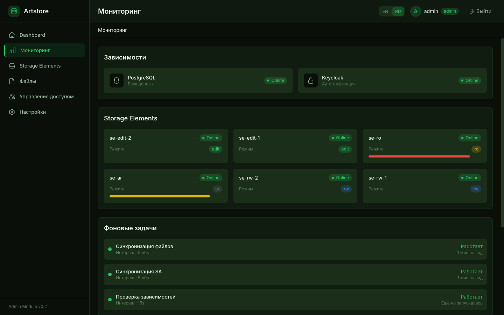

# Artstore — Руководство по эксплуатации

> **Язык**: [English](operations-guide.md) | [Русский](operations-guide.ru.md)
>
> **Связанные руководства**: [Руководство администратора](admin-guide.ru.md) | [Руководство разработчика](developer-guide.ru.md)

---

## Содержание

- [1. Обзор мониторинга](#1-обзор-мониторинга)
  - [1.1 Архитектура метрик](#11-архитектура-метрик)
  - [1.2 Справочник метрик Prometheus](#12-справочник-метрик-prometheus)
  - [1.3 Настройка сбора метрик Prometheus](#13-настройка-сбора-метрик-prometheus)
  - [1.4 Мониторинг зависимостей (topologymetrics)](#14-мониторинг-зависимостей-topologymetrics)
  - [1.5 Встроенный мониторинг в Admin UI](#15-встроенный-мониторинг-в-admin-ui)
- [2. Дашборды Grafana](#2-дашборды-grafana)
  - [2.1 Подключение дашбордов](#21-подключение-дашбордов)
  - [2.2 Дашборд Artstore Overview](#22-дашборд-artstore-overview)
  - [2.3 Дашборд Admin Module](#23-дашборд-admin-module)
  - [2.4 Дашборд Storage Element](#24-дашборд-storage-element)
  - [2.5 Дашборд Ingester Module](#25-дашборд-ingester-module)
  - [2.6 Дашборд Query Module](#26-дашборд-query-module)
  - [2.7 Дашборд Dependency Topology](#27-дашборд-dependency-topology)
  - [2.8 Шаблонные переменные](#28-шаблонные-переменные)
- [3. Алертинг](#3-алертинг)
  - [3.1 Интеграция с AlertManager](#31-интеграция-с-alertmanager)
  - [3.2 Справочник алертов](#32-справочник-алертов)
  - [3.3 Runbooks](#33-runbooks)
  - [3.4 Подавление и ингибирование](#34-подавление-и-ингибирование)
  - [3.5 Каналы уведомлений](#35-каналы-уведомлений)
- [4. Устранение неполадок](#4-устранение-неполадок)
  - [4.1 Эндпоинты проверки здоровья](#41-эндпоинты-проверки-здоровья)
  - [4.2 Диагностика зависимостей через topologymetrics](#42-диагностика-зависимостей-через-topologymetrics)
  - [4.3 Анализ логов (slog JSON)](#43-анализ-логов-slog-json)
  - [4.4 Типичные проблемы и решения](#44-типичные-проблемы-и-решения)
- [5. Резервное копирование и восстановление](#5-резервное-копирование-и-восстановление)
  - [5.1 PostgreSQL](#51-postgresql)
  - [5.2 Данные Storage Element (PVC Snapshots)](#52-данные-storage-element-pvc-snapshots)
  - [5.3 Экспорт Keycloak Realm](#53-экспорт-keycloak-realm)
  - [5.4 Рекомендации по расписанию резервного копирования](#54-рекомендации-по-расписанию-резервного-копирования)
- [6. Масштабирование](#6-масштабирование)
  - [6.1 Горизонтальное масштабирование (stateless-модули)](#61-горизонтальное-масштабирование-stateless-модули)
  - [6.2 Добавление Storage Element](#62-добавление-storage-element)
  - [6.3 Рекомендации по ресурсам](#63-рекомендации-по-ресурсам)
  - [6.4 Настройка производительности](#64-настройка-производительности)

---

## 1. Обзор мониторинга

Artstore обеспечивает комплексную наблюдаемость через метрики Prometheus, структурированное логирование (slog JSON), эндпоинты проверки здоровья и мониторинг межсервисных зависимостей через [topologymetrics](https://github.com/BigKAA/topologymetrics). Каждый модуль предоставляет эндпоинт `/metrics` в формате Prometheus.

### 1.1 Архитектура метрик

Каждый модуль экспортирует метрики с уникальным префиксом для исключения коллизий имён:

| Модуль | Префикс метрик | Порт по умолчанию | Путь к метрикам |
|--------|:--------------:|:-----------------:|:---------------:|
| Admin Module | `am_` | 8000 | `/metrics` |
| Storage Element | `se_` | 8010 | `/metrics` |
| Ingester Module | `im_` | 8020 | `/metrics` |
| Query Module | `qm_` | 8030 | `/metrics` |

Помимо этого, все модули экспортируют метрики здоровья зависимостей с префиксом `app_` (из SDK topologymetrics).

**Используемые типы метрик**:

- **Counter** (`_total`) — монотонно возрастающие значения (запросы, операции, ошибки)
- **Gauge** — значения, которые могут расти и уменьшаться (активные загрузки, количество файлов, объём хранилища)
- **Histogram** (`_seconds`, `_bytes`) — распределение значений (задержки, размеры файлов)

### 1.2 Справочник метрик Prometheus

#### Общие HTTP-метрики (все модули)

Каждый модуль регистрирует эти метрики со своим префиксом (`am_`, `se_`, `im_`, `qm_`):

| Метрика | Тип | Метки | Описание |
|---------|-----|-------|----------|
| `*_http_requests_total` | Counter | method, path, status | Общее количество HTTP-запросов |
| `*_http_request_duration_seconds` | Histogram | method, path | Задержка HTTP-запросов (секунды) |

> **Примечание**: Метка `path` нормализуется для снижения кардинальности (например, `/api/v1/files/{id}` вместо `/api/v1/files/abc-123`).

#### Метрики Admin Module (`am_`)

| Метрика | Тип | Метки | Описание |
|---------|-----|-------|----------|
| `am_http_requests_total` | Counter | method, path, status | HTTP-запросы AM |
| `am_http_request_duration_seconds` | Histogram | method, path | Задержка HTTP AM |

#### Метрики Storage Element (`se_`)

| Метрика | Тип | Метки | Описание |
|---------|-----|-------|----------|
| `se_http_requests_total` | Counter | method, path, status | HTTP-запросы SE |
| `se_http_request_duration_seconds` | Histogram | method, path | Задержка HTTP SE |
| `se_files_total` | Gauge | status | Количество файлов по статусу (active, deleted, expired) |
| `se_storage_bytes` | Gauge | — | Общий объём хранимых данных |
| `se_operations_total` | Counter | operation, result | Количество операций (upload, download, delete, update) |
| `se_gc_runs_total` | Counter | — | Количество запусков GC |
| `se_gc_files_deleted_total` | Counter | — | Файлы, удалённые GC |
| `se_gc_files_expired_total` | Counter | — | Файлы с истёкшим сроком, обработанные GC |
| `se_gc_duration_seconds` | Histogram | — | Время выполнения GC |
| `se_index_sync_runs_total` | Counter | — | Количество перестроений индекса |
| `se_index_sync_errors_total` | Counter | — | Ошибки перестроения индекса |
| `se_index_sync_files_total` | Gauge | — | Файлы в индексе |
| `se_index_sync_duration_seconds` | Histogram | — | Время перестроения индекса |
| `se_mode_sync_runs_total` | Counter | — | Проверки синхронизации режима |
| `se_mode_sync_changes_total` | Counter | — | Обнаруженные смены режима |
| `se_mode_sync_errors_total` | Counter | — | Ошибки синхронизации режима |
| `se_reconcile_runs_total` | Counter | — | Количество запусков reconcile |
| `se_reconcile_issues_total` | Counter | type | Обнаруженные проблемы (orphaned, checksum mismatch) |
| `se_reconcile_duration_seconds` | Histogram | — | Время выполнения reconcile |

#### Метрики Ingester Module (`im_`)

| Метрика | Тип | Метки | Описание |
|---------|-----|-------|----------|
| `im_http_requests_total` | Counter | method, path, status | HTTP-запросы IM |
| `im_http_request_duration_seconds` | Histogram | method, path | Задержка HTTP IM |
| `im_uploads_total` | Counter | retention_policy, status | Загрузки по типу хранения и результату |
| `im_upload_duration_seconds` | Histogram | retention_policy | Время полного цикла загрузки (корзины: 0.5с–600с) |
| `im_upload_size_bytes` | Histogram | retention_policy | Распределение размеров файлов (корзины: 1КБ–1ГБ) |
| `im_se_upload_duration_seconds` | Histogram | — | Время передачи файла в SE |
| `im_active_uploads` | Gauge | — | Текущие активные загрузки |
| `im_retry_total` | Counter | reason | Статистика повторных попыток |
| `im_se_selection_total` | Counter | result | Результаты выбора SE (success, no_storage, error) |

#### Метрики Query Module (`qm_`)

| Метрика | Тип | Метки | Описание |
|---------|-----|-------|----------|
| `qm_http_requests_total` | Counter | method, path, status | HTTP-запросы QM |
| `qm_http_request_duration_seconds` | Histogram | method, path | Задержка HTTP QM |
| `qm_search_total` | Counter | — | Общее количество поисковых запросов |
| `qm_search_duration_seconds` | Histogram | — | Задержка поиска (корзины: 0.01с–60с) |
| `qm_downloads_total` | Counter | status | Скачивания по результату |
| `qm_download_duration_seconds` | Histogram | — | Задержка скачивания (корзины: 0.1с–300с) |
| `qm_download_bytes_total` | Counter | — | Общий объём переданных данных |
| `qm_active_downloads` | Gauge | — | Текущие активные скачивания |
| `qm_cache_hits_total` | Counter | — | Попадания в кэш файлов |
| `qm_cache_misses_total` | Counter | — | Промахи кэша файлов |
| `qm_lazy_cleanup_total` | Counter | — | Очистки кэша по 404-ответам |

#### Метрики здоровья зависимостей (`app_`) — topologymetrics

| Метрика | Тип | Метки | Описание |
|---------|-----|-------|----------|
| `app_dependency_health` | Gauge | service, target, group | Здоровье зависимости: 1=ОК, 0=сбой |
| `app_dependency_latency_seconds` | Histogram | service, target, group | Задержка проверки зависимости |
| `app_dependency_status` | Gauge | service, target, group, status_category | Категории статуса: ok, degraded, fail, unknown |
| `app_dependency_status_detail` | Gauge | service, target, group, status_detail | Детальная информация о статусе |

### 1.3 Настройка сбора метрик Prometheus

#### Pod Annotations (рекомендуемый способ)

Все Helm-чарты Artstore включают Prometheus pod annotations по умолчанию. Это обеспечивает автоматический сбор метрик при настройке Prometheus с `kubernetes_sd_configs` и relabeling на основе аннотаций.

Аннотации, добавляемые к каждому pod-у:

```yaml
prometheus.io/scrape: "true"
prometheus.io/port: "<порт-модуля>"
prometheus.io/path: "/metrics"
```

Проверка наличия аннотаций:

```bash
# Проверить аннотации всех pod-ов Artstore
kubectl get pods -n artstore -o jsonpath='{range .items[*]}{.metadata.name}{"\t"}{.metadata.annotations.prometheus\.io/scrape}{"\n"}{end}'
```

#### ServiceMonitor (Prometheus Operator)

При использовании Prometheus Operator разверните ресурсы ServiceMonitor для точного управления сбором метрик:

```yaml
apiVersion: monitoring.coreos.com/v1
kind: ServiceMonitor
metadata:
  name: artstore
  namespace: artstore
  labels:
    release: prometheus  # должен совпадать с селектором Prometheus operator
spec:
  namespaceSelector:
    matchNames:
      - artstore
  selector:
    matchLabels:
      app.kubernetes.io/part-of: artstore
  endpoints:
    - port: http
      path: /metrics
      interval: 30s
      scrapeTimeout: 10s
```

#### Проверка сбора метрик

Убедитесь, что метрики собираются:

```bash
# Прямая проверка метрик от pod-а
kubectl port-forward -n artstore svc/admin-module 8000:8000
curl -s http://localhost:8000/metrics | head -20

# Проверка таргетов Prometheus
curl -s http://prometheus:9090/api/v1/targets | jq '.data.activeTargets[] | select(.labels.job | test("artstore"))'
```

### 1.4 Мониторинг зависимостей (topologymetrics)

Artstore использует SDK [topologymetrics](https://github.com/BigKAA/topologymetrics) для мониторинга межсервисных зависимостей в реальном времени. Каждый модуль регистрирует свои критические зависимости и периодически проверяет их здоровье.

**Карта зависимостей**:

| Модуль (group) | Зависимости (targets) | Критичность |
|----------------|----------------------|:-----------:|
| admin-module | PostgreSQL, Keycloak | Критические |
| ingester-module | Admin Module, Keycloak | Критические |
| query-module | PostgreSQL, Admin Module | Критические |
| storage-element | Admin Module | Критические |

> **Примечание**: Storage Element НЕ регистрируются как динамические зависимости AM/IM/QM в topologymetrics. Здоровье SE отслеживается отдельно через периодические проверки AM и отображается в Admin UI.

**Принцип работы**:

1. Каждый модуль создаёт `dephealth.Service` при запуске со списком зависимостей
2. Фоновая горутина периодически проверяет каждую зависимость (HTTP health check или TCP connect)
3. Результаты экспортируются как метрики `app_dependency_health`, `app_dependency_latency_seconds` и `app_dependency_status`
4. Admin Module UI подписывается на SSE-события для обновлений в реальном времени

**Интерпретация значений здоровья**:

| Значение `app_dependency_health` | Значение |
|:--------------------------------:|----------|
| 1 | Зависимость здорова |
| 0 | Зависимость недоступна или нездорова |

### 1.5 Встроенный мониторинг в Admin UI

Admin Module включает встроенную страницу мониторинга, доступную по адресу `https://<домен>/admin/monitoring`. Она обеспечивает видимость в реальном времени без необходимости внешнего стека мониторинга.


*Рисунок 1.1 — Встроенная страница мониторинга Admin UI*

**Возможности**:

- **Карточки статуса зависимостей** — здоровье PostgreSQL и Keycloak в реальном времени (через SSE)
- **Статус Storage Element** — текущий режим, ёмкость, количество файлов для каждого SE
- **Статус фоновых задач** — интервалы синхронизации файлов, SA и проверки dephealth с временем последнего запуска
- **Авто-генерируемые алерты** — предупреждения о SE offline/degraded, SE capacity > 80%, сбоях зависимостей
- **Графики задержек** — межсервисная задержка во времени (требуется настройка Prometheus в AM; выбор периода: 1ч, 6ч, 24ч, 7д)

> **Совет**: Встроенный мониторинг удобен для быстрых проверок, но для промышленной эксплуатации используйте дашборды Grafana для более богатой визуализации и исторического анализа.

---

## 2. Дашборды Grafana

Artstore поставляется с 6 предустановленными дашбордами Grafana, покрывающими обзор системы, метрики по модулям и топологию зависимостей. JSON-файлы дашбордов расположены в `charts/artstore/dashboards/`.

### 2.1 Подключение дашбордов

#### Ручной импорт

1. Откройте Grafana → **Dashboards** → **Import**
2. Загрузите JSON-файл или вставьте его содержимое
3. Выберите источник данных Prometheus
4. Нажмите **Import**

#### Kubernetes ConfigMap (Grafana Sidecar)

При использовании Helm-чарта Grafana с включённым sidecar-контейнером дашборды подключаются автоматически:

```yaml
# ConfigMap для подключения дашбордов Grafana
apiVersion: v1
kind: ConfigMap
metadata:
  name: artstore-dashboards
  namespace: monitoring
  labels:
    grafana_dashboard: "1"  # метка для обнаружения sidecar
data:
  overview.json: |
    <содержимое charts/artstore/dashboards/overview.json>
  admin-module.json: |
    <содержимое charts/artstore/dashboards/admin-module.json>
  # ... повторить для всех 6 дашбордов
```

Альтернативно используйте umbrella Helm-чарт (см. [Руководство администратора §3](admin-guide.ru.md#3-установка)), который создаёт этот ConfigMap автоматически при `monitoring.dashboards.enabled: true`.

#### Список дашбордов

| Дашборд | Файл | UID | Описание |
|---------|------|-----|----------|
| Artstore Overview | `overview.json` | `artstore-overview` | Здоровье системы, частота запросов, задержки, ошибки, хранилище |
| Admin Module | `admin-module.json` | `artstore-admin-module` | HTTP-метрики AM, распределение задержек, зависимости |
| Storage Element | `storage-element.json` | `artstore-storage-element` | Файлы, хранилище, операции, GC, reconcile, синхронизация индекса |
| Ingester Module | `ingester-module.json` | `artstore-ingester-module` | Загрузки, выбор SE, размеры файлов, повторные попытки |
| Query Module | `query-module.json` | `artstore-query-module` | Поиск, скачивание, кэш, пропускная способность |
| Dependency Topology | `dependency-topology.json` | `artstore-dependency-topology` | Матрица здоровья, задержки, карта статусов, Node Graph |

### 2.2 Дашборд Artstore Overview

Обзорный дашборд предоставляет единое окно для наблюдения за всей системой Artstore.

**Строки и панели**:

| Строка | Панель | На что обращать внимание |
|--------|--------|--------------------------|
| **System Health** | Статус модулей (stat-панели) | Все 4 модуля должны показывать `1` (up). `0` вызывает алерт `ArtstoreServiceDown` |
| **Dependency Health** | Матрица здоровья (таблица) | Все зависимости должны быть `1`. Проверяйте метку `group` для определения затронутого модуля |
| **Request Rate** | RPS по модулям (stacked) | Базовые паттерны трафика. Резкие пики или провалы указывают на аномалии |
| **Request Rate** | Error Rate (% 5xx) | Должен оставаться ниже 5%. Устойчивое повышение вызывает `ArtstoreHighErrorRate` |
| **Latency** | p50 / p95 / p99 | p95 < 500мс типично. p99 > 2с для AM или > 3с для поиска QM вызывает алерты |
| **Storage** | Файлы по статусу | Отслеживайте соотношение `active` и `deleted`. Рост `deleted` может указывать на проблемы GC |
| **Storage** | Использование хранилища | Отслеживайте тренд роста. Планируйте добавление SE до достижения ёмкости |
| **Storage** | Операции SE (stacked) | Разбивка: upload, download, delete, update. Падение upload может указывать на проблемы SE |

**Сценарии использования**:

- **Утренняя проверка**: все модули работают, error rate около нуля, нет аннотаций алертов
- **Триаж инцидентов**: начните здесь для определения затронутого модуля/слоя, затем перейдите к дашборду конкретного модуля
- **Планирование ёмкости**: отслеживайте тренд роста хранилища за недели/месяцы

### 2.3 Дашборд Admin Module

Сфокусирован на HTTP-производительности Admin Module и здоровье зависимостей.

**Ключевые панели**:

| Строка | Панель | Описание |
|--------|--------|----------|
| **HTTP Overview** | RPS по Path | Наиболее нагруженные эндпоинты. `/api/v1/files` и `/api/v1/storage-elements` доминируют |
| **HTTP Overview** | Latency по Path (p95) | Задержка по эндпоинтам. UI-маршруты (`/admin/*`) обычно быстрее API |
| **HTTP Overview** | Error Rate по Path | Определение эндпоинтов с повышенной частотой ошибок |
| **HTTP Overview** | RPS по Status Code | Норма: большинство 200/204. Следите за 401 (auth), 500 (серверные ошибки) |
| **Latency Distribution** | p50 / p95 / p99 | Общие перцентили задержки AM |
| **Latency Distribution** | Request Duration Heatmap | Визуальное распределение времени запросов |
| **Dependency Health** | Статус зависимостей | Здоровье PostgreSQL и Keycloak из topologymetrics |
| **Dependency Health** | Задержка зависимостей | Время до PG и KC. Высокая задержка = более медленные ответы AM |

**Типичный порядок расследования**: Скачок error rate → проверить RPS по Status Code → определить 5xx или 4xx → проверить Dependency Health → если зависимость деградирована, проверить этот сервис.

### 2.4 Дашборд Storage Element

Наиболее детальный дашборд, покрывающий файлы, хранилище, операции, GC, reconcile и синхронизацию индекса/режима.

**Ключевые панели**:

| Строка | Панель | Описание |
|--------|--------|----------|
| **Storage Overview** | Active / Deleted / Index Files, Storage Used | Высокоуровневые счётчики в stat-панелях |
| **Files & Storage** | Файлы по статусу (по инстансу) | Распределение файлов по SE-инстансам |
| **Files & Storage** | Использование хранилища по инстансу | Определение какой SE заполняется |
| **Operations** | Частота операций | Скорость upload/download/delete/update |
| **Operations** | Операции по результату | Разбивка success vs error по типу операции |
| **HTTP Metrics** | RPS по Path, Latency p50/p95/p99 | Производительность API SE |
| **GC & Reconcile** | GC Duration (p95) | Норма: < 1с. Высокое значение: проверьте дисковый I/O |
| **GC & Reconcile** | Активность GC | Запуски, удалённые файлы, файлы с истёкшим сроком |
| **GC & Reconcile** | Проблемы Reconcile | Orphaned файлы, несовпадения checksums. Должны быть около нуля |
| **Index & Mode Sync** | Index Sync | Количество перестроений, ошибки, файлы в индексе |
| **Index & Mode Sync** | Mode Sync | Проверки режима, обнаруженные изменения, ошибки |

**Важно**: Используйте переменную `$instance` для фильтрации по конкретному SE при расследовании проблем отдельного SE.

**Признаки проблем**:

- `se_reconcile_issues_total` растёт → проблемы целостности данных, проверьте логи SE
- `se_gc_duration_seconds` p95 > 10с → узкое место дискового I/O
- `se_index_sync_errors_total` > 0 → ошибка перестроения индекса, файлы могут быть недоступны для поиска
- Операции `result="error"` растут → проверьте дисковое пространство SE и состояние файловой системы

### 2.5 Дашборд Ingester Module

Сфокусирован на конвейере загрузки файлов, выборе SE и поведении повторных попыток.

**Ключевые панели**:

| Строка | Панель | Описание |
|--------|--------|----------|
| **Upload Overview** | Active Uploads, Upload RPS, Error Rate, No-Storage Rate | Быстрые индикаторы здоровья |
| **Upload Metrics** | Загрузки по Retention и Status | Разбивка: temporary vs permanent, success vs error |
| **Upload Metrics** | Upload Duration (p50/p95/p99) | Полное время конвейера включая регистрацию в AM |
| **Upload Metrics** | Upload File Size (p50/p95) | Типичные размеры файлов для планирования ёмкости |
| **Upload Metrics** | SE Selection и Retries | Результаты `no_storage` и причины повторных попыток |
| **HTTP Metrics** | RPS по Status Code | Общее распределение HTTP-статусов |
| **HTTP Metrics** | HTTP Latency p50/p95/p99 | Сквозная задержка включая передачу файла |
| **Dependency Health** | Статус зависимостей | Здоровье AM и Keycloak |

**Ключевые индикаторы**:

- `im_se_selection_total{result="no_storage"}` растёт → нет SE для записи, проверьте режимы SE
- `im_retry_total` увеличивается → временные сбои SE, проверьте здоровье SE
- Upload duration p95 > 30с для маленьких файлов → проблемы сети между IM и SE

### 2.6 Дашборд Query Module

Сфокусирован на производительности поиска, пропускной способности скачивания и эффективности кэша.

**Ключевые панели**:

| Строка | Панель | Описание |
|--------|--------|----------|
| **Overview** | Active Downloads, Search RPS, Download RPS, Cache Hit Rate, Bytes Transferred, Lazy Cleanup | Сводная статистика |
| **Search** | Search Rate | Запросов в секунду во времени |
| **Search** | Search Duration (p50/p95/p99) | Производительность PostgreSQL FTS |
| **Download** | Downloads по Status | Разбивка success, error, not_found |
| **Download** | Download Duration (p50/p95/p99) | Сквозное время скачивания |
| **Download** | Download Throughput | Пропускная способность (байт/секунду) |
| **Cache** | Cache Hits vs Misses | Абсолютные значения во времени |
| **Cache** | Cache Hit Rate (%) | Цель: > 50% для нагрузок с повторным доступом |
| **HTTP Metrics** | RPS по Endpoint, Error Rate по Endpoint | Разбивка по эндпоинтам |
| **Dependency Health** | Статус зависимостей | Здоровье PostgreSQL и AM |

**Ключевые индикаторы**:

- Cache Hit Rate < 30% → рассмотрите увеличение `QM_CACHE_MAX_SIZE` или `QM_CACHE_TTL`
- Search p99 > 3с → проверьте индексы PostgreSQL FTS (`files_fts_idx`), сложность запросов
- `qm_lazy_cleanup_total` растёт → файлы удалены из SE, но всё ещё в кэше QM
- Рост ошибок скачивания → проверьте доступность SE и реестр файлов AM

### 2.7 Дашборд Dependency Topology

Визуализирует здоровье межсервисных зависимостей с использованием данных topologymetrics. Требуется Grafana 10+ для панели Node Graph.

**Ключевые панели**:

| Строка | Панель | Описание |
|--------|--------|----------|
| **Health Matrix** | All Dependencies Health (stat) | Цветовая индикация: зелёный=ОК, красный=сбой |
| **Health Matrix** | Critical Dependencies Table | Таблица с group, target, статусом здоровья и задержкой |
| **Dependency Latency** | Average Dependency Latency | Тренд во времени по каждой зависимости |
| **Dependency Latency** | Dependency Latency p95 | 95-й перцентиль задержки по зависимости |
| **Dependency Latency** | Latency Heatmap | Распределение времён проверки зависимостей |
| **Status Details** | Status Categories Table | Детальный статус: ok, degraded, fail, unknown |
| **Topology Graph** | Node Graph | Визуальный граф: модули как узлы, зависимости как рёбра |
| **Health History** | Health Over Time (Status Map) | Временная шкала изменений состояния зависимостей |

**Типичный сценарий**: Во время инцидента этот дашборд отвечает на вопрос «что затронуто и что от чего зависит?» — помогает быстро найти корневую причину по цепочке зависимостей.

### 2.8 Шаблонные переменные

Все дашборды поддерживают шаблонные переменные для фильтрации:

| Переменная | Дашборды | Значения | Назначение |
|------------|----------|----------|------------|
| `$namespace` | Все | Пространства имён Kubernetes | Фильтр по namespace |
| `$interval` | Все | 1m, 5m, 15m, 30m, 1h | Интервал агрегации для `rate()` |
| `$instance` | Storage Element | Имена pod-ов SE | Фильтр по конкретному SE-инстансу |
| `$group` | Dependency Topology | Имена модулей (множественный выбор) | Фильтр по группе зависимостей |

> **Совет**: При расследовании проблем конкретного SE выберите его в `$instance`, чтобы видеть только метрики этого SE на дашборде Storage Element.

---

## 3. Алертинг

Artstore предоставляет набор алертов PrometheusRule, покрывающих доступность сервисов, частоту ошибок, задержки и здоровье хранилища. Правила алертов определены в `charts/artstore/alerts/artstore-alerts.yaml`.

### 3.1 Интеграция с AlertManager

#### Установка правил алертов

**Как Kubernetes CRD** (требуется Prometheus Operator):

```bash
kubectl apply -f charts/artstore/alerts/artstore-alerts.yaml
```

**Через Helm** (umbrella chart):

```yaml
# values.yaml
monitoring:
  alerts:
    enabled: true
```

**Автономный Prometheus** (без Operator):

Скопируйте выражения алертов в `prometheus.yml` в секцию `rule_files`:

```yaml
rule_files:
  - /etc/prometheus/rules/artstore-alerts.yaml
```

#### Метки алертов

Все алерты Artstore включают:

| Метка | Значения | Назначение |
|-------|----------|------------|
| `team` | `artstore` | Маршрутизация алертов команде эксплуатации Artstore |
| `severity` | `critical`, `warning` | Приоритет алерта |
| `module` | `admin-module`, `ingester-module`, `query-module`, `storage-element` | Идентификация затронутого модуля |

### 3.2 Справочник алертов

#### Алерты доступности

| Алерт | Severity | Условие | For | Описание |
|-------|:--------:|---------|:---:|----------|
| **ArtstoreServiceDown** | critical | `up{job=~".*<module>.*"} == 0` | 2м | Модуль не отвечает на Prometheus scrape |
| **SENoEditAvailable** | warning | Не обнаружено активных файлов SE | 5м | Нет Storage Element, доступного для записи |

#### Алерты частоты ошибок

| Алерт | Severity | Условие | For | Модули |
|-------|:--------:|---------|:---:|--------|
| **ArtstoreHighErrorRate** | warning | Частота 5xx ошибок > 5% (окно 5м) | 5м | AM, IM, QM, SE (по инстансу) |

#### Алерты задержек

| Алерт | Severity | Условие | For | Описание |
|-------|:--------:|---------|:---:|----------|
| **ArtstoreHighLatency** (AM) | warning | p99 задержки > 2с | 5м | Деградация времени ответа Admin Module |
| **ArtstoreHighLatency** (QM search) | warning | p99 задержки поиска > 3с | 5м | Деградация производительности поиска Query Module |
| **DependencyLatencyHigh** | warning | Средняя задержка зависимости > 1с | 5м | Замедление межсервисной коммуникации |

#### Алерты хранилища

| Алерт | Severity | Условие | For | Описание |
|-------|:--------:|---------|:---:|----------|
| **SEReconcileIssuesHigh** | warning | Частота проблем reconcile > 0.1/с | 15м | Проблемы целостности данных на SE |
| **SEIndexSyncErrors** | warning | Частота ошибок index sync > 0 | 10м | Ошибка перестроения индекса SE |
| **IMNoStorageAvailable** | critical | Ошибки выбора SE > 10% | 5м | Загрузка файлов может быть заблокирована |

### 3.3 Runbooks

#### ArtstoreServiceDown

**Severity**: critical | **Порог**: Модуль недоступен > 2 минут

**Диагностика**:

```bash
# 1. Проверить статус pod-ов
kubectl get pods -n artstore -l app.kubernetes.io/name=<имя-модуля>

# 2. Проверить события pod-а
kubectl describe pod -n artstore <имя-pod-а>

# 3. Проверить последние логи
kubectl logs -n artstore <имя-pod-а> --tail=100 | jq '.'

# 4. Проверить использование ресурсов
kubectl top pod -n artstore <имя-pod-а>
```

**Типичные причины и решения**:

| Причина | Симптомы | Решение |
|---------|----------|---------|
| OOMKilled | `OOMKilled` в статусе pod-а | Увеличить лимиты памяти в Helm values |
| CrashLoopBackOff | Повторяющиеся перезапуски | Проверить логи на наличие panic/fatal ошибок |
| Сбой Liveness probe | События `Unhealthy` | Проверить эндпоинт `/health/live`, верифицировать зависимости |
| Ошибка загрузки образа | `ImagePullBackOff` | Проверить тег образа и доступ к реестру |
| Ошибка монтирования PVC (SE) | `ContainerCreating` завис | Проверить статус PVC, storage class, NFS-сервер |

---

#### SENoEditAvailable

**Severity**: warning | **Порог**: Нет активных SE > 5 минут

**Диагностика**:

```bash
# 1. Проверить pod-ы SE
kubectl get pods -n artstore -l app.kubernetes.io/name=storage-element

# 2. Проверить режимы SE через AM API
curl -s -H "Authorization: Bearer $TOKEN" \
  "https://artstore.example.com/api/v1/storage-elements" | jq '.[] | {name, mode, status}'

# 3. Проверить наличие SE в режиме edit
curl -s -H "Authorization: Bearer $TOKEN" \
  "https://artstore.example.com/api/v1/storage-elements" | jq '[.[] | select(.mode == "edit")] | length'
```

**Типичные причины и решения**:

| Причина | Решение |
|---------|---------|
| Все SE в режиме `ro` или `ar` | Переведите SE в режим `rw` или разверните новый `edit` SE |
| Pod-ы SE недоступны | Перезапустите pod-ы SE, проверьте доступность PVC |
| AM потерял связь с SE | Проверьте сетевую связность, запустите ручную синхронизацию SE из Admin UI |

---

#### ArtstoreHighErrorRate

**Severity**: warning | **Порог**: > 5% ответов 5xx за 5 минут

**Диагностика**:

```bash
# 1. Определить модуль из метки алерта
# module: admin-module | ingester-module | query-module | storage-element

# 2. Проверить распределение ошибок
kubectl logs -n artstore <pod-модуля> --tail=500 | \
  jq 'select(.level == "ERROR") | {time, msg, error}' | head -20

# 3. Проверить зависимости
kubectl logs -n artstore <pod-модуля> --tail=100 | \
  jq 'select(.msg | test("dependency|health|connect"))' | head -10
```

**Типичные причины по модулям**:

| Модуль | Типичные причины 5xx |
|--------|----------------------|
| AM | Ошибки подключения к PostgreSQL, сбой получения JWKS из Keycloak |
| IM | SE недоступен, AM недоступен, таймаут при загрузке файла |
| QM | Таймаут запроса PostgreSQL, SE недоступен при скачивании, ошибки AM API |
| SE | Диск заполнен (507), ошибки файловой системы, повреждение WAL |

---

#### ArtstoreHighLatency

**Severity**: warning | **Порог AM**: p99 > 2с | **Порог QM search**: p99 > 3с

**Диагностика**:

```bash
# 1. Проверить медленные запросы (AM/QM — PostgreSQL)
kubectl exec -n artstore <pod-postgres> -- psql -U artstore -c "
  SELECT pid, now() - pg_stat_activity.query_start AS duration, query
  FROM pg_stat_activity
  WHERE state != 'idle'
  ORDER BY duration DESC LIMIT 5;"

# 2. Проверить задержку зависимостей
curl -s http://localhost:8000/metrics | grep 'app_dependency_latency_seconds'

# 3. Проверить нагрузку на ресурсы
kubectl top pod -n artstore
```

**Типичные причины и решения**:

| Причина | Решение |
|---------|---------|
| Медленные запросы PostgreSQL | Проверить `EXPLAIN ANALYZE`, перестроить индексы при необходимости |
| Медленная валидация токенов Keycloak | Проверить кэш JWKS (`AM_JWKS_CACHE_TTL`), проверить ресурсы pod-а KC |
| Сетевая задержка до удалённого SE | Проверить WAN-связность, рассмотреть изменение приоритета |
| Троттлинг CPU | Увеличить лимиты CPU в Helm values |

---

#### DependencyLatencyHigh

**Severity**: warning | **Порог**: Средняя задержка > 1 секунды

**Диагностика**:

```bash
# 1. Проверить какая зависимость медленная (из меток алерта: group → target)
curl -s http://localhost:8000/metrics | grep 'app_dependency_latency' | sort

# 2. Протестировать связность напрямую
kubectl exec -n artstore <pod> -- curl -w "%{time_total}\n" -o /dev/null -s http://<target-host>:<port>/health/live
```

**Типичные причины**: Перегрузка сети, перегрузка целевого сервиса, проблемы DNS-резолвинга, изменение правил файрвола.

---

#### SEReconcileIssuesHigh

**Severity**: warning | **Порог**: > 0.1 проблем/секунду в течение 15 минут

**Диагностика**:

```bash
# 1. Проверить логи reconcile
kubectl logs -n artstore <pod-se> --tail=500 | \
  jq 'select(.msg | test("reconcile|orphan|checksum"))' | head -20

# 2. Проверить метрики reconcile
curl -s http://localhost:8010/metrics | grep 'se_reconcile_issues_total'
```

**Типичные причины**:

| Тип проблемы | Значение | Решение |
|-------------|----------|---------|
| orphaned | Файл на диске без `attr.json` | SE GC автоматически очистит; проверьте целостность WAL |
| checksum_mismatch | Checksum в `attr.json` отличается от файла | Возможное повреждение диска; проверьте целостность ФС |
| missing_file | `attr.json` существует, но файл отсутствует | Возможная неполная загрузка или сбой диска |

---

#### SEIndexSyncErrors

**Severity**: warning | **Порог**: Любые ошибки > 10 минут

**Диагностика**:

```bash
# 1. Проверить логи SE на ошибки индекса
kubectl logs -n artstore <pod-se> --tail=200 | \
  jq 'select(.msg | test("index|sync|rebuild"))' | head -20

# 2. Проверить файловую систему (директория данных SE)
kubectl exec -n artstore <pod-se> -- ls -la /data/
kubectl exec -n artstore <pod-se> -- df -h /data/
```

**Решение**: Если файловая система в порядке, перезапустите pod SE для запуска свежего перестроения индекса. При наличии ошибок диска замените PVC.

---

#### IMNoStorageAvailable

**Severity**: critical | **Порог**: > 10% ошибок выбора SE за 5 минут

**Диагностика**:

```bash
# 1. Проверить логи IM по выбору SE
kubectl logs -n artstore <pod-im> --tail=200 | \
  jq 'select(.msg | test("selection|no_storage|retry"))' | head -20

# 2. Проверить доступные SE через AM
curl -s -H "Authorization: Bearer $TOKEN" \
  "https://artstore.example.com/api/v1/storage-elements" | \
  jq '.[] | select(.mode == "edit" or .mode == "rw") | {name, mode, status}'

# 3. Проверить здоровье SE с точки зрения IM
kubectl logs -n artstore <pod-im> --tail=100 | \
  jq 'select(.msg | test("health|se_list"))' | head -10
```

**Типичные причины и решения**:

| Причина | Решение |
|---------|---------|
| Нет SE в режиме edit/rw | Разверните новый SE или переведите существующий в rw/edit |
| Все SE заполнены (507) | Добавьте больше SE или увеличьте объём хранилища |
| AM недоступен из IM | Проверьте сетевые политики, здоровье pod-а AM |
| Сбой health check SE | Проверьте pod-ы SE, перезапустите при необходимости |

### 3.4 Подавление и ингибирование

#### Подавление алертов

Во время планового обслуживания подавляйте алерты для снижения шума:

```bash
# Подавить все алерты Artstore на 2 часа
amtool silence add --alertmanager.url=http://alertmanager:9093 \
  --comment="Плановое обслуживание" \
  --duration=2h \
  team=artstore

# Подавить конкретный модуль во время обновления
amtool silence add --alertmanager.url=http://alertmanager:9093 \
  --comment="Обновление AM" \
  --duration=30m \
  module=admin-module
```

#### Правила ингибирования

Настройте AlertManager для подавления менее критичных алертов при срабатывании критических:

```yaml
# alertmanager.yml
inhibit_rules:
  - source_matchers:
      - severity = critical
    target_matchers:
      - severity = warning
    equal:
      - team
      - module
```

Это гарантирует, что при срабатывании `ArtstoreServiceDown` (critical) для модуля, соответствующий `ArtstoreHighErrorRate` (warning) будет подавлен — поскольку ошибки ожидаемы когда сервис недоступен.

### 3.5 Каналы уведомлений

Настройте маршрутизацию AlertManager для алертов Artstore:

```yaml
# alertmanager.yml
route:
  group_by: ['team', 'module']
  group_wait: 30s
  group_interval: 5m
  repeat_interval: 4h
  routes:
    - matchers:
        - team = artstore
        - severity = critical
      receiver: artstore-critical
    - matchers:
        - team = artstore
        - severity = warning
      receiver: artstore-warning

receivers:
  - name: artstore-critical
    # Настройте: PagerDuty, OpsGenie, телефонный звонок и т.д.
    webhook_configs:
      - url: 'https://hooks.example.com/artstore-critical'
  - name: artstore-warning
    # Настройте: Slack, email, Telegram и т.д.
    slack_configs:
      - channel: '#artstore-ops'
        send_resolved: true
```

---

## 4. Устранение неполадок

### 4.1 Эндпоинты проверки здоровья

Каждый модуль Artstore предоставляет два эндпоинта проверки здоровья:

| Эндпоинт | Назначение | Ожидаемый ответ |
|----------|------------|:---------------:|
| `GET /health/live` | Liveness probe — процесс работает | `200 OK` |
| `GET /health/ready` | Readiness probe — готов обслуживать трафик | `200 OK` |

**Быстрая проверка здоровья всех модулей**:

```bash
# Проверка всех модулей через API Gateway
for path in "api/v1/health" "upload/health/live" "query/health/live"; do
  echo -n "$path: "
  curl -s -o /dev/null -w "%{http_code}" "https://artstore.example.com/$path"
  echo
done

# Прямая проверка здоровья pod-а (через port-forward)
kubectl port-forward -n artstore svc/admin-module 8000:8000 &
curl -s http://localhost:8000/health/live | jq '.'
curl -s http://localhost:8000/health/ready | jq '.'
```

**Ответ readiness check** (пример):

```json
{
  "status": "ok",
  "checks": {
    "postgresql": "ok",
    "keycloak": "ok"
  }
}
```

Если какая-либо зависимость недоступна, readiness возвращает `503 Service Unavailable` с именем сбойной проверки.

### 4.2 Диагностика зависимостей через topologymetrics

Используйте PromQL-запросы для диагностики цепочки зависимостей:

```promql
# Все сбойные зависимости
app_dependency_health == 0

# Зависимости конкретного модуля
app_dependency_health{group="admin-module"}

# Средняя задержка до каждой зависимости
rate(app_dependency_latency_seconds_sum[5m]) / rate(app_dependency_latency_seconds_count[5m])

# Детали статуса зависимостей
app_dependency_status{status_category!="ok"}
```

**Отслеживание цепочки зависимостей** (пример: сбой загрузки файла):

1. Проверить зависимости IM: `app_dependency_health{group="ingester-module"}` → если AM сбойный, загрузки не могут зарегистрировать файлы
2. Проверить зависимости AM: `app_dependency_health{group="admin-module"}` → если PostgreSQL сбойный, AM не может зарегистрировать файлы
3. Проверить здоровье SE: `up{job=~".*storage-element.*"}` → если SE недоступен, передача файлов невозможна

### 4.3 Анализ логов (slog JSON)

Все модули Artstore используют пакет Go `slog` с JSON-выводом. Это позволяет проводить мощный анализ логов с помощью `jq`.

**Формат логов** (все модули):

```json
{
  "time": "2026-03-03T10:15:30.123Z",
  "level": "ERROR",
  "msg": "failed to register file",
  "error": "connection refused",
  "request_id": "abc-123",
  "method": "POST",
  "path": "/api/v1/files"
}
```

**Типичные запросы к логам**:

```bash
# Последние ошибки конкретного модуля
kubectl logs -n artstore deploy/admin-module --tail=500 | \
  jq 'select(.level == "ERROR")' | head -20

# Ошибки за последние 5 минут
kubectl logs -n artstore deploy/admin-module --since=5m | \
  jq 'select(.level == "ERROR") | {time, msg, error}'

# Поиск конкретного сообщения об ошибке
kubectl logs -n artstore deploy/ingester-module --tail=1000 | \
  jq 'select(.msg | test("se_selection|no_storage"))'

# Подсчёт ошибок по сообщению
kubectl logs -n artstore deploy/query-module --tail=5000 | \
  jq -r 'select(.level == "ERROR") | .msg' | sort | uniq -c | sort -rn

# Медленные запросы (если duration логируется)
kubectl logs -n artstore deploy/admin-module --tail=1000 | \
  jq 'select(.duration_ms > 2000) | {time, method, path, duration_ms}'

# Все логи по конкретному request ID
kubectl logs -n artstore deploy/admin-module --tail=5000 | \
  jq 'select(.request_id == "abc-123")'

# Агрегация логов нескольких pod-ов
kubectl logs -n artstore -l app.kubernetes.io/name=storage-element --all-containers --tail=200 | \
  jq 'select(.level == "ERROR")' 2>/dev/null
```

### 4.4 Типичные проблемы и решения

#### Модуль не может запуститься (CrashLoopBackOff)

| Симптом | Вероятная причина | Диагностика | Решение |
|---------|-------------------|-------------|---------|
| `dial tcp: connection refused` в логах | PostgreSQL не готов | `kubectl get pods -n artstore -l app=postgresql` | Дождаться PG pod, проверить PG сервис |
| `JWKS fetch failed` | Keycloak недоступен | Проверить pod KC, верифицировать `AM_KEYCLOAK_URL` | Дождаться KC, проверить URL сервиса KC |
| `migration failed` | Ошибка миграции БД | Проверить логи на SQL-ошибки | Исправить миграцию или пересоздать БД для dev |
| `bind: address already in use` | Конфликт портов | Проверить дублирование деплойментов | Удалить конфликтующий pod/сервис |

#### Загрузка файла не работает (IM → SE → AM)

```
Client → IM: 500 Internal Server Error
```

**Шаги диагностики**:

```bash
# 1. Проверить логи IM
kubectl logs -n artstore deploy/ingester-module --tail=200 | \
  jq 'select(.level == "ERROR")'

# 2. Проверить доступность AM из IM
kubectl exec -n artstore deploy/ingester-module -- \
  curl -s http://admin-module:8000/health/live

# 3. Проверить наличие валидного SA-токена у IM
kubectl logs -n artstore deploy/ingester-module --tail=100 | \
  jq 'select(.msg | test("token"))'

# 4. Проверить доступность SE из IM
kubectl logs -n artstore deploy/ingester-module --tail=100 | \
  jq 'select(.msg | test("se_selection|se_list"))'
```

**Типичные причины**: IM не может получить SA-токен (проблема Keycloak), AM недоступен, нет SE в режиме edit, диск SE заполнен.

#### Поиск не возвращает результатов (QM)

```bash
# 1. Проверить наличие файла в реестре AM
curl -s -H "Authorization: Bearer $TOKEN" \
  "https://artstore.example.com/api/v1/files?search=<запрос>" | jq '.total'

# 2. Проверить логи QM на ошибки поиска
kubectl logs -n artstore deploy/query-module --tail=200 | \
  jq 'select(.msg | test("search"))'

# 3. Проверить индекс PostgreSQL FTS
kubectl exec -n artstore <pod-postgres> -- psql -U artstore -c "
  SELECT indexname FROM pg_indexes WHERE tablename = 'files' AND indexname LIKE '%fts%';"
```

**Типичные причины**: FTS-индекс не создан (запустите миграции), файл ещё не синхронизирован в БД QM, ошибка синтаксиса поиска.

#### Скачивание завершается с 404 или 502

```bash
# 1. Проверить существование файла в реестре
curl -s -H "Authorization: Bearer $TOKEN" \
  "https://artstore.example.com/api/v1/files/<file-id>" | jq '{id, status, se_id}'

# 2. Проверить доступность SE файла
curl -s -H "Authorization: Bearer $TOKEN" \
  "https://artstore.example.com/api/v1/storage-elements/<se-id>" | jq '{name, status, mode}'

# 3. Проверить логи QM
kubectl logs -n artstore deploy/query-module --tail=200 | \
  jq 'select(.msg | test("download|stream|proxy"))'
```

**Типичные причины**: Файл на архивном SE (`mode=ar` → 410 Gone), SE оффлайн, файл удалён из SE но реестр не обновлён.

#### Admin UI не загружается

```bash
# 1. Проверить здоровье pod-а AM
kubectl get pods -n artstore -l app.kubernetes.io/name=admin-module

# 2. Проверить readiness AM
curl -s "https://artstore.example.com/api/v1/health" | jq '.'

# 3. Проверить доступность Keycloak (UI требует KC для логина)
curl -s "https://artstore.example.com/realms/artstore/.well-known/openid-configuration" | jq '.issuer'

# 4. Проверить маршрутизацию Gateway
kubectl get httproute -n artstore -o yaml | grep -A5 "admin"
```

**Типичные причины**: Keycloak недоступен (сбой OIDC-редиректа), ошибка конфигурации Gateway, изменён ключ шифрования cookie AM (сессии инвалидированы).

#### Проблемы выбора лидера SE (режим replicated)

```bash
# 1. Проверить логи SE по выбору лидера
kubectl logs -n artstore <pod-se> --tail=200 | \
  jq 'select(.msg | test("leader|follower|flock"))'

# 2. Проверить NFS-монтирование
kubectl exec -n artstore <pod-se> -- ls -la /data/.leader.lock /data/.leader.info

# 3. Проверить актуальность информации о лидере
kubectl exec -n artstore <pod-se> -- cat /data/.leader.info
```

**Типичные причины**: NFS-сервер недоступен, устаревший lock-файл (предыдущий лидер упал без освобождения блокировки), `flock()` не поддерживается NFS (требуется NFS v4+).

---

## 5. Резервное копирование и восстановление

Artstore хранит данные в трёх местах, требующих резервного копирования: PostgreSQL (реестр файлов, пользовательские данные), PVC Storage Element (фактические файлы) и конфигурация Keycloak realm. Автоматическое резервное копирование ещё не встроено в Artstore — разделы ниже описывают ручные процедуры и рекомендации.

### 5.1 PostgreSQL

PostgreSQL хранит реестр файлов (AM), поисковый индекс (QM) и конфигурацию модулей. Это наиболее критичный компонент для резервного копирования.

#### Резервное копирование с pg_dump

```bash
# Полный дамп базы данных (сжатый, custom формат)
kubectl exec -n artstore <pod-postgres> -- \
  pg_dump -U artstore -Fc artstore > artstore-db-$(date +%Y%m%d).dump

# Дамп только схемы (для планирования восстановления)
kubectl exec -n artstore <pod-postgres> -- \
  pg_dump -U artstore --schema-only artstore > artstore-schema.sql

# Конкретные таблицы (только реестр файлов)
kubectl exec -n artstore <pod-postgres> -- \
  pg_dump -U artstore -t files -t storage_elements -Fc artstore > artstore-registry.dump
```

#### Восстановление с pg_restore

```bash
# Восстановление из дампа custom формата
kubectl exec -i -n artstore <pod-postgres> -- \
  pg_restore -U artstore -d artstore --clean --if-exists < artstore-db-20260303.dump

# Восстановление конкретных таблиц
kubectl exec -i -n artstore <pod-postgres> -- \
  pg_restore -U artstore -d artstore -t files -t storage_elements < artstore-registry.dump
```

> **Важно**: После восстановления перезапустите все модули для переинициализации подключений к БД и очистки внутренних кэшей.

#### Непрерывное архивирование (на основе WAL)

Для промышленных сред настройте PostgreSQL с непрерывным WAL-архивированием для восстановления на момент времени (PITR):

```yaml
# postgresql.conf (или Helm values)
wal_level: replica
archive_mode: "on"
archive_command: "cp %p /backup/wal/%f"
```

### 5.2 Данные Storage Element (PVC Snapshots)

Storage Element хранят файлы на persistent volumes. Стратегии резервного копирования зависят от бэкенда хранения.

#### CSI VolumeSnapshot (рекомендуемый)

Если ваш CSI-драйвер поддерживает снапшоты (например, Longhorn, Rook-Ceph, AWS EBS CSI):

```yaml
apiVersion: snapshot.storage.k8s.io/v1
kind: VolumeSnapshot
metadata:
  name: se-edit-01-backup-20260303
  namespace: artstore
spec:
  volumeSnapshotClassName: csi-snapshotter
  source:
    persistentVolumeClaimName: data-se-edit-01-0
```

```bash
# Создать снапшот
kubectl apply -f se-snapshot.yaml

# Проверить снапшот
kubectl get volumesnapshot -n artstore
```

#### Ручное копирование файлов

Для сред без поддержки CSI-снапшотов:

```bash
# Копирование директории данных SE (сначала остановите запись, переведя SE в режим ro)
kubectl exec -n artstore <pod-se> -- tar czf - /data | \
  gzip > se-edit-01-backup-$(date +%Y%m%d).tar.gz
```

> **Предупреждение**: Копирование файлов во время активной записи может привести к несогласованному бэкапу. Переведите SE в режим `ro` перед копированием или используйте снапшоты на уровне файловой системы.

#### Восстановление из снапшота

```yaml
apiVersion: v1
kind: PersistentVolumeClaim
metadata:
  name: data-se-edit-01-restored
  namespace: artstore
spec:
  dataSource:
    name: se-edit-01-backup-20260303
    kind: VolumeSnapshot
    apiGroup: snapshot.storage.k8s.io
  accessModes:
    - ReadWriteOnce
  resources:
    requests:
      storage: 50Gi
```

### 5.3 Экспорт Keycloak Realm

Keycloak хранит конфигурацию realm (клиенты, роли, группы, scopes, mappers) в своей базе данных. Экспортируйте realm для восстановления после аварии.

#### Экспорт через CLI

```bash
# Экспорт realm (без пользователей)
kubectl exec -n artstore <pod-keycloak> -- \
  /opt/keycloak/bin/kc.sh export \
  --realm artstore \
  --dir /tmp/export \
  --users skip

# Копирование экспорта из pod-а
kubectl cp artstore/<pod-keycloak>:/tmp/export/artstore-realm.json \
  artstore-realm-export-$(date +%Y%m%d).json
```

#### Импорт при новой установке

```bash
# Импорт при запуске Keycloak (Helm values)
# keycloak.extraEnvVars:
#   KEYCLOAK_IMPORT: /opt/keycloak/data/import/artstore-realm.json

# Или ручной импорт через CLI
kubectl exec -n artstore <pod-keycloak> -- \
  /opt/keycloak/bin/kc.sh import \
  --file /tmp/artstore-realm.json \
  --override true
```

> **Примечание**: Экспорт realm не включает пароли пользователей. Пользователям потребуется сбросить пароли после импорта. Для полного бэкапа пользователей используйте бэкап на уровне базы данных Keycloak.

### 5.4 Рекомендации по расписанию резервного копирования

| Компонент | Частота | Хранение | Метод |
|-----------|:-------:|:--------:|-------|
| PostgreSQL (полный дамп) | Ежедневно | 30 дней | `pg_dump -Fc` |
| PostgreSQL (WAL-архив) | Непрерывно | 7 дней | WAL-архивирование |
| PVC-снапшоты SE | Еженедельно | 4 снапшота | VolumeSnapshot |
| Экспорт Keycloak realm | После изменений | 5 версий | `kc.sh export` |

> **Планы на будущее**: Автоматическое резервное копирование через CronJob и/или специализированный оператор бэкапов (Velero, Stash) запланировано для будущего релиза.

---

## 6. Масштабирование

### 6.1 Горизонтальное масштабирование (stateless-модули)

**Ingester Module** и **Query Module** — stateless-модули, их можно масштабировать горизонтально увеличением количества реплик.

```yaml
# Helm values для горизонтального масштабирования
ingester-module:
  replicaCount: 3

query-module:
  replicaCount: 3
```

Или через kubectl:

```bash
kubectl scale deployment -n artstore ingester-module --replicas=3
kubectl scale deployment -n artstore query-module --replicas=3
```

**Admin Module** должен оставаться с **1 репликой** в большинстве деплойментов. Он управляет задачами синхронизации (sync файлов, sync SA, проверки dephealth), которые не рассчитаны на многоинстансную работу. Запуск нескольких инстансов AM может привести к дублированию операций синхронизации.

> **Примечание**: API Gateway (Envoy) автоматически распределяет нагрузку между несколькими репликами IM и QM.

**Когда масштабировать**:

| Метрика | Порог | Действие |
|---------|-------|----------|
| Задержка upload IM p95 > 10с | Устойчивая нагрузка | Добавить реплики IM |
| Задержка поиска QM p95 > 2с | Устойчивая нагрузка | Добавить реплики QM |
| `qm_active_downloads` > 50 | Высокая параллельность | Добавить реплики QM |
| `im_active_uploads` > 100 | Высокая параллельность | Добавить реплики IM |

### 6.2 Добавление Storage Element

Для увеличения ёмкости хранилища разверните дополнительные Storage Element:

**В Kubernetes**:

```yaml
# Helm values — добавление нового SE-инстанса
storage-element:
  instances:
    - name: se-rw-03
      mode: rw
      priority: 30
      storage: 100Gi
```

**Удалённый Docker SE**:

```bash
docker run -d \
  --name se-remote-01 \
  -p 8010:8010 \
  -v /data/se-remote-01:/data \
  -e SE_MODE=rw \
  -e SE_ADMIN_MODULE_URL=https://artstore.example.com \
  -e SE_ADMIN_MODULE_TOKEN_URL=https://keycloak.example.com/realms/artstore/protocol/openid-connect/token \
  -e SE_TLS_CERT=/certs/tls.crt \
  -e SE_TLS_KEY=/certs/tls.key \
  harbor.kryukov.lan/library/storage-element:v0.1.0
```

После развёртывания зарегистрируйте SE через Admin UI или API (см. [Руководство администратора §5.3](admin-guide.ru.md#53-регистрация-storage-element)).

**Приоритет SE и порядок заполнения**: Ingester Module использует алгоритм Sequential Fill — меньший номер приоритета заполняется первым. При добавлении нового SE назначайте более высокий номер приоритета, чтобы сначала заполнить существующие SE:

| Имя SE | Приоритет | Порядок заполнения |
|--------|:---------:|:------------------:|
| se-rw-01 | 10 | 1-й |
| se-rw-02 | 20 | 2-й |
| se-rw-03 (новый) | 30 | 3-й |

### 6.3 Рекомендации по ресурсам

#### Разработка / Тестирование

| Модуль | CPU Request | CPU Limit | Memory Request | Memory Limit | Реплики |
|--------|:----------:|:---------:|:--------------:|:------------:|:-------:|
| Admin Module | 100m | 500m | 128Mi | 256Mi | 1 |
| Storage Element | 100m | 500m | 128Mi | 256Mi | 1 на режим |
| Ingester Module | 100m | 500m | 128Mi | 256Mi | 1 |
| Query Module | 100m | 500m | 128Mi | 256Mi | 1 |
| PostgreSQL | 200m | 1000m | 256Mi | 512Mi | 1 |
| Keycloak | 200m | 1000m | 512Mi | 1Gi | 1 |

**Минимум итого**: ~4 CPU ядра, ~4 ГБ RAM (помещается на одном узле minikube/kind).

#### Промышленная эксплуатация

| Модуль | CPU Request | CPU Limit | Memory Request | Memory Limit | Реплики |
|--------|:----------:|:---------:|:--------------:|:------------:|:-------:|
| Admin Module | 250m | 1000m | 256Mi | 512Mi | 1 |
| Storage Element | 250m | 1000m | 256Mi | 512Mi | 2+ на режим |
| Ingester Module | 250m | 1000m | 256Mi | 512Mi | 2+ |
| Query Module | 250m | 1000m | 256Mi | 512Mi | 2+ |
| PostgreSQL | 500m | 2000m | 1Gi | 4Gi | 1 (или HA) |
| Keycloak | 500m | 2000m | 1Gi | 2Gi | 1 (или HA) |

**Рекомендуемый итого**: ~8-16 CPU ядер, ~16-32 ГБ RAM (кластер K8s из 3 узлов).

### 6.4 Настройка производительности

#### Настройка PostgreSQL

Для реестров файлов с 100К+ записями:

```sql
-- Убедитесь что FTS-индекс существует и актуален
REINDEX INDEX files_fts_idx;

-- Проверьте производительность запроса
EXPLAIN ANALYZE SELECT * FROM files WHERE to_tsvector('english', name) @@ to_tsquery('test');
```

Ключевые параметры PostgreSQL для нагрузок Artstore:

| Параметр | По умолчанию | Рекомендация | Влияние |
|----------|:------------:|:------------:|---------|
| `shared_buffers` | 128МБ | 25% RAM | Производительность кэша запросов |
| `work_mem` | 4МБ | 64МБ | FTS и операции сортировки |
| `max_connections` | 100 | 200 | Соединения AM + QM + IM |
| `effective_cache_size` | 4ГБ | 75% RAM | Решения планировщика запросов |

#### Настройка кэша Query Module

| Параметр | Env-переменная | По умолчанию | Руководство по настройке |
|----------|---------------|:------------:|--------------------------|
| Размер кэша | `QM_CACHE_MAX_SIZE` | 1000 | Увеличить для нагрузок с повторным доступом |
| TTL кэша | `QM_CACHE_TTL` | 5м | Увеличить для редко изменяющихся файлов |

Мониторинг эффективности кэша:

```promql
# Процент попаданий в кэш
100 * rate(qm_cache_hits_total[5m]) / (rate(qm_cache_hits_total[5m]) + rate(qm_cache_misses_total[5m]))
```

Целевой процент попаданий в кэш > 50% для типичных нагрузок. Если стабильно ниже 30%, увеличьте размер кэша.

#### Настройка Ingester Module

| Параметр | Env-переменная | По умолчанию | Руководство по настройке |
|----------|---------------|:------------:|--------------------------|
| Макс. размер загрузки | `IM_MAX_UPLOAD_SIZE` | 1ГБ | Настроить под ожидаемые размеры файлов |
| Таймаут загрузки | `IM_UPLOAD_TIMEOUT` | 300с | Увеличить для больших файлов через медленные сети |
| Количество повторов SE | `IM_SE_RETRY_COUNT` | 3 | Увеличить при временных сбоях SE |

---

*Последнее обновление: 2026-03-03*
